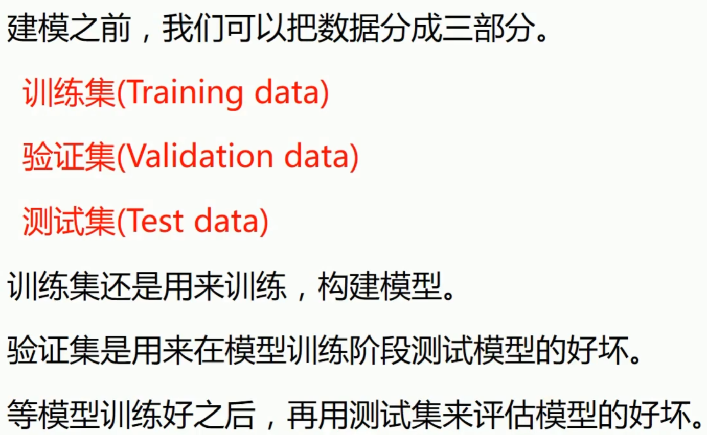
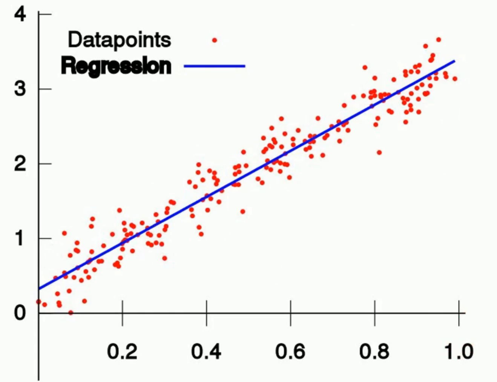
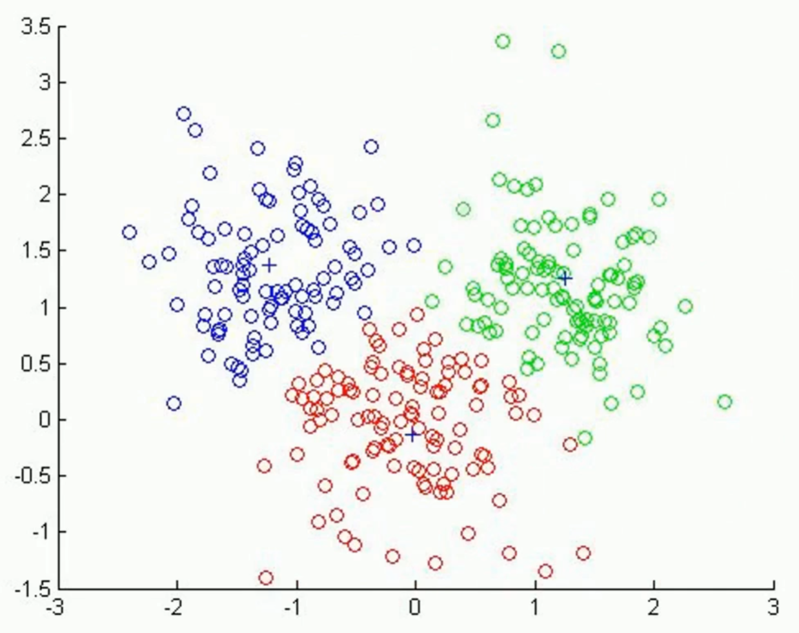

有时候偷懒,我们会直接用测试集当验证集来使用

比较标准的情况下,我们一般分三个集

监督学习指的是 训练带有标签的数据集

无监督学习一般用于聚类

半监督学习是监督学习和无监督学习相结合的一种学习方式。主要是用来解决使用少量带标签的数据和大量没有标签的数据进行训练和分类的问题

## 常见应用

### 回归

### 分类

- 图像识别
- 垃圾邮件分类
- 文本分类

### 聚类

### 总结

回归: 预测数据为连续型数值

分类: 预测数据为类别型数据,并且类别已知

聚类: 预测数据为类别型数据,但是类别未知

