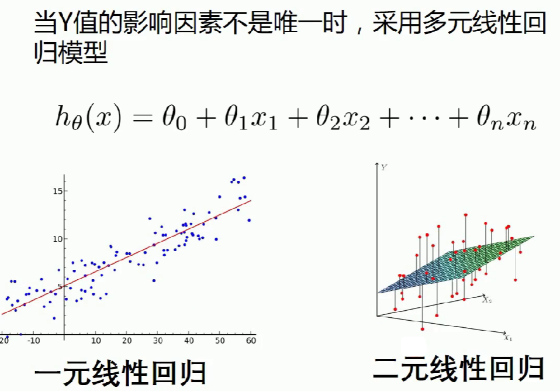
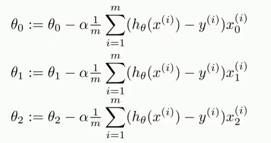

## 梯度下降法

```python
import numpy as np
from numpy import genfromtxt
import matplotlib.pyplot as plt  
from mpl_toolkits.mplot3d import Axes3D  

# 读入数据 (10, 3) => 运输里程 运输速度 运输时间
data = genfromtxt(r"Delivery.csv",delimiter=',')
print(data)
```


```python
# 切分数据
x_data = data[:,:-1]
y_data = data[:,-1]
print(x_data)
print(y_data)
```


```python
# 学习率learning rate
lr = 0.0001
# 参数
theta0 = 0
theta1 = 0
theta2 = 0
# 最大迭代次数
epochs = 1000

# 最小二乘法
def compute_error(theta0, theta1, theta2, x_data, y_data):
    totalError = 0
    for i in range(0, len(x_data)):
        totalError += (y_data[i] - (theta1 * x_data[i,0] + theta2*x_data[i,1] + theta0)) ** 2
    return totalError / float(len(x_data))

def gradient_descent_runner(x_data, y_data, theta0, theta1, theta2, lr, epochs):
    # 计算总数据量
    m = float(len(x_data))
    # 循环epochs次
    for i in range(epochs):
        theta0_grad = 0
        theta1_grad = 0
        theta2_grad = 0
        # 计算梯度的总和再求平均
        for j in range(0, len(x_data)):
            theta0_grad += (1/m) * ((theta1 * x_data[j,0] + theta2*x_data[j,1] + theta0) - y_data[j])
            theta1_grad += (1/m) * x_data[j,0] * ((theta1 * x_data[j,0] + theta2*x_data[j,1] + theta0) - y_data[j])
            theta2_grad += (1/m) * x_data[j,1] * ((theta1 * x_data[j,0] + theta2*x_data[j,1] + theta0) - y_data[j])
        # 更新b和k
        theta0 = theta0 - (lr*theta0_grad)
        theta1 = theta1 - (lr*theta1_grad)
        theta2 = theta2 - (lr*theta2_grad)
    return theta0, theta1, theta2
```


```python
ax = plt.figure().add_subplot(111, projection = '3d') 
ax.scatter(x_data[:,0], x_data[:,1], y_data, c = 'r', marker = 'o', s = 100) #点为红色三角形  
x0 = x_data[:,0]
x1 = x_data[:,1]
# 生成网格矩阵
x0, x1 = np.meshgrid(x0, x1)
z = theta0 + x0*theta1 + x1*theta2
# 画3D图
ax.plot_surface(x0, x1, z)
#设置坐标轴  
ax.set_xlabel('Miles')  
ax.set_ylabel('Num of Deliveries')  
ax.set_zlabel('Time')  
  
#显示图像  
plt.show()  
```


## sklearn

```python
import numpy as np
from numpy import genfromtxt
from sklearn import linear_model
import matplotlib.pyplot as plt  
from mpl_toolkits.mplot3d import Axes3D  

# 读入数据 
data = genfromtxt(r"Delivery.csv",delimiter=',')
print(data)
```


```python
# 切分数据
x_data = data[:,:-1]
y_data = data[:,-1]
print(x_data)
print(y_data)
```


```python
# 创建模型
model = linear_model.LinearRegression()
model.fit(x_data, y_data)
```


```python
# 系数
print("coefficients:",model.coef_)

# 截距
print("intercept:",model.intercept_)

# 测试
x_test = [[102,4]]
predict = model.predict(x_test)
print("predict:",predict)
```


```python
ax = plt.figure().add_subplot(111, projection = '3d') 
ax.scatter(x_data[:,0], x_data[:,1], y_data, c = 'r', marker = 'o', s = 100) #点为红色三角形  
x0 = x_data[:,0]
x1 = x_data[:,1]
# 生成网格矩阵
x0, x1 = np.meshgrid(x0, x1)
z = model.intercept_ + x0*model.coef_[0] + x1*model.coef_[1]
# 画3D图
ax.plot_surface(x0, x1, z)
#设置坐标轴  
ax.set_xlabel('Miles')  
ax.set_ylabel('Num of Deliveries')  
ax.set_zlabel('Time')  
  
#显示图像  
plt.show()
```

