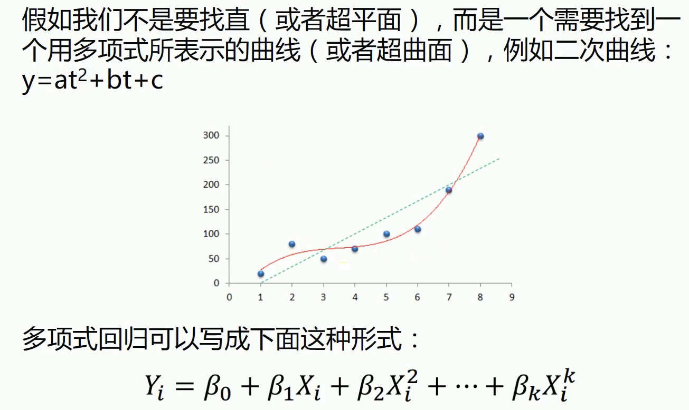

```python
import numpy as np
import matplotlib.pyplot as plt
from sklearn.preprocessing import PolynomialFeatures
from sklearn.linear_model import LinearRegression

# 载入数据
data = np.genfromtxt("job.csv", delimiter=",")
x_data = data[1:,1]
y_data = data[1:,2]
plt.scatter(x_data,y_data)
plt.show()
```


```python
x_data = x_data[:,np.newaxis]
y_data = y_data[:,np.newaxis]
# 创建并拟合模型
model = LinearRegression()
model.fit(x_data, y_data)
```


```python
# 画图
plt.plot(x_data, y_data, 'b.')
plt.plot(x_data, model.predict(x_data), 'r')
plt.show()
```


```python
# 定义多项式回归,degree的值可以调节多项式的特征
poly_reg  = PolynomialFeatures(degree=5) 
# 特征处理
x_poly = poly_reg.fit_transform(x_data)
# 定义回归模型
lin_reg = LinearRegression()
# 训练模型
lin_reg.fit(x_poly, y_data)
```


```python
# 画图
plt.plot(x_data, y_data, 'b.')
# 用做了特征处理的数据训练模型, 所以预测的时候用的数据也要做特征处理
plt.plot(x_data, lin_reg.predict(poly_reg.fit_transform(x_data)), c='r')
plt.title('Truth or Bluff (Polynomial Regression)')
plt.xlabel('Position level')
plt.ylabel('Salary')
plt.show()
```


```python
# 画图
plt.plot(x_data, y_data, 'b.')
# np.linspace(1,10,100) 从1到10,均匀的生成100个点
x_test = np.linspace(1,10,100)
x_test = x_test[:,np.newaxis]
plt.plot(x_test, lin_reg.predict(poly_reg.fit_transform(x_test)), c='r')
plt.title('Truth or Bluff (Polynomial Regression)')
plt.xlabel('Position level')
plt.ylabel('Salary')
plt.show()
```

