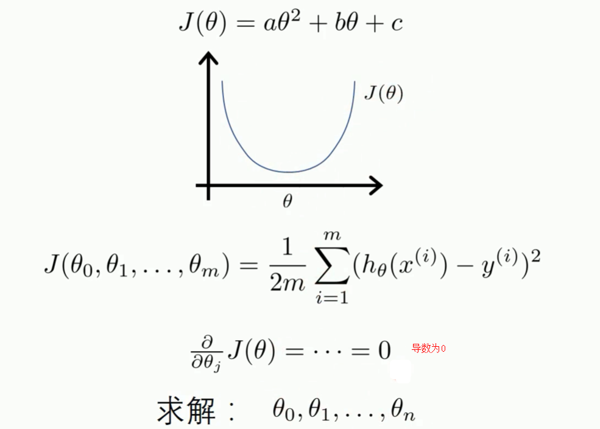
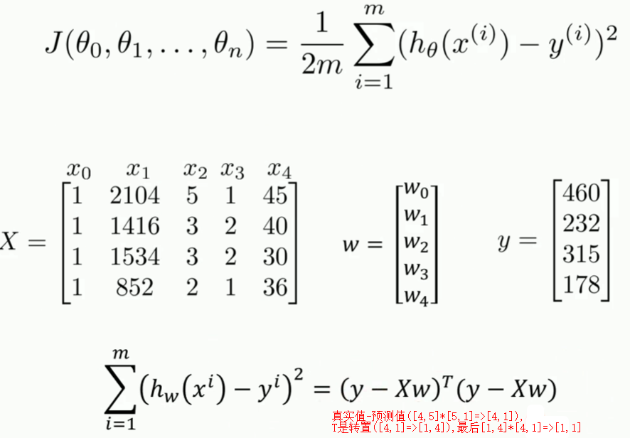
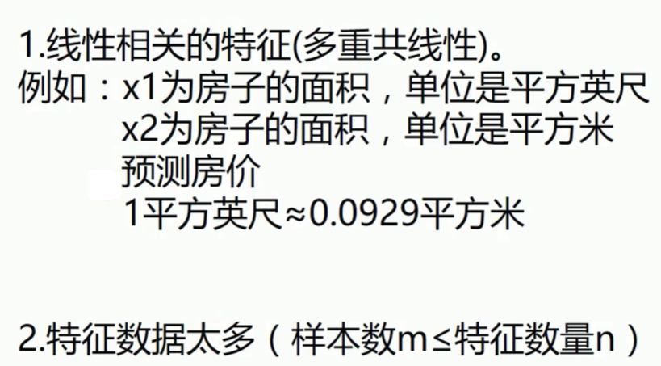
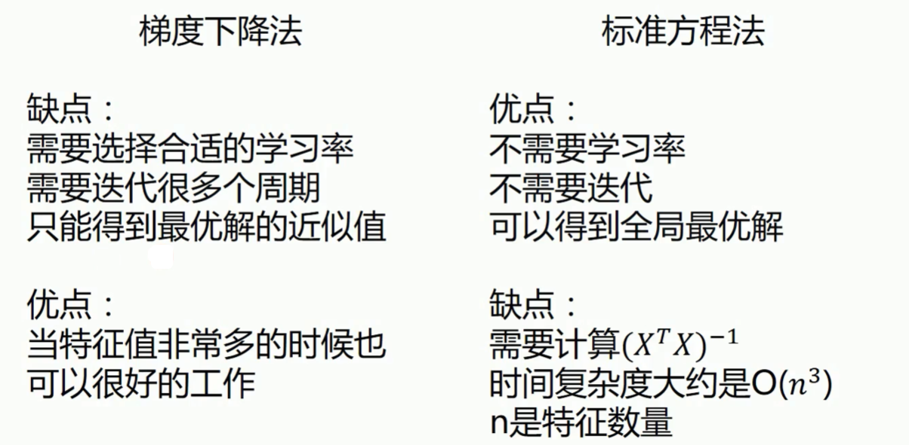
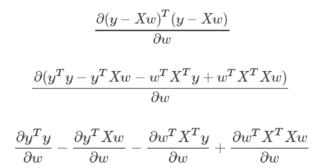
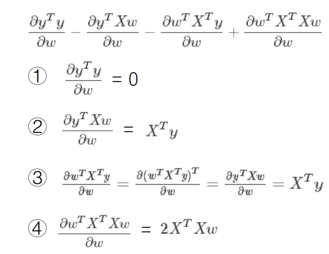
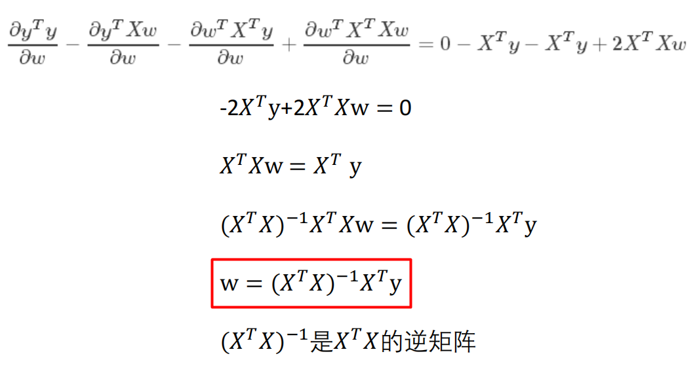

> 矩阵不可逆的情况, 标准方程法不可用





## 推导过程

```shell
https://en.wikipedia.org/wiki/Matrix_calculus#Scalar-by-vector_identities
https://zh.wikipedia.org/wiki/矩阵微积分

分子布局（Numerator-layout）： 分子为列向量或者分母为行向量
分母布局（Denominator-layout）： 分子为行向量或者分母为列向量
```






