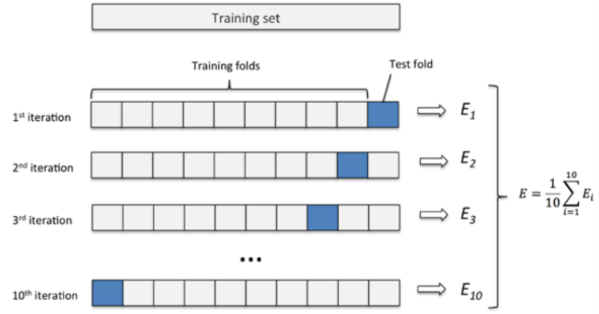

## 数据归一化
```shell
数据归一化就是把数据的取值范围处理为0-1或者-1-1之间

任意数据转化为0-1之间：
newValue = (oldValue-min)/(max-min)

任意数据转化为-1-1之间：
newValue = ((oldValue-min)/(max-min)-0.5)*2
```

## 均值标准化

```shell
均值标准化

x为特征数据，u为数据的平均值，s为数据的方差
newValue = (oldValue-u)/s

例子: 
(1,3,5,7,9)
u = (1+3+5+7+9)/5=5
s = ((1-5)^2+(3-5)^2+(5-5)^2+(7-5)^2+(9-5)^2)/5=8
(1-5)/8=-1/2
(3-5)/8=-1/4
(5-5)/8=0
(7-5)/8=1/4
(9-5)/8=1/2
```


## 交叉验证法



> 有时候本身数据量不是很大的时候, 28切分不太合适, 就会使用到交叉验证法
>
> 把所有的数据切成十份样本, 然后每一份样本切成十份, 九份训练集1份测试集, 每一份样本算出误差
