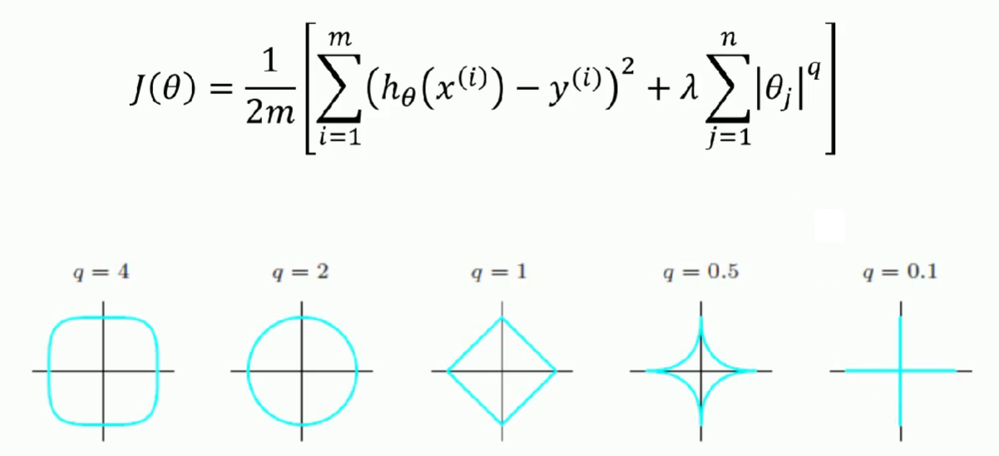
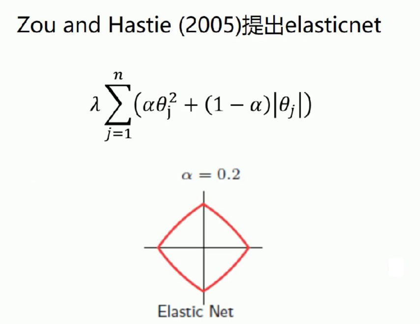

> q=2 => 岭回归
>
> q=1 => LASSO




> 弹性网集合了 岭回归跟LASSO


```python
import numpy as np
from numpy import genfromtxt
from sklearn import linear_model

# 读入数据 
data = genfromtxt(r"longley.csv",delimiter=',')
print(data)
```

```python
# 切分数据
x_data = data[1:,2:]
y_data = data[1:,1]
print(x_data)
print(y_data)
```

```python
# 创建模型
model = linear_model.ElasticNetCV()
model.fit(x_data, y_data)

# 弹性网系数
print(model.alpha_)
# 相关系数
print(model.coef_)
```

```python
model.predict(x_data[-2,np.newaxis])
```

