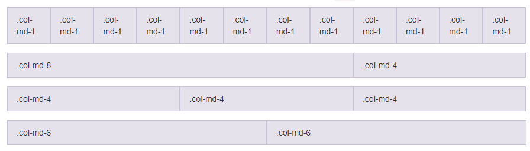
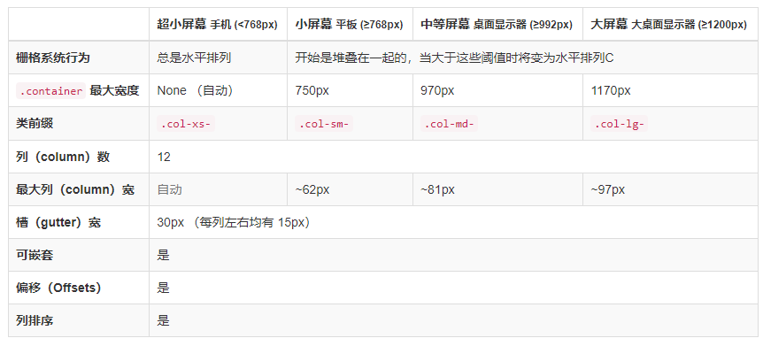

## 介绍

> 官网 https://getbootstrap.com/
>
> 中文 http://www.bootcss.com


Bootstrap是一套现成的CSS样式集合(做得还是很友好的) 。是两个推特的员工干出来的

Bootstrap是最欢迎的HTML, CSS和JS框架,用于开发响应式布局、移动设备优先的WEB项目

2011年, twitter的"一小撮"工程师为了提高他们内部的分析和管理能力,用业余时间为他们的产品构建了一套易用、优雅、灵活、可扩展的前端工具集-BootStrap

Bootstrap由MARK OTTO和Jacob Thornton所设计和建立,在github上开源之后,迅速成为该站上最多人watch&fork的项目。大量工程师踊跃为该项目贡献代码,社区惊人地活跃,代码版本进化非常快速,官方文档质量极其高(可以说是优雅),同时涌现了许多基于Bootstrap建设的网站:界面清新、简洁;要素排版利落大方

Bootstrap特别适合那种没有设计师的团队(甚至说没有前端的团队) ,可以快速的出一个网页


## 特点

1. 简洁、直观、强悍的前端开发框架, html, css. javascript工具集,让web开发更速、简单
2. 基于html5,css3的bootstrap,具有大量的诱人特性:友好的学习曲线,卓越的兼容性,响应式设计, 12列格网,样式向导文档
3. 自定义JQuery插件,完整的类库, bootstrap3基于Less, bootstrap4基于Sass的Css预处理技术
4. Bootstrap响应式布局设计,让一个网站可以兼容不同分辨率的设备。Bootstrap响应式布局设计,给用户提供更好的视觉使用体验
5. 丰富的组件


## 下载和使用

> bootstrap: https://v3.bootcss.com/getting-started/
>
> jQuery: http://jquery.com/


拷贝`dist/css`中的`bootstrap.min.css`到项目`css`中

拷贝`dist/js`中的`bootstrap.min.js`到项目的`js`中


```html
<!DOCTYPE html>
<html lang="en">
	<head>
		<!--设置当前HTML文件的字符编码-->
		
		<!--compatible兼容的，设置浏览器的兼容模式版本（让IE使用最新的渲染引擎工作）-->
		
		<!--声明当前网页在移动端浏览器展示的相关设置-->
		<!-- 
			viewport表示用户是否可以缩放页面
			width指定视区的逻辑宽度
			device-width指定视区宽度应为设备的屏幕宽度
			initial-scale指令用于设置Web页面的初始化缩放比例
			initial-scale-1则将显示未经缩放的Web文档
		 -->
		
		<!-- 上述3个meta标签*必须*放在最前面，任何其他内容都*必须*跟随其后！ -->
		<title>Bootstrap基本的HTML模板</title>
		<!--引入Bootstrap核心样式表(CSS)文件-->
		<link  rel="stylesheet" href="bootstrap/css/bootstrap.min.css"/>
		<!--引入html5shiv.min.js让浏览器可以识别HTML5的新标签-->
		<!--引入respond.min.js让低版本浏览器可以使用CSS3的媒体查询-->
		<!--[if It IE 9]>
		<script src="html5shiv/html5shiv.min.js"></script>
		<script src="Respond/respond.min.js"></script>
		<![endif]-->
		<!--自己写的CSS样式文件放head最下面-->
	</head>
	<body>
		<div><h1>Hello,world!</h1></div>
		<!-- Bootstrap的所有JS组件都是依赖jQuery的，所以必须放在前边-->
		<script src="js/jquery.js"></script>
		<!-- 加载 Bootstrap 的所有 JavaScript 插件。你也可以根据需要只加载单个插件。-->
		<script src="bootstrap/js/bootstrap.min.js"></script>
		<!--自己写的js文件放在body最下面-->
	</body>
</html>
```

1. viewport <meta>标记用于指定用户是否可以缩放Web页面
2. width和height指令分别指定视区的逻辑宽度和高度。他们的值要么是以像素为单位的数字,要么是一个特殊的标记符号
3. Twidth指令使用device-width标记可以指示视区宽度应为设备的屏幕宽度
4. height指令使用device-height标记指示视区高度为设备的屏幕高度
5. initial-scale指令用于设置Web页面的初始缩放比例。默认的初始缩放比例值因智能手机浏览器的不同而有所差异。通常情况下设备会在浏览器中呈现出整个Web页面,设为1.0则将显示未经缩放的Web文档


## 布局容器

1. .container类用于固定宽度并支持响应式布局的容器 (两次留白效果,版心居中,这种用的居多)

   ```html
   <div class="container">
       ...
   </div>
   ```

2. .container-fluid用于100%宽度,占据全部视口(viewport)的容器

   ```html
   <div class="container-fluid">
       ...
   </div>
   ```


## 栅格网格系统

Bootstrap提供了一套响应式、移动设备优先的流式栅格系统,随着屏幕或视口(viewport)尺寸的增加,系统会自动分为最多12列。栅格系统用于通过一系列的行(row)与列(column)的组合来创建页面布局,你的内容就可以放入这些创建好的布局中

网格系统的实现原理非常简单,仅仅是通过定义容器大小,平分12份(也有平分成24份或32份,但12份是最常见的),再调整内外边距,最后结合媒体查询,就制作出了强大的响应式网格系统。Bootstrap框架中的网格系统就是将容器平分成12份



container, row, xs (xsmall phones), sm (small tablets), md (middle desktops), Ig (larger desktops)

即:超小屏(自动),小屏(750px),中屏(970px)和大屏(1170px)


数据行(.row)必须包含在容器(.container)中,以便为其赋予合适的对齐方式和内距(padding)

在行(.row)中可以添加列.column),只有列(column)才可以作为行容器(.row)的直接子元素,但列数之和不能超过平分的总列数,比如12,如果大于12,则自动换到下一行

具体内容应当放置在列容器(column)之内

```html
<div class="container">
    <div class="row">
        <div class="col-md-4">4列</div>
        <div class="col-md-8">8列</div>
    </div>
</div>
```




## 列组合

列组合简单理解就是更改数字来合并列(原则:列总和数不能超12,大于12,则自动换到下一行。) ,有点类似于表格的colspan属性

```html
<div class="container">
    <div class="row">
        <div class="col-md-4">4列</div>
        <div class="col-md-8">8列</div>
    </div>
    <div class="row">
        <div class="col-md-2">2列</div>
        <div class="col-md-10">10列</div>
    </div>
</div>
```


## 列偏移

如果我们不希望相邻的两个列紧靠在一起,但又不想使用margin或者其他的技术手段来。这个时候就可以使用列偏移(offset)功能来实现。使用列偏移也非常简单,只需要在列元素上添加类名"col-md-offset-\*"(其中星号代表要偏移的列组合数),那么具有这个类名的列就会向右偏移。例如,你在列元素上添加"col-md-offset-8",表示该列向右移动8个列的宽度(要保证列与偏移列的总数不超过12,不然会致列断行|换行显示)。 

```html
<div class="container">
    <div class="row">
        <div class="col-md-4">4列</div>
        <div class="col-md-4 col-md-offset-4">8列</div>
    </div>
</div>
```


## 列排序

列排序其实就是改变列的方向,就是改变左右浮动,并且设置浮动的距离。在Bootstrap框架的网格系统中是通过添加类名col-md-push-\*和col-md-pull-\* (其中星号代表移动的列组合数)。往前pull,往后push

跟列偏移相比,偏移会挤掉别的元素;排序不会挤掉,可以被覆盖

```html
<div class="container">
    <div class="row">
        <div class="col-md-1 col-md-push-1">1列</div>
        <div class="col-md-1 col-md-pull-1">2列</div>
    </div>
</div>
```


## 列嵌套

可以在一个列中添加一个或者多个行(row)容器,然后在这个行容器中插入列

```html
<div class="container">
    <div class="row">
        <div class="col-md-4">4列</div>
        <div class="col-md-8">
        	<div class="row">
                <div class="col-md-2">2列</div>
                <div class="col-md-10">10列</div>
    		</div>
        </div>
    </div>
</div>
```


## 常用样式

### 排版

#### 标题

Bootstrap和普通的HTML页面一样,定义标题都是使用标签<h1>到<h6>,只不过Bootstrap覆盖了其默认的样式,使用其在所有浏览器下显示的效果一样。为了让非标题元素和标题使用相同的样式,还特意定义了.h1~.h6六个类名。同时后面可以紧跟着一行小的副标题<smal1></smal1>或使用.small

```html
<hl>h1. Bootstrap heading<small>副标题</sma11></hl>
<div class="h1">Bootstrap标题1<span class="small">副标题</span></div>
```

#### 段落

段落是排版中另一个重要元素之一。通过.lead来突出强调内容(其作用就是增大文本字号,加粗文本,而且对行高和margin也做相应的处理。可以使用以下标签给文本做突出样式处理: 

<small>: 小号字

<b><strong>: 加粗

<i><em>: 斜体

```html
<p class="lead">
    <small>1</small>
    <b>2</b>
    <i>3</i>
    <em>4</em>
    <strong>5</strong>
</p>
```

#### 强调

定义了一套类名,这里称其为强调类名,这些强调类都是通过颜色来表示强调,具本说明如下:

​	.text-muted:提示,使用浅灰色(#999)

​	.text-primary:主要,使用蓝色(#428bca)

​	.text-success:成功,使用浅绿色(#3c763d)

​	.text-info:通知信息,使用浅蓝色(#31708f)

​	.text-warning:警告,使用黄色(#8a6d3b)

​	.text-danger:危险,使用褐色(#a94442) 

```html
<div class="text-danger">danger</div>
```

#### 对齐效果

在CSS中常常使用text-align来实现文本的对齐风格的设置。其中主要有四种风格:

​	左对齐,取值left

​	居中对齐,取值center

​	右对齐, 取值right

​	两端对齐,取值justify

为了简化操作,方便使用, Bootstrap通过定义四个类名来控制文本的对齐风格: 

.text-left:左对齐.text-center:居中对齐.text-right:右对齐.text-justify:两端对齐

```html
<p class="text-center">居中对齐</p>
```


#### 列表

在HTML文档中,列表结构主要分三种:

​	无序列表:(<ul><li>...</li></ul>)

​	有序列表:(<ol><li>...</li></ol>)

​	定义列表:(<dl><dt>...</dt><dd>...</dd></dl>)

##### 去点列表

​	class="list-unstyled"

```html
<ul class="list-unstyled">
    <li>无序列表一</li>
    <li>无序列表二</li>
</ul>
```

##### 内联列表

​	class="list-inline",把垂直列表换成水平列表,而且去掉项目符号(编号) ,保持水平显示。也可以说内联列表就是为制作水平导航而生

```html
<ul class="list-inline">
    <li>1</li>
    <li>2</li>
</ul>
```

##### 自定义列表

在原有的基础加入了一些样式,使用样式class="dl-horizontal"制作水平定义列表:当标题宽度超过160px时，将会显示三个省略号

```html
<dl class="dl-horizontal">
    <dt>HTML 超文本标记语言</dt>
    <dd>HTML是一种标识性的语言</dd>
</dl>
```


#### 代码

一般在个人博客上使用的较为频繁,用于显示代码的风格。在Bootstrap主要提供了三种代码风格:

1. 使用<code></code>来显示单行内联代码

2. 使用<pre></pre>来显示多行块代码

   样式: pre-scrollable (height,max-height高度固定,为340px,超过存在滚动条)

3. 使用<kbd></kbd>来显示用户输入代码,如快捷键


#### 表格

##### 表格样式

Bootstrap为表格提供了1种基础样式和4种附加样式以及1个支持响应式的表格。在使用Bootstrap的表格过程中,只需要添加对应的类名就可以得到不同的表格风格: 

 1. 基础样式

    table: 基础表格

 2. 附加样式

     	1. .table-striped:斑马线表格
          	2. .table-bordered:带边框的表格
          	3. .table-hover:鼠标悬停高亮的表格
          	4. .table-condensed:紧凑型表格,单元格没内距或者内距较其他表格的内距小 

##### tr、th、td样式

​	提供了五种不同的类名,每种类名控制了行的不同背景颜色 

| 类       | 描述                             |
| -------- | -------------------------------- |
| .active  | 将悬停的颜色应用在行或者单元格上 |
| .success | 表示成功的操作                   |
| .info    | 表示信息变化的操作               |
| ,warning | 表示一个警告的操作               |
| .danger  | 表示一个危险的操作               |


### 表单

表单主要功能是用来与用户做交流的一个网页控件,良好的表单设计能够让网页与用户更好的沟通。表单中常见的元素主要包括:文本输入框、下拉选择框、单选按钮、复选按钮、文本域和按钮等

#### 表单控件

​	.form-control	.input-lg(较大)	.input-sm(较小)

##### 输入框text

```html
<div class="col-sm-3">
    <input type="text" name="" id="" class="form-control"/>
    <input type="text" name="" id="" class="form-control input-lg"/>
    <input type="text" name="" id="" class="form-control input-sm"/>
</div>
```

##### 下拉选择框 select

​	多行选择设置: multiple="multiple"

```html
<div class="row">
    <div class="col-md-3">
        <select class="form-control">
            <option>请选择城市</option>
            <option>上海</option>
            <coption>北京</option>
        </select> <br>
        <select class="form-control"multiple="multiple">
            <option>请选择城市</option>
            <option>上海</option>
            <option>北京</option>
		</select> <br>
	</div>
</div>
```

##### 文本域

```html
<div class="row">
    <div class="col-md-3">
        <textarea class="form-control"></textarea>
	</div>
</div>
```

##### 复选框

​	垂直显示: .checkbox

​	水平显示: .checkbox-inline

```html
<!--垂直显示-->
<div>
    <div class="checkbox">
        <label><input type="checkbox" >游戏</label>
    </div>
    <div class="checkbox">
    	<label><input type="checkbox" >学习</label>
    </div>
</div>
<!--水平显示-->
<div>
    <label class="checkbox-inline">
        <input type="checkbox" >游戏
    </label>
    <label class="checkbox-inline">
        <input type="checkbox" >学习
    </label>
</div>
```

##### 单选框

​	垂直显示: .radio

​	水平显示: .radio-inline

```html
<!--垂直显示-->
<div>
    <div class="radio">
        <label><input type="radio" name="sex">游戏</label>
    </div>
    <div class="radio">
    	<label><input type="radio" name="sex">学习</label>
    </div>
</div>
<!--水平显示-->
<div>
    <label class="radio-inline">
        <input type="checkbox" name="sex">游戏
    </label>
    <label class="radio-inline">
        <input type="checkbox" name="sex">学习
    </label>
</div>
```

##### 按钮

1. 使用button实现

   基础样式: btn

   ```html
   <button class="btn">按钮</button>
   ```

   附加样式: btn-primary btn-info btn-success btn-warning btn-danger btn-ink btn-default

   ```html
   <button class="btn btn-primary">按钮</button>
   ```

   

2. 多标签支持: 使用a div 等制作按钮

   ```html
   <a href="##" class="btn btn-primary">a</a>
   <span class="btn btn-primary">span</span>
   ```

   

3. 按钮大小

   使用.btn-lg 、.btn-sm 或 .btn-xs就可以获得不同尺寸的按钮

   ```html
   <button class="btn btn-primary btn-xs">超小按钮</button>
   ```

   

4. 按钮禁用

   在标签中添加disabled属性

   ```html
   <button class="btn btn-danger" disabled="disabled">禁用按钮</button>
   ```

   在元素标签中添加类名disabled (这个只是样式禁用,实际效果还是有的)

   ```html
   <button class="btn btn-danger disabled">禁用按钮</button>
   ```


#### 表单布局

基本的表单结构是Bootstrap自带的,个别的表单控件自动接收一些全局样式。下面列出了创建基本表单的步骤：

- 向父<form>元素添加role="form"
- 把标签和控件放在一个带有class.form-group的<div>中。这是获取最佳间距所必需的
- 向所有的文本元素<input>, <textarea>和<select>添加class ="form-control"

##### 水平表单

​	同一行显示form-horizontal

​	配合Bootstrap框架的网格系统

```html
<form class="form-horizontal">
  <div class="form-group">
    <label for="inputEmail3" class="col-sm-2 control-label">Email</label>
    <div class="col-sm-10">
      <input type="email" class="form-control" id="inputEmail3" placeholder="Email">
    </div>
  </div>
    
  <div class="form-group">
    <label for="inputPassword3" class="col-sm-2 control-label">Password</label>
    <div class="col-sm-10">
      <input type="password" class="form-control" id="inputPassword3" placeholder="Password">
    </div>
  </div>
    
  <div class="form-group">
    <div class="col-sm-offset-2 col-sm-10">
      <div class="checkbox">
        <label>
          <input type="checkbox"> Remember me
        </label>
      </div>
    </div>
  </div>
    
  <div class="form-group">
    <div class="col-sm-offset-2 col-sm-10">
      <button type="submit" class="btn btn-default">Sign in</button>
    </div>
  </div>
</form>
```

##### 内联表单

​	将表单的控件都在一行内显示form-inline

​	注意label不会显示,存在的意义:如果没有为输入控件设置label标签,屏幕阅读器将无法正确识别

```html
<form class="form-inline">
  <div class="form-group">
    <label class="sr-only" for="exampleInputEmail3">Email address</label>
    <input type="email" class="form-control" id="exampleInputEmail3" placeholder="Email">
  </div>
  <div class="form-group">
    <label class="sr-only" for="exampleInputPassword3">Password</label>
    <input type="password" class="form-control" id="exampleInputPassword3" placeholder="Password">
  </div>
  <div class="checkbox">
    <label>
      <input type="checkbox"> Remember me
    </label>
  </div>
  <button type="submit" class="btn btn-default">Sign in</button>
</form>
```


### 缩略图

缩略图在电商类的网站很常见,最常用的地方就是产品列表页面。缩略图的实现是配合网格系统一起使用。同时还可以让缩略图配合标题、描述内容,按钮等

```html
<div class="container">
    <div class="row">
        <div class="col-md-3">
			<div class="thumbnail">
                
                <h3>xxx</h3>
                <p>xxx</p>
            </div>            
        </div>
    </div>
</div>
```


### 面板

​	默认的.panel组件所做的只是设置基本的边框(border)和内补(padding)来包含内容

​	.panel-default:默认样式

​	.panel-heading: 面板头

​	.panel-body:面板主体内容

```html
<div class="panel panel-success">
    <div class="panel-heading">
        ...
    </div>
    <div class="panel-body">
        ...
    </div>
</div>
```


## BootStrap插件

参考：BootStrap-菜鸟教程 https://www.runoob.com/bootstrap/bootstrap-tutorial.html

