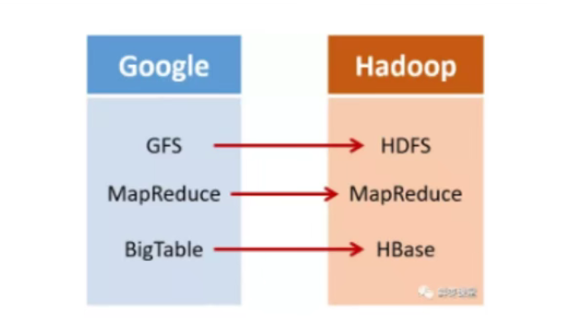
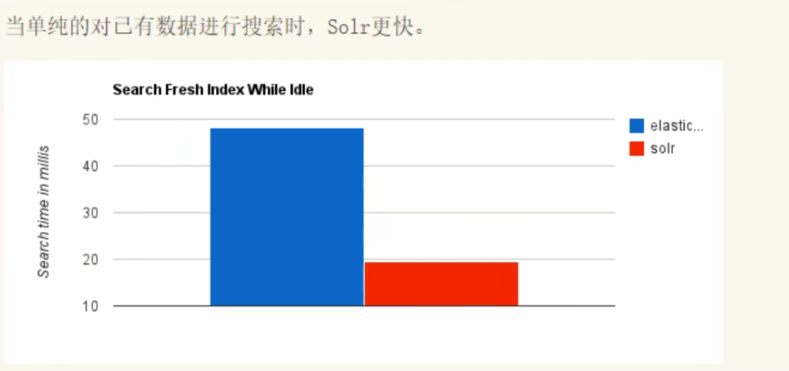
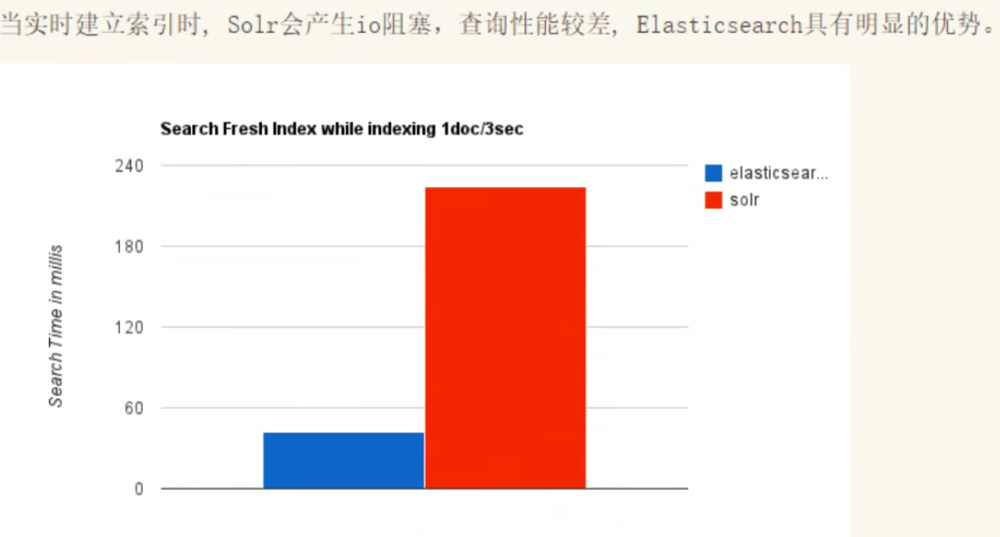
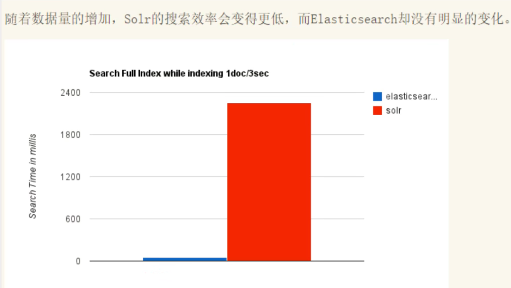
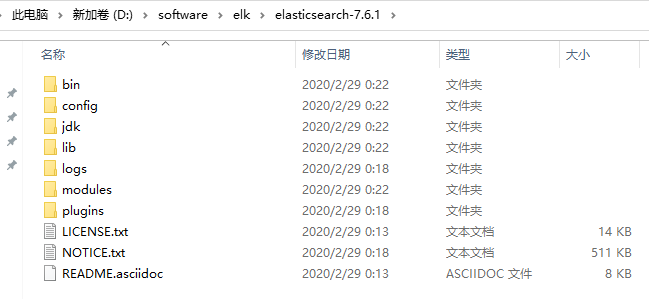
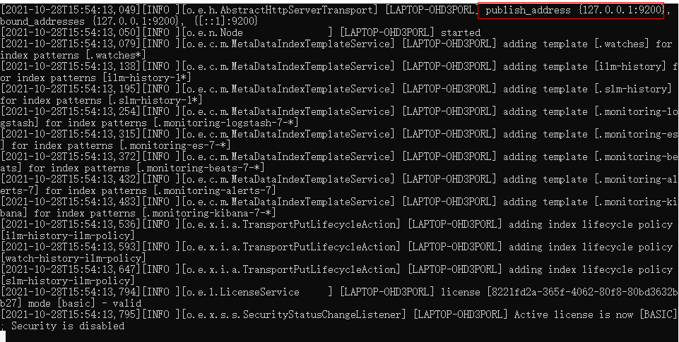
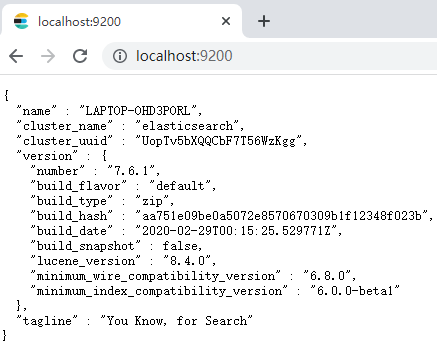

# 概述

Elaticsearch ,简称为es , es是一个开源的**高扩展**的**分布式全文检索引擎**,它可以近乎**实时的存储、检索数据**

本身扩展性很好可以扩展到上百台服务器,处理PB级别(大数据时代)的数据。es也使用Java开发并使用Lucene作为其核心来实现所有索引和搜索的功能,但是它的目的是通过简单的**RESTful API**来隐藏Lucene的复杂性,从而让全文搜索变得简单


# es solr 选择








1. es基本是开箱即用(解压就可以用! ) ,非常简单.	Solr安装略微复杂一点
2. Solr利用Zookeeper进行分布式管理,而Elasticsearch自身带有分布式协调管理功能
3. Solr支持更多格式的数据,比如JSON,XML, CSV,而Elasticsearch仅支持json文件格式
4. Solr官方提供的功能更多,而Elasticsearch本身更注重于核心功能,高级功能多有第三方插件提供,例如图形化界面需要kibana友好支撑
5. Solr查询快,但更新索引时慢(即插入删除慢) ,用于电商等查询多的应用; ES建立索引快(即查询慢) ,即实时性查询快,用于facebook新浪等搜索, Solr是传统搜索应用的有力解决方案,但Elasticsearch更适用于新兴的实时搜索应用
6. Solr比较成熟,有 个更大,更成熟的用户、开发和贡献者社区,而Elasticsearch相对开发维护者较少,更新太快,学习使用成本较高


# 安装es

官网: https://www.elastic.co

下载地址: https://www.elastic.co/cn/downloads/elasticsearch



```shell
bin		# 启动文件
config	# 配置文件
	elasticsearch.yml	# elasticsearch配置文件	默认端口:9200
	log4j2.properties	# 日志配置文件
	jvm.options			# java虚拟机相关配置
logs	# 日志
lib		# 相关jar包
modules	# 功能模块
plugins	# 插件
```






# 安装es -head

https://github.com/mobz/elasticsearch-head


