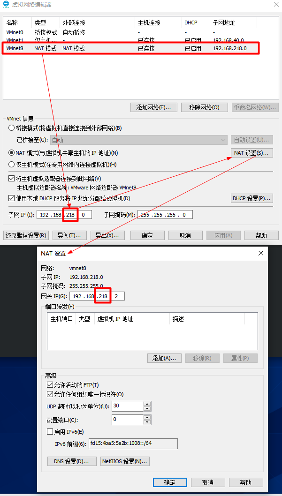

# 安装VM

# 安装Centos

# 配置网络

```shell
VM -> 编辑 -> 虚拟网络编辑器
```





```shell
vim /etc/sysconfig/network-scripts/ifcfg-ens33

# 配置静态地址
TYPE=Ethernet
PROXY_METHOD=none
BROWSER_ONLY=no
BOOTPROTO=static	#静态
DEFROUTE=yes
IPV4_FAILURE_FATAL=no
IPV6INIT=yes
IPV6_AUTOCONF=yes
IPV6_DEFROUTE=yes
IPV6_FAILURE_FATAL=no
NAME=ens33
UUID=35ab7cb1-280e-4e4b-b6ca-6236e0088e20
DEVICE=ens33
ONBOOT=yes

IPADDR=192.168.218.100	# IP地址
GATEWAY=192.168.218.2	# 网关
DNS1=192.168.218.2		# 域名解析器
```

```shell
# 主机名称
vim /etc/hostname

# 主机名称映射
vim /etc/hosts

192.168.218.100 hadoop100
192.168.218.101 hadoop101
192.168.218.102 hadoop102
192.168.218.103 hadoop103
......
```


# 虚拟机环境准备

## 虚拟机配置

```shell
# 相当于是一个软件仓库，大多数rpm包在官方 repository 中是找不到的
yum install -y epel-release

# 在企业开发时，通常单个服务器的防火墙时关闭的。公司整体对外会设置非常安全的防火墙
systemctl stop firewalld				# 关闭防火墙
systemctl disable firewalld.service		# 关闭防火墙开机自启

# 创建用户
useradd hadoop
passwd hadoop

# 配置hadoop用户具有root权限，方便后期加sudo执行root权限的命令
vim /etc/sudoers

# 修改/etc/sudoers文件
## Allow root to run any commands anywhere
root    ALL=(ALL)     ALL
## Allows people in group wheel to run all commands
%wheel  ALL=(ALL)       ALL
hadoop   ALL=(ALL)     NOPASSWD:ALL	# 添加这一行,程序执行到%wheel行时，该功能又被覆盖回需要密码。所以hadoop要放到%wheel这行下面

# 卸载自带的JDK
rpm -qa | grep -i java | xargs -n1 rpm -e --nodeps
```

## 克隆虚拟机


```shell
当前虚拟机状态 -> 创建完整克隆 -> 修改名字、位置 -> 完成
```

```shell
# 每台克隆出来的虚拟机, 修改ip跟主机名
vim /etc/sysconfig/network-scripts/ifcfg-ens33
vim vim /etc/hostname
```

