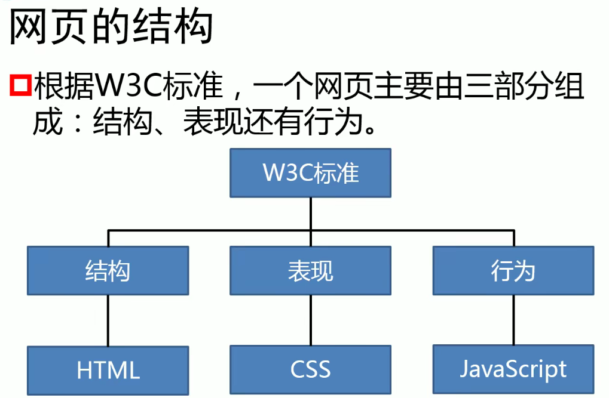
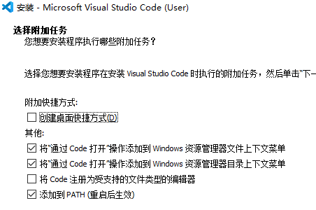

# HTML

```html
<html>
    <head>
      	<title></title>
    </head>
    <body>
        
    </body>
</html>
```

```html
<html>
    <head>
      	<title></title>
    </head>
    <body>
        <!--自结束标签-->
        
        
        <input>
        <input />
    </body>
</html>
```

```html
<html>
    <head>
      	<title></title>
    </head>
    <body>
        <!--
			属性, 在标签(开始标签或自结束标签)可以设置属性
		-->
    	<h1>
            测试属性-<font color="red">颜色</font>
        </h1> 
    </body>
</html>
```

```html
<!DOCTYPE html>
<html>
    <head>
        <!--可以通过meta标签来设置网页的字符集, 避免乱码问题-->
        <meta charset="utf-8">
      	<title></title>
    </head>
    <body>
        <!--
			迭代
				网页的版本
					HTML4
					XHTML2.0
					HTML5
				文档声明(doctype)
					文档声明用来告诉浏览器当前网页的版本
					htm15的文档声明
					<!doctype html>
					<!Doctype HTML>
		-->
    </body>
</html>
```

```html
<!-- 文档声明，声明当前网页的版本 -->
<!doctype html>

<!-- html的根标签（元素），网页中的所有内容都要写根元素的里边 -->
<html>

	<!-- head是网页的头部，head中的内容不会在网页中直接出现，主要用来帮助浏览器或搜索引擎来解析网页 -->
	<head>

		<!-- meta标签用来设置网页的元数据，这里meta用来设置网页的字符集，避免乱码问题 -->
		<meta charset="utf-8">
		
		<!-- title中的内容会显示在浏览器的标题栏，搜索引擎会主要根据title中的内容来判断网页的主要内容 -->
		<title>网页的标题</title>

	</head>

	<!-- body是html的子元素，表示网页的主体，网页中所有的可见内容都应该写在body里 -->
	<body>

		<!-- h1网页的一级标题 -->
		<h1>网页的大标题</h1>

	</body>

</html>
```



