# 垃圾回收算法

## 判断对象已死的算法

在堆里面存放着各种各类的Java对象,垃圾收集器在对堆进行垃圾回收时,首要就是判断哪些对象还活着,哪些对象已经死去(即不被任何途径引用的对象)。

## 引用计数器算法:

引用计数器算法简单概括为: 给对象添加一个引用计数器,每当有一个地方引用该对象时,计数器+1,当引用失效时,计数器-1,任何时刻,当计数器为0的时候,该对象不再被引用。客观的说,引用计数器的实现简单,判定效率也高,大部分场景下是一个不错的选择。但是,当前主流的Jvm均没有采用标记清除算法,原因在于,它很难解决对象之间互相循环调用的情况。

## 可达性分析算法:

在主流的商用程序语言(如C#, Java)的主流实现中,都是通过可达性分析来判断对象是否存活,这个算法的思想就是通过一系列的成为"GC Roots"的对象作为起始点从这些节点开始向下搜索,搜索所走过的路径成为引用链,当一个对象到"GC Roots"没有任何引用链相连,则证明此对象是不可用的。

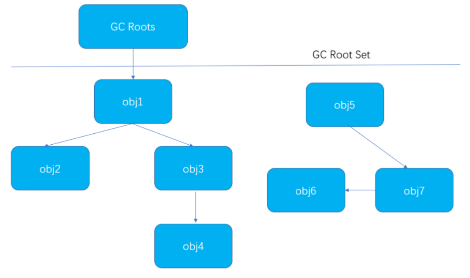

如图所示,虽然Obj5, Obj6, Obj7互有关联,但是他们到GC root没有任何引用链,所以判定为需要被回收的对象

常说的GC(Garbage Collector) roots, 指的是垃圾收集器(Garbage Collector)的对象, GC会收集那些不是GC roots 没有被GC roots 用的对象。

在Java中,可以作为GC Roots的对象包括下面几种:

- 虚拟机栈中引用的对象

- 方法区中类静态属性引用的对象

- 方法区中的常量引用的对象

- 本地方法栈中JNI(即一般说的Native方法)的引用的对象

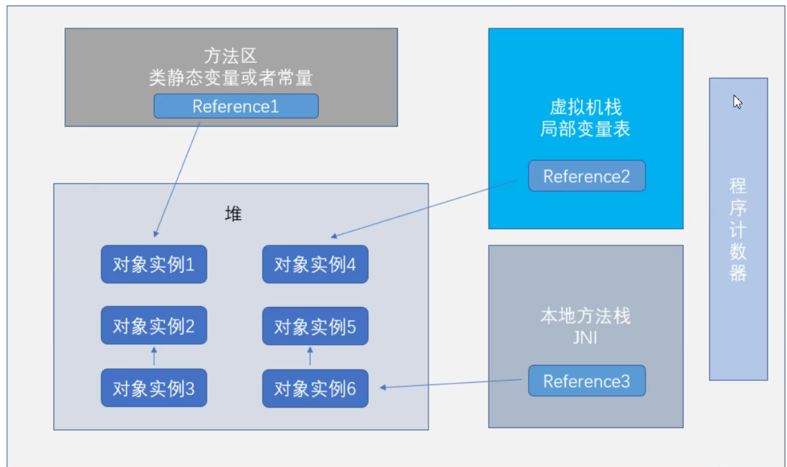

## 再谈引用：

无论是通过引用计数器判断的引用数量，还是通过可达性分析判断出的引用链是否可达，判定对象是否存活都跟引用有关。在JDK1.2以前，引用被定义为当一个reference类型的数据

代表的是另外一块内存的起始地址，该类型的数据被称之为引用，这种定义很纯粹，但是也很狭隘，一个对象在这种定义下只有被引用和没有被引用两种状态。对于描述一些“食之无味，弃之可

惜”的对象就显得无能为力。我们希望能描述这类对象，当内存足够的时候，将它存放在内存中，当内存空间进行垃圾回收后显得还是内存紧张时，可以回收这部分对象，很多系统的缓存功能

都符合这样的应用场景。因此在**JDK1.2以后**对引用进行重新的扩充，分为强引用，软引用，弱引用，虚引用4中，这四种引用的强度依次递减。

 **强引用：**

 强引用是在代码中普遍存在的，类似于Object obj = new Object()，只要强引用一直存在，垃圾收集器就永远不会回收被引用的对象。

 **软引用：**

 软引用用来描述一些还有用但并非必须的对象，对于软引用关联着的对象，当内存溢出异常发生之前，通过垃圾回收进行二次回收。如果二次回收完成之后，系统内存依然不够，才会抛出

 内存溢出异常，在jdk1,2以后用SoftReference类来实现软引用。

 **弱引用：**

 弱引用也是用来描述非必须对象的，但是它的强度相比于软引用来说更弱一些，它仅仅能生存到下一次垃圾回收之前。当垃圾收集时，无论内存是否足够，弱引用的对象都要被回收，

 在jdk1.2以后用WeakReference类来实现弱引用

 **虚引用：**

 虚引用是最弱的一种引用关系，一个对象是否有虚引用的存在，完全不会对其生存时间构成影响，也无法通过一个虚引用来获取一个实例对象。为一个对象设置弱引用的唯一目的就是

 该对象在垃圾回收时受到一个系统通知，Jdk1,2以后用PhantomReference实现虚引用。

## 标记清除算法

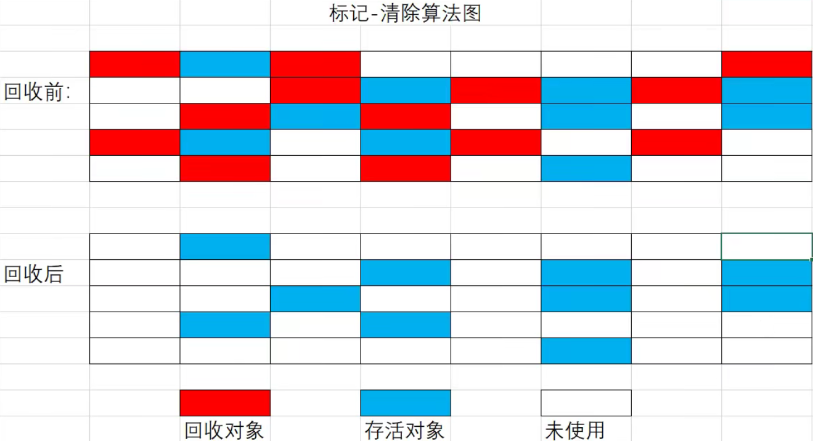

> 会导致大量内存碎片

## 标记整理算法

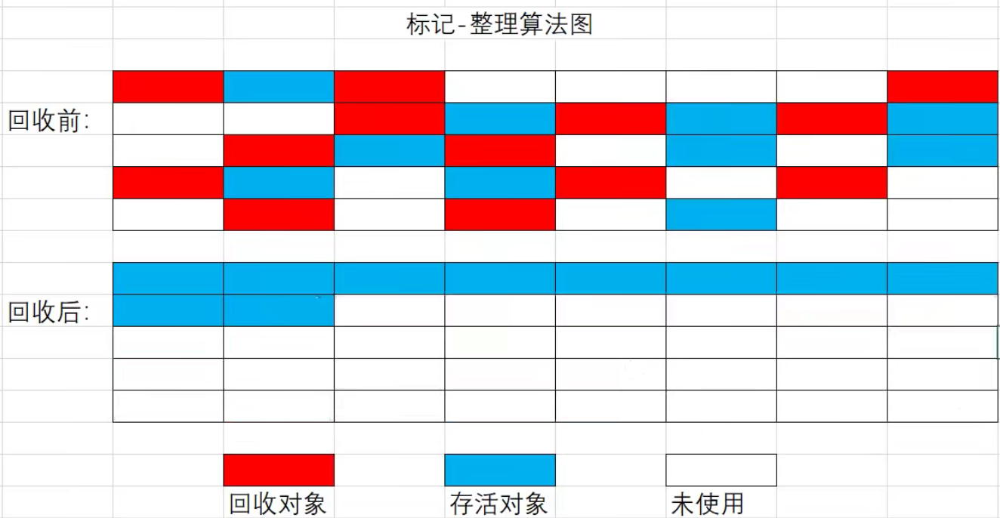

## 复制算法

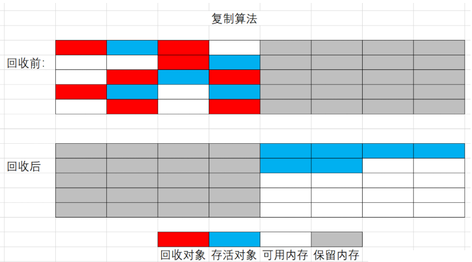

回收前, 右边为预留空间 -> 把左边的存活对象复制到预留区域 -> 把左边的区域清空掉 -> 左边的区域作为预留区域

空间利用率太差

## 分代垃圾回收算法

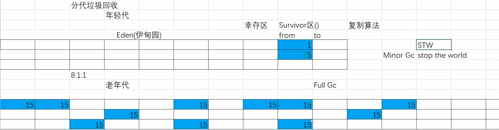

1. 分代分为年轻代和老年代,年轻代里头又分为Eden区和Survivor区,通常默认的比例为8:1:1,每次只保留10%的空间用作预留区域,然后将90%的空间可以用作新生对象
2. 每一次垃圾回收之后,存活的对象年龄对应+1,当经历15次还依然存活的对象,我们让它直接进入到老年代
3. 另外一种进入到老年代的方式是内存担保机制,也就是当新生代的空间不够的时候,对象直接进入到老年代
4. 新生代圾回收叫Minor GC, 老年代的叫Full GcEden的存活对象, 通过复制算法到Survivor区, from跟to交替使用

当前商用的垃圾收集器都采用的是分代垃圾回收，这种算法没有什么新的思想，只是根据对象的存活周期将内存分为几块，一般是将java堆分为新生代和老年代，这样就可以根据各个年代的对象特点选用最适当的回收算法。在新生代，每次垃圾回收都有大量的对象死去，只有少量存活，这样就适合采用复制算法。只需要付出少量的对象复制成本就可以完成垃圾回收，而老年代因为存活率高，没有其他内存进行分配担保，就必须使用标记-清理或者标记-整理进行回收

# 垃圾收集器

## **Serial收集器**

Serial收集器是最基本，发展最悠久的收集器，在JDK1.3.1之前是虚拟机新生代垃圾回收的唯一选择。这个收集器是一个**单线程**的。它的单线程的意义并不仅仅说明它只会使用一个CPU或者一条收集线程去完成收集工作，最重要的是，它进行垃圾收集时，其他工作线程会暂停，直到收集结束。这项工作由虚拟机在后台自动发起和执行的，在用户不可见的情况下将所有工作线程全部停掉，这对于很多应用程序来说是不可容忍的。我们可以设想一下，我们的计算机在运行1个小时就要停止5分钟的时候，这是什么情况？对于这种设计，虚拟机设计人员表示的也是非常委屈，因为不可能边收集，这边还要不断的产生垃圾对象，这样是清理不完的。
所以从1.3一直到现在，虚拟机的开发团队一直为减少因垃圾回收而产生的线程停顿所努力着，所出现的虚拟机越来越优秀，但直到现在，依然没有完全消除。

讲到这里，貌似Serial收集器已经是"食之无味弃之可惜"了，但实际上，它依然是虚拟机在Client模式下，新生代默认的垃圾收集器。它有**相对于其他垃圾收集器的优势，比如由于没有线程之间切换的开销，专心做垃圾收集自然能够收获最高的线程利用效率**。在用户桌面应用背景下，一般分配给虚拟机的内存不会太大，收集几十兆或者一两百兆的新生代对象，停顿时间完全可以控制在几十毫秒到一百毫秒之间，这个是可以接受的，只要不是频繁发生。因此，Serial收集器在Client模式下，对于新生代来说依然是一个很好的选择。

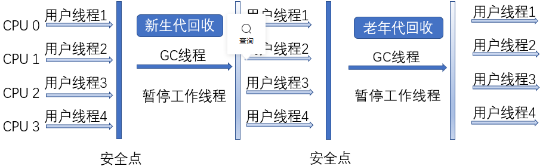

## ParNew收集器

ParNew收集器其实就是Serial收集器的多线程版本，除了使用**多线程进行垃圾回收之外，其余可控参数，收集算法，停止工作线程，对象分配原则，回收策略等与Serial收集器完全一致**。

除了多线程实现垃圾收集之外，其他没有什么太多创新之处，但是它确实Server模式下的新生代的首选的虚拟机收集器。其中一个重要的原因就是除了Serial收集器外，只有它能与CMS配合使用。在JDK1.5时期，HotSpot推出了一款在强交互应用划时代的收集器CMS，这款收集器是HotSpot第一款真正意义上的并发收集器，第一次实现了垃圾回收与工作线程同时工作的可能性，换而言之，你可以边污染，边收集。

不过CMS作为老年代的收集器，却无法与1.4中发布的最新的新生代垃圾收集器配合使用，反之只能使用Serial或者Parnew中的一个。ParNew收集器可以使用-XX:+UseParNewGC强行指定它，或者使用-XX:+UseConcMarkSweepGC选项后的默认新生代收集器。

ParNew收集器在单CPU环境下绝对不会有比Serial收集器更好的效果，甚至优于存在线程交互开销，该收集器在通过超线程技术实现的两个CPU的环境下都不能保证百分之百超越Serial收集器。当然，随着CPU数量的增加，对于GC时系统的有效资源利用还是很有好处的。在CPU非常多的情况下，可以使用-XX:ParallelGCThreads来限制垃圾回收线程的数量。

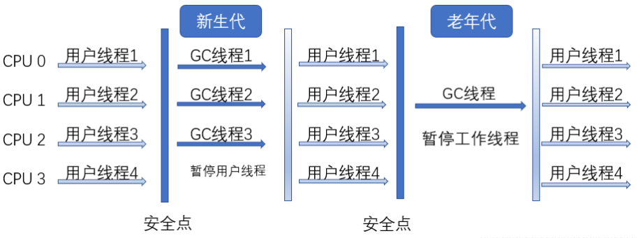

## Parallel Scavenge收集器

Parallel Scavenge收集器是一个新生代收集器，采用复制算法，又是并行的**多线程**垃圾收集器。

它的关注点与其它收集器的关注点不一样，CMS等收集器的关注点在于缩短垃圾回收时用户线程停止的时间，而Parallel Scavenge收集器则是达到一个**可控制的吞吐量**，所谓吞吐量就是CPU运行用户线程的时间与CPU运行总时间的比值，

即 吞吐量 = （用户线程工作时间）/（用户线程工作时间 + 垃圾回收时间），比如虚拟机总共运行100分钟，垃圾收集消耗1分钟，则吞吐量为99%。

停顿时间越短越适合与用户交互的程序，良好的响应速度能提高用户体验，但是高吞吐量则可以高效率的利用CPU的时间，尽快完成程序的运算任务，主要适合在后台运算而不需要太多交互的程序。

有两个参数控制吞吐量，分别为最大垃圾收集时间： -XX:MaxGCPauseMills， 直接设置吞吐量的大小: -XX:GCTimeRatio

-XX:+UseAdaptiveSizePolicy	自适应策略也是Parallel Scavenge收集器区别去Parnew收集器的重要一点

## Serial Old收集器

Serial Old收集器是Serial收集器的**老年代**版本，它同样是一个**单线程**收集器，使用标记-整理算法，这个收集器的主要目的也是在与给Client模式下使用。

如果在Server模式下，还有两种用途，一种是在jdk5以前的版本中配合Parallel Scavenge收集器使用，另一种用途作为CMS的备用方案，在并发收集发生Concurrent Mode Failure时使用。

## Parallel Old收集器

Parallel Old收集器是Parallel Scavenge收集器的**老年代**版本，使用**多线程**和标记-整理算法，这个收集器在jdk6中才开始使用的，在此之前Parallel Scavenge收集器一直处于比较尴尬的阶段，

原因是，如果新生代采用了Parallel Scavenge收集器，那么老年代除了Serial Old之外，别无选择，由于老年代Serial在服务端的拖累，使得使用了Parallel Scavenge收集器也未必能达到吞吐量最大化的效果，由于单线程的老年代无法充分利用服务器多CPU的处理能力，在老年代很大而且硬件比较高级的环境中，这种组合的吞吐量甚至不如Parallel Scavenge收集器 + CMS。

直到Parallel Old收集器出现后，"吞吐量优先收集器"终于有了名副其实的组合，在注重吞吐量优先和CPU资源敏感的场合，可以采用Parallel Scavenge收集器 + Parallel Old收集器

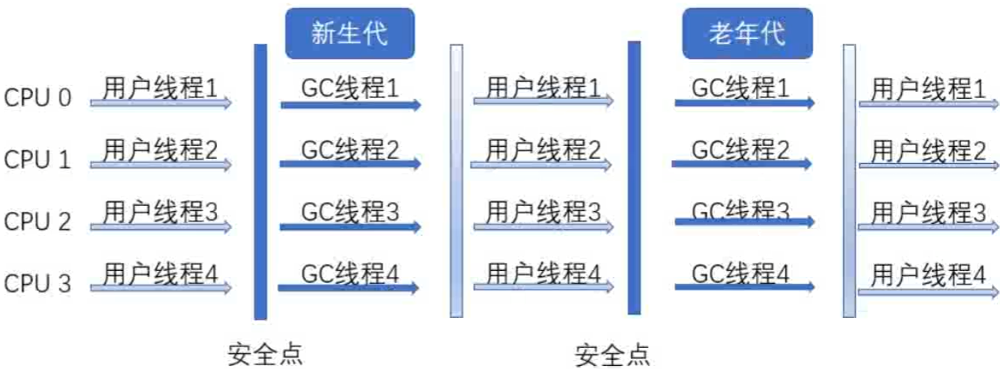

## CMS收集器

CMS收集器是一种**以获取最短停顿时间为目标**的收集器。从名字(Concurrent Mark Sweep)上就可以看出，采用的**标记-清除**算法，它的过程分为4个步骤：

只有初始标记和重新标记需要暂停用户线程。

1. 初始标记(STW) — 仅仅关联GC Roots能直接关联到的对象，速度很快
2. 并发标记 — 进行GC Roots Tracing的过程
3. 重新标记(STW) — 为了修正并发标记期间，因用户程序运作而导致标记产生变动的那一部分对象的标记记录
4. 并发清除

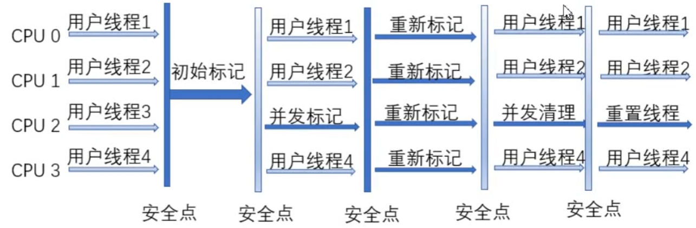

由于整个过程中耗时最长的并发标记和并发清除过程收集器都能与用户线程一起工作，所以总的来说，CMS的内存回收过程与用户线程一起并发执行的

CMS收集器的三大缺点：

1. CMS收集器对CPU资源非常敏感
2. 无法处理浮动垃圾
3. 因为基于标记清除算法，所以会有大量的垃圾碎片产生-XX:+UseCMSCompactAtFullCollection

## G1收集器

首先, G1的设计原则就是简单可行的性能调优

-XX:+UseG1GC -Xmx32g -XX:MaxGCPauseMills-200

其中-XX:+UseG1GC为开启G1垃圾收集器, -Xmx32g设计堆内存的最大内存为32G, -xxMaxGCPauseMillis-200置GC的最大暂停时间为200ms.如果我们需要调优,在内存大小一定的情况下,我们只需要修改最大暂停时间即可。

1. 内存分配
2. Young垃圾回收
3. Mix垃圾回收

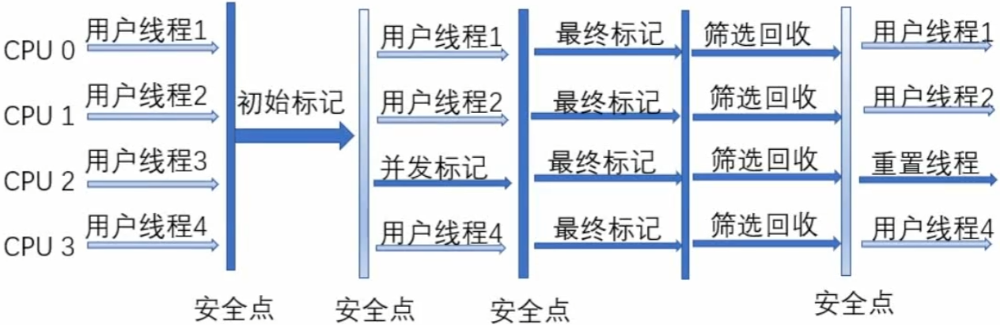

# JVM常见参数设置

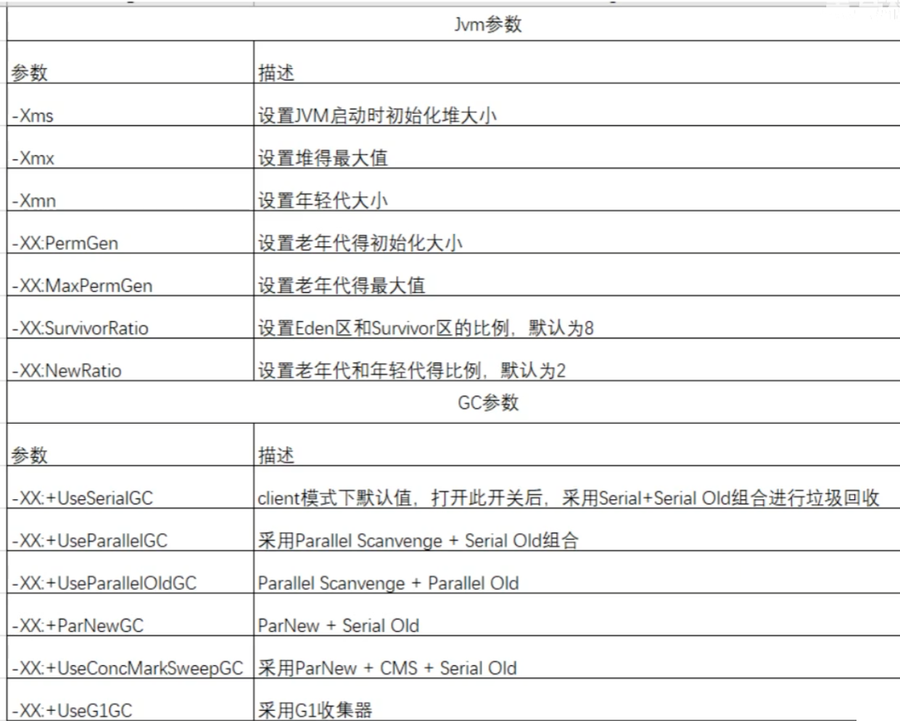

