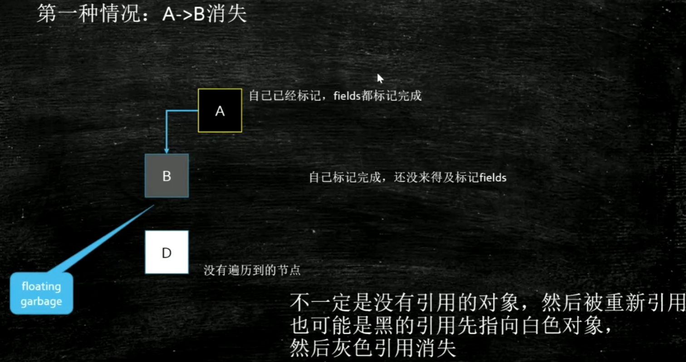

> 根可达算法

## 三色标记 第一种情况

## 三色标记 第二种情况

> 写屏障 把"黑"写成"灰"

> (并发标记, 产生漏标) 回收线程还没标记完A, 只标记属性1(即A为"灰色"), 切换到业务线程, 此时业务线程把属性1指向对象D, 把A标记成"灰色"  切回到回收线程的时候, 回收线程继续做没完成的事情, 也就是标记属性2(不会再管已经标记过的属性1), 然后将A标记成"黑色", 此时D漏标
>
> 所以, CMS的remark阶段, 必须从头扫描一遍

## G1

> 物理不分区, 逻辑分区

1. 追求吞吐量

- 100 cpu
- 99 app 1 GC
- 吞吐量=99%

2. 追求响应时间

- XX:MaxGCPauseMillis 200

- 对STW进行控制

3. 灵活

- 分Region回收
- 优先回收**花费时间少、垃圾比例高**的Region

