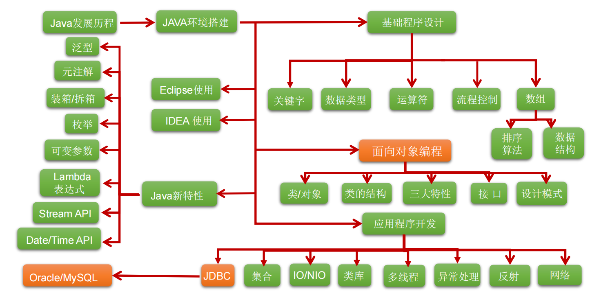
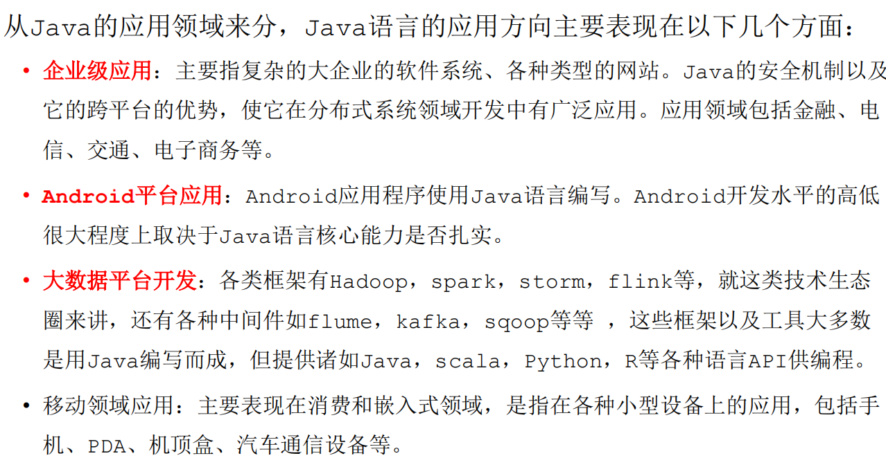
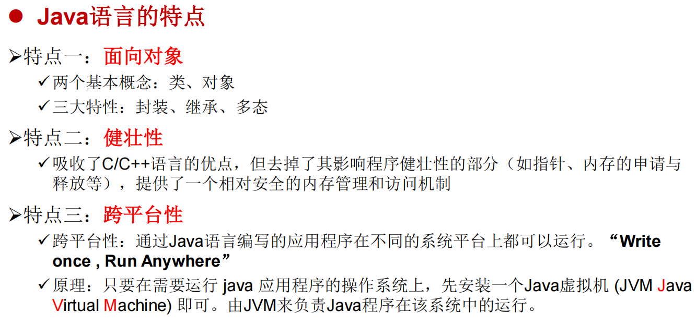
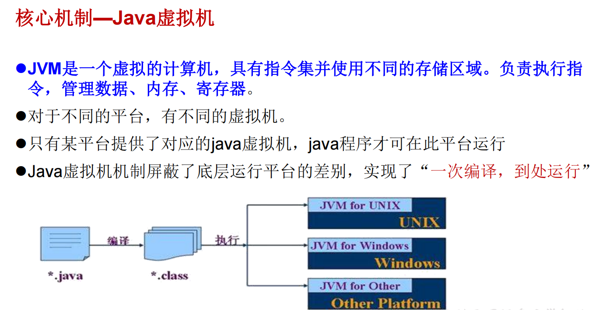
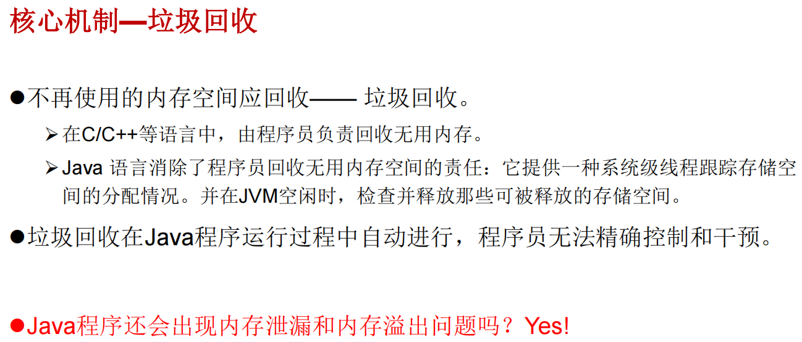
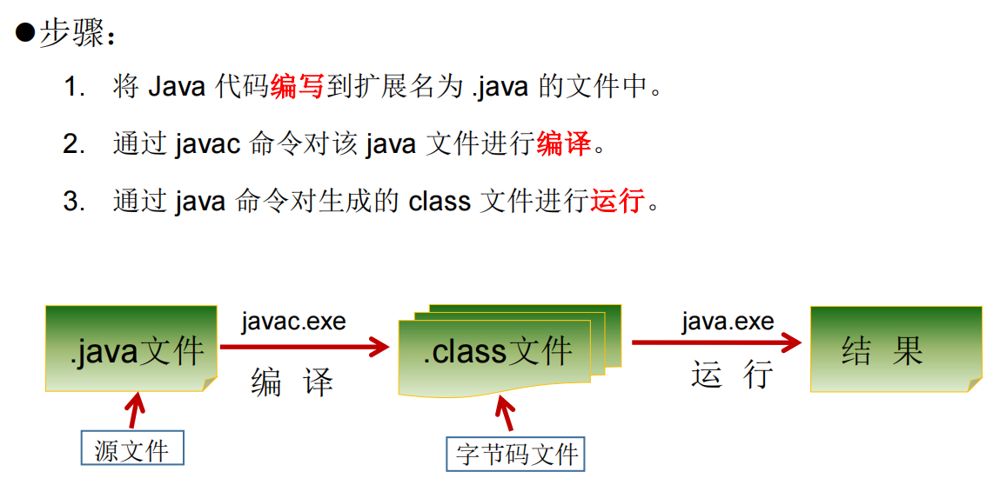

```shell
用于注解说明解释程序的文字就是注释
Java中的注释类型：
 单行注释
 多行注释
 文档注释 (java特有) 
提高了代码的阅读性；调试程序的重要方法
注释是一个程序员必须要具有的良好编程习惯
将自己的思想通过注释先整理出来，再用代码去体现
```

```shell
单行注释
	格式： //注释文字
多行注释
	格式： /* 注释文字 */ 

注：
对于单行和多行注释，被注释的文字，不会被JVM（java虚拟机）解释执行
多行注释里面不允许有多行注释嵌套
```

```shell
文档注释（Java特有）
格式：/**
    @author 指定java程序的作者
    @version 指定源文件的版本
	*/
注释内容可以被JDK提供的工具 javadoc 所解析，生成一套以网页文件形式体现的该程序的说明文档

操作方式: javadoc -d name1 -author -version xxx.java
```


```shell
API （Application Programming Interface,应用程序编程接口）是 Java 提供的基本编程接口。

Java语言提供了大量的基础类，因此 Oracle 也为这些基础类提供了相应的
API文档，用于告诉开发者如何使用这些类，以及这些类里包含的方法
```


```shell
在一个java源文件中可以声明多个class。但是,只能最多有一个类声明为public的
而且要求声明为public的类的类名必须与源文件名相同

```

