### 保留字与关键字

```shell
关键字(keyword)的定义和特点
	定义：被Java语言赋予了特殊含义，用做专门用途的字符串（单词）
	特点：关键字中所有字母都为小写
```

```shell
保留字：现有Java版本尚未使用，但以后版本可能会作为关键字使用。
自己命名标识符时要避免使用这些保留字
goto 、const
```

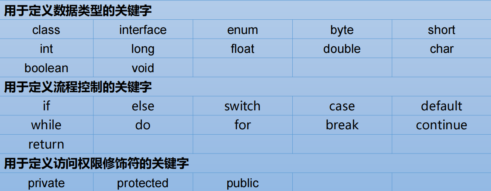

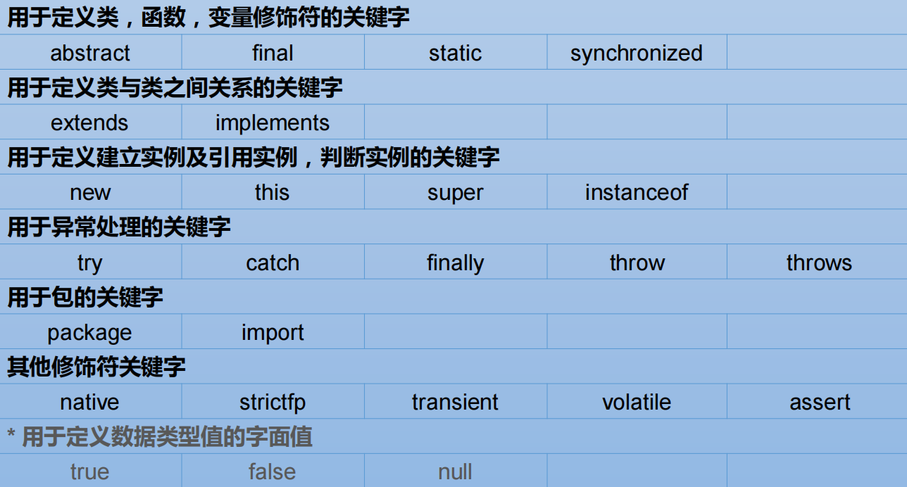


### 标识符

```shell
标识符：
	Java 对各种变量、方法和类等要素命名时使用的字符序列称为标识符
	技巧：凡是自己可以起名字的地方都叫标识符
```

```shell
定义合法标识符规则：
	由26个英文字母大小写，0-9 ，_或 $ 组成
	数字不可以开头。
	不可以使用关键字和保留字，但能包含关键字和保留字。
	Java中严格区分大小写，长度无限制。
	标识符不能包含空格。
```

```shell
Java中的名称命名规范：
	包名：多单词组成时所有字母都小写：xxxyyyzzz
	类名、接口名：多单词组成时，所有单词的首字母大写：XxxYyyZzz
	变量名、方法名：多单词组成时，第一个单词首字母小写，第二个单词开始每个单词首字母大写：xxxYyyZzz
	常量名：所有字母都大写。多单词时每个单词用下划线连接：XXX_YYY_ZZZ
	
	注意1：在起名字时，为了提高阅读性，要尽量有意义，“见名知意”。
	注意2：java采用unicode字符集，因此标识符也可以使用汉字声明，但是不建议使用
```


### 变量

```shell
变量的概念：
    内存中的一个存储区域
    该区域的数据可以在同一类型范围内不断变化
    变量是程序中最基本的存储单元。包含变量类型、变量名和存储的值

变量的作用：
	用于在内存中保存数据
	
使用变量注意：
    Java中每个变量必须先声明，后使用
    使用变量名来访问这块区域的数据
    变量的作用域：其定义所在的一对{}内 变量只有在其作用域内才有效
    同一个作用域内，不能定义重名的变量
```


### 变量类型

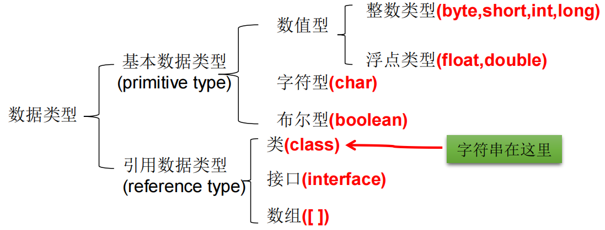

```shell
整数 byte、short、int、long
Java各整数类型有固定的表数范围和字段长度，不受具体OS的影响，以保证java程序的可移植性。
java的整型常量默认为 int 型，声明long型常量须后加‘l’或‘L’
java程序中变量通常声明为int型，除非不足以表示较大的数，才使用long

bit: 计算机中的最小存储单位。byte:计算机中基本存储单元
```

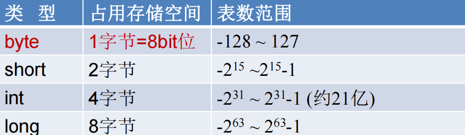


```shell
浮点 float、double
与整数类型类似，Java 浮点类型也有固定的表数范围和字段长度，不受具体操作系统的影响。
浮点型常量有两种表示形式：
	十进制数形式：如：5.12 512.0f .512 (必须有小数点）
	科学计数法形式:如：5.12e2 512E2 100E-2
	
float:单精度，尾数可以精确到7位有效数字。很多情况下，精度很难满足需求
double:双精度，精度是float的两倍。通常采用此类型

Java 的浮点型常量默认为double型，声明float型常量，须后加‘f’或‘F’
```

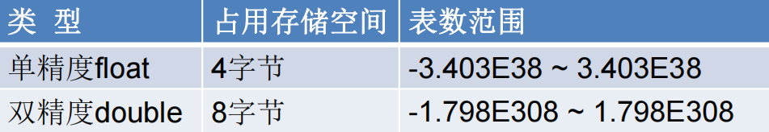


```shell
字符 char
char 型数据用来表示通常意义上“字符”(2字节) Java中的所有字符都使用Unicode编码，故一个字符可以存储一个字母，一个汉字，或其他书面语的一个字符

字符型变量的三种表现形式：
	字符常量是用单引号(‘ ’)括起来的单个字符。例如：char c1 = 'a'; char c2 = '中'; char c3 = '9';
	Java中还允许使用转义字符‘\’来将其后的字符转变为特殊字符型常量。
		例如：char c3 = ‘\n’; // '\n'表示换行符
	直接使用 Unicode 值来表示字符型常量：‘\uXXXX’。其中，XXXX代表一个十六进制整数。如：\u000a 表示 \n。
	
char类型是可以进行运算的。因为它都对应有Unicode码
```

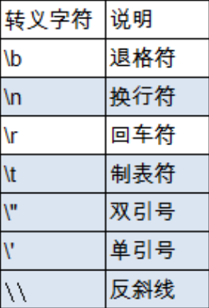


```shell
布尔 boolean
boolean 类型用来判断逻辑条件，一般用于程序流程控制：
	if条件控制语句；
	while循环控制语句；
	do-while循环控制语句；
	for循环控制语句；
	
boolean类型数据只允许取值true和false，无null
	不可以使用0或非 0 的整数替代false和true，这点和C语言不同
	Java虚拟机中没有任何供boolean值专用的字节码指令，Java语言表达所操作的boolean值，在编译之后都使用java虚拟机中的int数据类型来代替：true用1表示，false用0表示
```

```shell
字符串 String
String不是基本数据类型，属于引用数据类型
使用方式与基本数据类型一致。例如：String str = “abcd”
一个字符串可以串接另一个字符串，也可以直接串接其他类型的数据 例如：
	str = str + “xyz”;
    int n = 100;
    str = str + n;
```


### 基本数据类型转换

##### 自动类型转换

```shell
容量小的类型自动转换为容量大的数据类型。数据类型按容量大小排序为 byte、char、short -> int -> long -> float -> double
此时的容量大小指的是,表示数的范围的大和小, 而非字节的大小。比如:float容量要大于long的容量
```

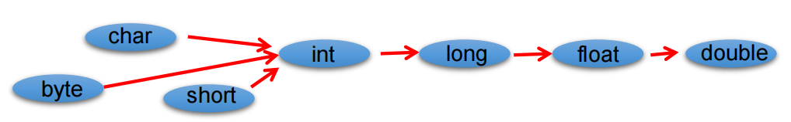

```shell
有多种类型的数据混合运算时，系统首先自动将所有数据转换成容量最大的那种数据类型，然后再进行计算
byte,short,char之间不会相互转换，他们三者在计算时首先转换为int类型
boolean类型不能与其它数据类型运算
当把任何基本数据类型的值和字符串(String)进行连接运算时(+)，基本数据类型的值将自动转化为字符串(String)类型
```

##### 强制类型转换

```shell
自动类型转换的逆过程，将容量大的数据类型转换为容量小的数据类型
使用时要加上强制转换符：()，但可能造成精度降低或溢出,格外要注意

通常，字符串不能直接转换为基本类型，但通过基本类型对应的包装类则可以实现把字符串转换成基本类型

如： String a = “43”;
	int i = Integer.parseInt(a);

boolean类型不可以转换为其它的数据类型
```

​	

### 进制

```shell
所有数字在计算机底层都以二进制形式存在
 
对于整数，有四种表示方式:
    二进制(binary)：0,1 ，满2进1.以0b或0B开头。
    十进制(decimal)：0-9 ，满10进1。 八进制(octal)：0-7 ，满8进1. 以数字0开头表示。
    十六进制(hex)：0-9及A-F，满16进1. 以0x或0X开头表示。此处的A-F不区分大小写。
		如：0x21AF +1= 0X21B0
```


### 二进制

```shell
Java整数常量默认是int类型，当用二进制定义整数时，其第32位是符号位；
当是long类型时，二进制默认占64位，第64位是符号位

二进制的整数有如下三种形式：
    原码：直接将一个数值换成二进制数。最高位是符号位
    负数的反码：是对原码按位取反，只是最高位（符号位）确定为1。
    负数的补码：其反码加1。

计算机以二进制补码的形式保存所有的整数。
    正数的原码、反码、补码都相同
    负数的补码是其反码+1

计算机底层都以补码的方式来存储数据
```

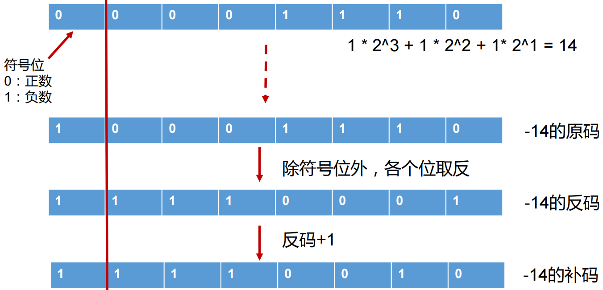

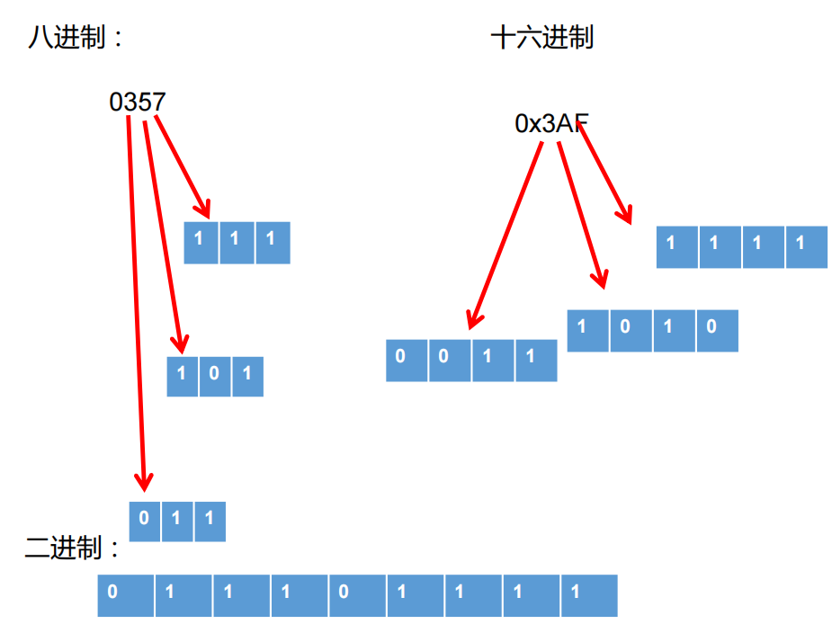


### 算术运算符

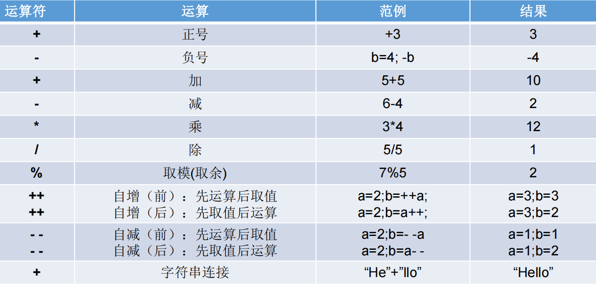

```shell
赋值运算符： +=, -=, *=, /=, %=
```

```java
short s1 = 10;
//s1 = s1 + 2;//编译不通过
s1++;//编译通过, 不会改变变量本身的数据类型
s1 += 2;//编译通过, 不会改变变量本身的数据类型
```


### 比较运算符

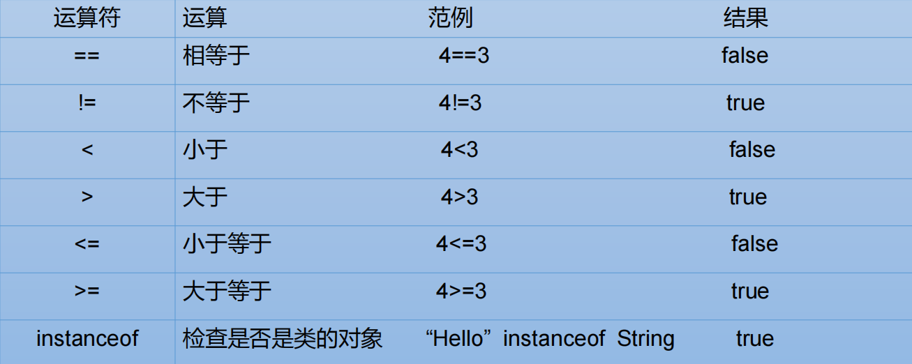

```shell
比较运算符的结果都是boolean型，也就是要么是true，要么是false
```


### 逻辑运算符

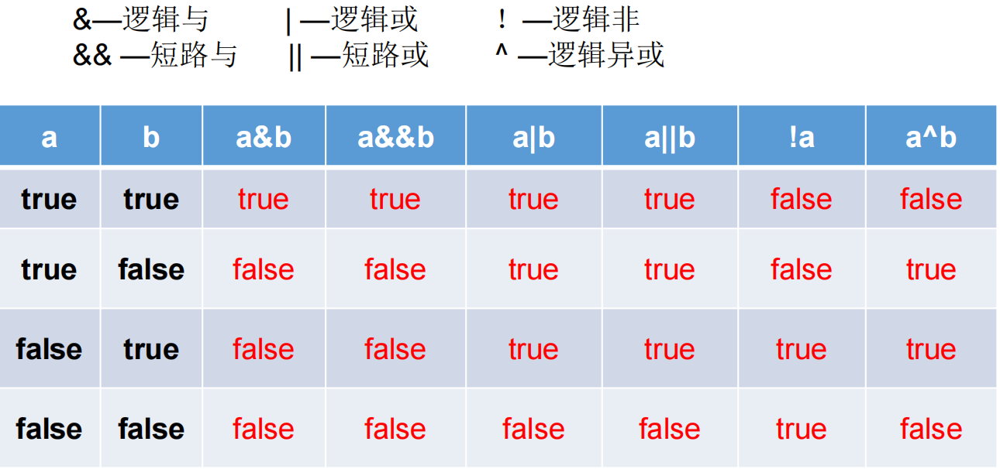

```shell
逻辑运算符用于连接布尔型表达式，在Java中不可以写成3<x<6，应该写成 x>3 & x<6

“&”和“&&”的区别：
	单&时，左边无论真假，右边都进行运算
	双&时，如果左边为真，右边参与运算，如果左边为假，那么右边不参与运算
	
“|”和“||”的区别同理，||表示：当左边为真，右边不参与运算

异或( ^ )与或( | )的不同之处是：当左右都为true时，结果为false
	理解：异或，追求的是“异”
```


### 位运算符

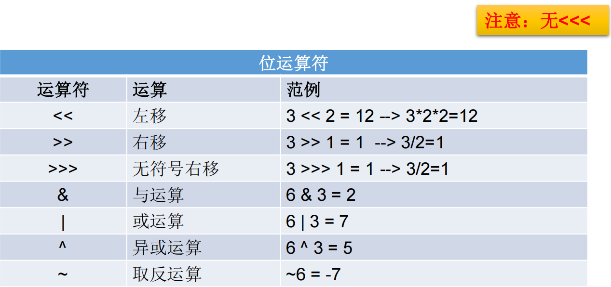

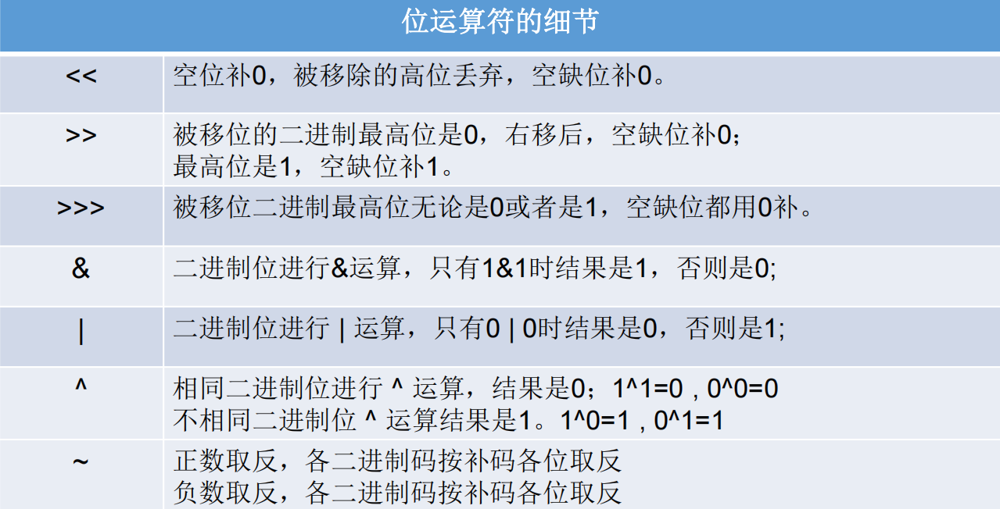

```java
//练习：交换两个变量的值
int num1 = 10;
int num2 = 20;

//方式一：定义临时变量的方式
//推荐的方式
int temp = num1;
num1 = num2;
num2 = temp;

//方式二：好处：不用定义临时变量  
//弊端：① 相加操作可能超出存储范围 ② 有局限性：只能适用于数值类型
//num1 = num1 + num2;
//num2 = num1 - num2;
//num1 = num1 - num2;

//方式三：使用位运算符
//有局限性：只能适用于数值类型
//num1 = num1 ^ num2;
//num2 = num1 ^ num2;
//num1 = num1 ^ num2;
```


### 三元(三目)运算符

```shell
 (条件表达式)?表达式1：表达式2；
 表达式1和表达式2为同种类型
 
三元运算符与if-else的联系与区别：
	三元运算符可简化if-else语句
	三元运算符要求必须返回一个结果
	if后的代码块可有多个语句
	凡是可以使用三元运算符的地方, 都可以改写成为if-else; 反之, 不成立
	优先选择三元运算符; 原因: 简洁、执行效率高
```


 ### 运算符优先级

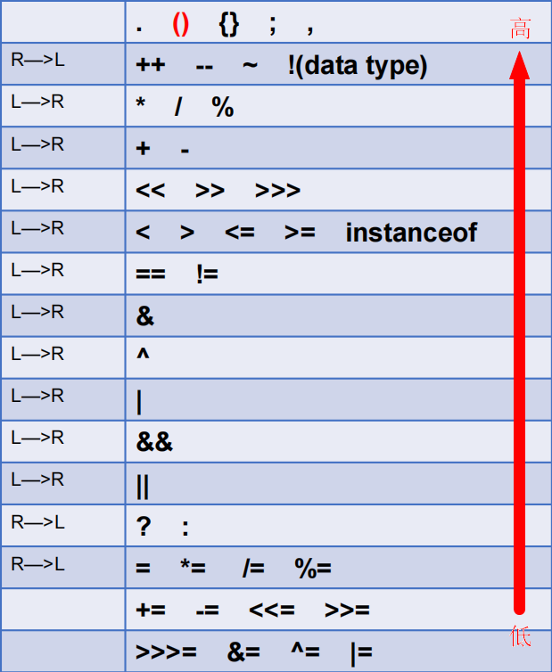

```shell
运算符有不同的优先级，所谓先级就是表达式运算中的运算顺序
只有单目运算符、三元运算符、赋值运算符是从右向左运算的
```


### 程序流程控制

```shell
顺序结构
	程序从上到下逐行地执行，中间没有任何判断和跳转。
分支结构
	根据条件，选择性地执行某段代码。
	有if…else和switch-case两种分支语句。
循环结构
	根据循环条件，重复性的执行某段代码。
	有while、do…while、for三种循环语句。
	注：JDK1.5提供了foreach循环，方便的遍历集合、数组元素
```

##### 分支结构

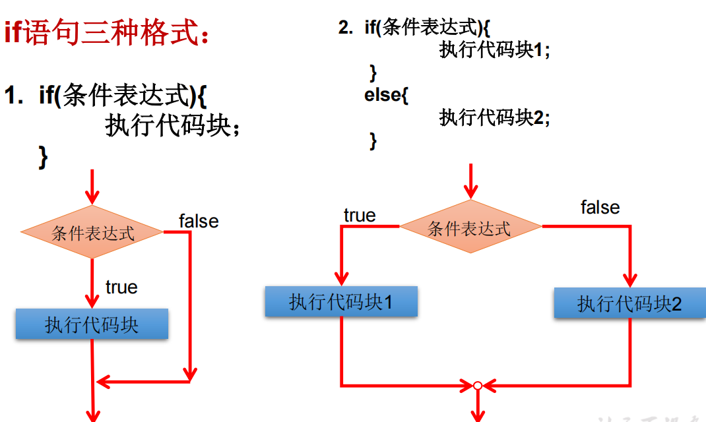

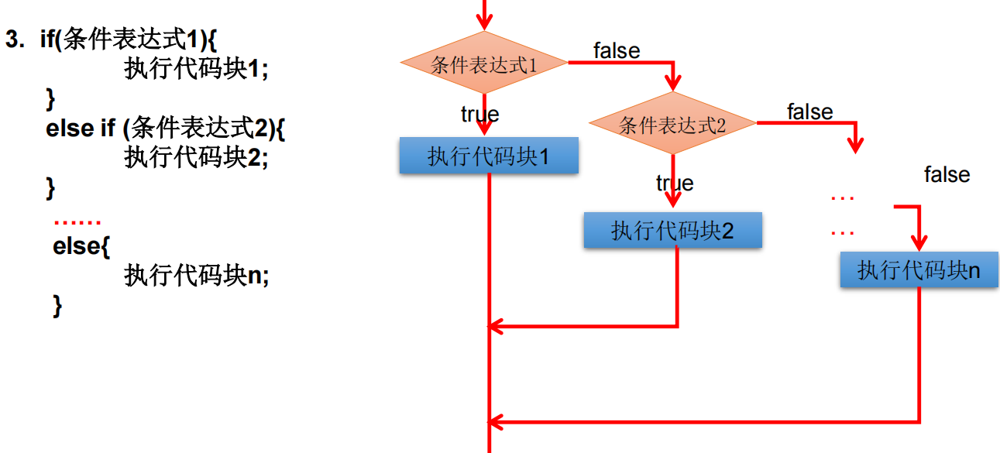

```shell
条件表达式必须是布尔表达式（关系表达式或逻辑表达式）、布尔变量
语句块只有一条执行语句时，一对{}可以省略，但建议保留
if-else语句结构，根据需要可以嵌套使用
当if-else结构是“多选一”时，最后的else是可选的，根据需要可以省略
当多个条件是“互斥”关系时，条件判断语句及执行语句间顺序无所谓
当多个条件是“包含”关系时，“小上大下 / 子上父下”
```

##### 循环结构


### 随机数

```shell
使用(int)(Math.random() * 90 + 10)产生随机数
Math.random() : [0,1) * 90 --> [0,90) + 10 --> [10,100) --> [10,99]
公式: [a,b] : (int)(Math.random() * (b - a + 1) + a)
```

