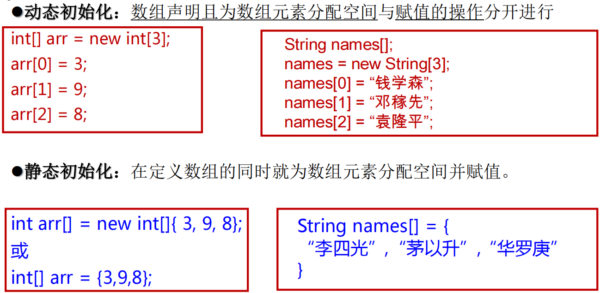
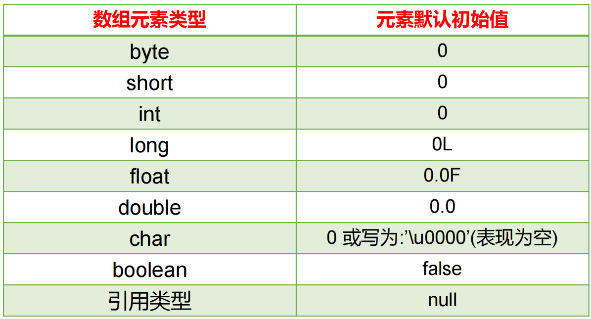
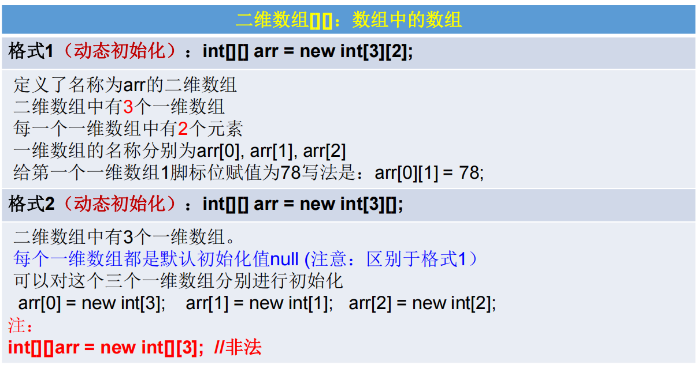
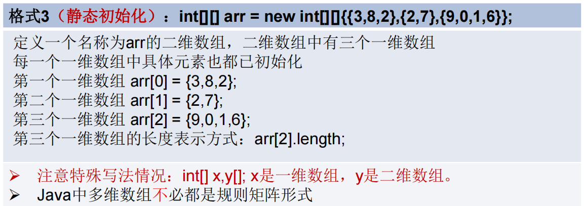

### 数组

```shell
数组(Array)，是多个相同类型数据按一定顺序排列的集合，并使用一个名字命名，并通过编号的方式对这些数据进行统一管理

数组本身是引用数据类型，而数组中的元素可以是任何数据类型，包括基本数据类型和引用数据类型。
创建数组对象会在内存中开辟一整块连续的空间，而数组名中引用的是这块连续空间的首地址。
数组的长度一旦确定，就不能修改。
我们可以直接通过下标(或索引)的方式调用指定位置的元素，速度很快

数组的分类:
按照维度：一维数组、二维数组、三维数组、…
按照元素的数据类型分：基本数据类型元素的数组、引用数据类型元素的数组(即对象数组)
```



```shell
定义并用运算符new为之分配空间后，才可以引用数组中的每个元素；
数组元素的引用方式：数组名[数组元素下标]
    数组元素下标可以是整型常量或整型表达式。如a[3] , b[i] , c[6*i];
    数组元素下标从0开始；长度为n的数组合法下标取值范围: 0 —>n-1；
		如int a[]=new int[3]; 可引用的数组元素为a[0]、a[1]、a[2]
每个数组都有一个属性length指明它的长度，例如：a.length 指明数组a的长度(元素个数) 
	数组一旦初始化，其长度是不可变的
```



### 多维数组

```shell
Java 语言里提供了支持多维数组的语法
如果说可以把一维数组当成几何中的线性图形，那么二维数组就相当于是一个表格，像右图Excel中的表格一样
对于二维数组的理解，我们可以看成是一维数组array1又作为另一个一维数组array2的元素而存在。其实，从数组底层的运行机制来看，其实没有多维数组
```



