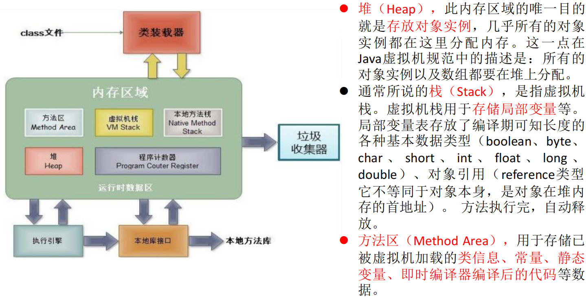

```shell
虚拟机栈,即为平时提到的栈结构。我们将局部变量存储在栈结构中
堆,我们将new出来的结构(比如:数组、对象)加载在对空间中。补充:对象的属性(非static的)加载在堆空间中。
方法区:类的加载信息、常量池、静态域
```

### 类与对象

```shell
面向过程(POP) 与 面向对象(OOP)
	二者都是一种思想，面向对象是相对于面向过程而言的。面向过程，强调的是功能行为，以函数为最小单位，考虑怎么做。面向对象，将功能封装进对象，强调具备了功能的对象，以类/对象为最小单位，考虑谁来做。
	面向对象更加强调运用人类在日常的思维逻辑中采用的思想方法与原则，如抽象、分类、继承、聚合、多态等。
```

```shell
面向对象的三大特征
    封装 (Encapsulation)
    继承 (Inheritance)
    多态 (Polymorphism)
```

```shell
类(Class)和对象(Object)是面向对象的核心概念。
	类是对一类事物的描述，是抽象的、概念上的定义
	对象是实际存在的该类事物的每个个体，因而也称为实例(instance)
```

```shell
Field = 属性 = 成员变量 = 域、字段
Method = (成员)方法 = 函数
```

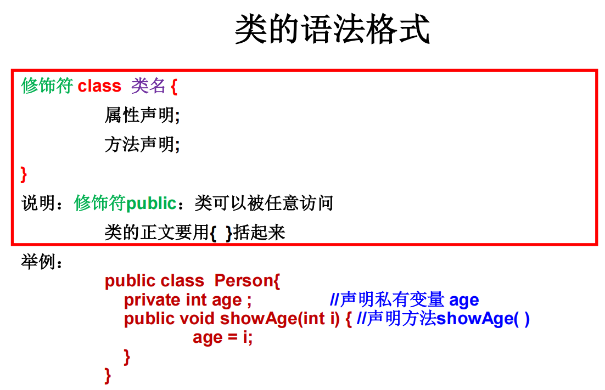

### 属性

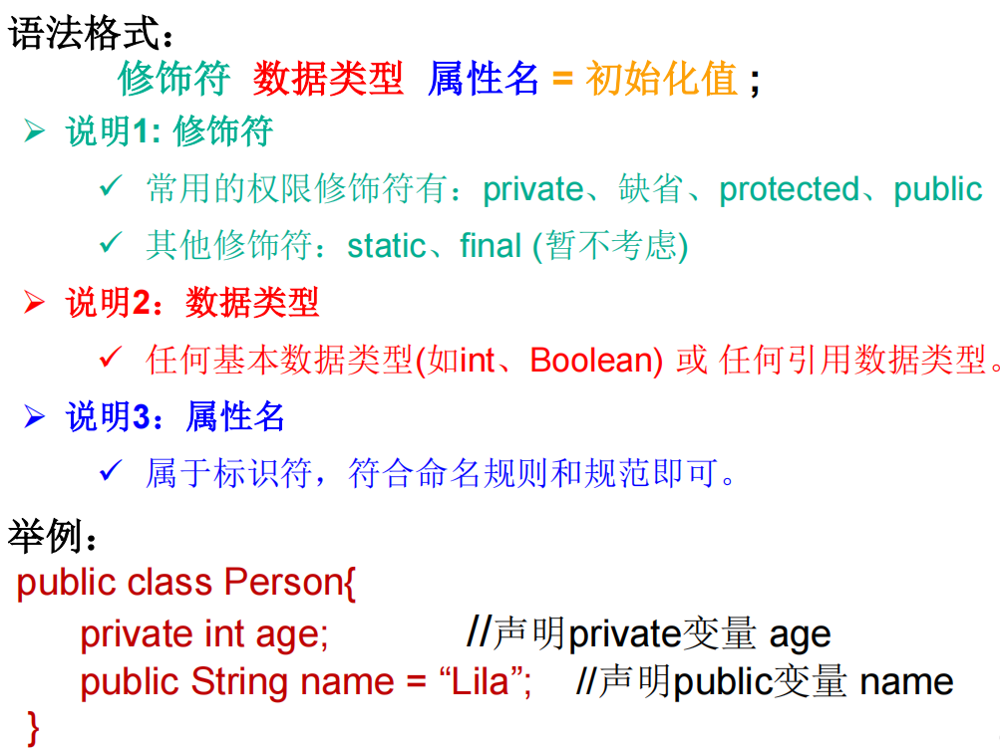

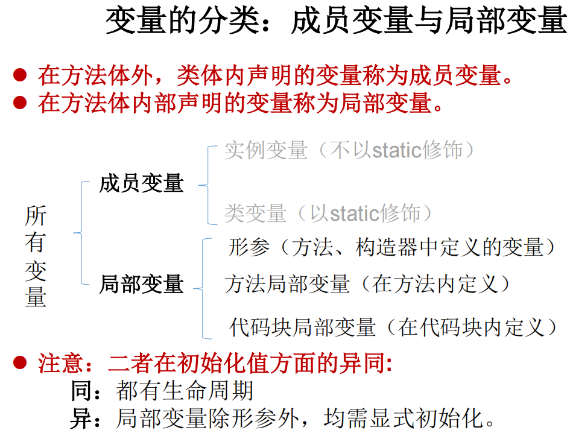

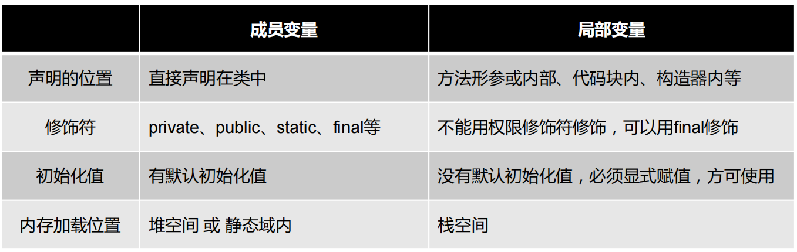

```shell
当一个对象被创建时，会对其中各种类型的成员变量自动进行初始化赋值
```

### 匿名对象

```shell
我们也可以不定义对象的句柄，而直接调用这个对象的方法。这样的对象叫做匿名对象。
	如：new Person().shout();

如果对一个对象只需要进行一次方法调用，那么就可以使用匿名对象。
我们经常将匿名对象作为实参传递给一个方法调用。
```

### 方法

```shell
什么是方法(method、函数):
    方法是类或对象行为特征的抽象，用来完成某个功能操作。在某些语言中也称为函数或过程。
    将功能封装为方法的目的是，可以实现代码重用，简化代码
    Java里的方法不能独立存在，所有的方法必须定义在类里
```

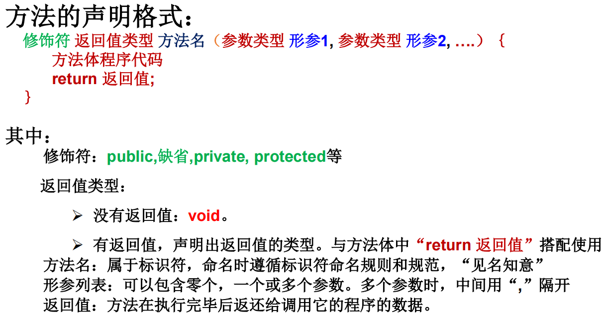

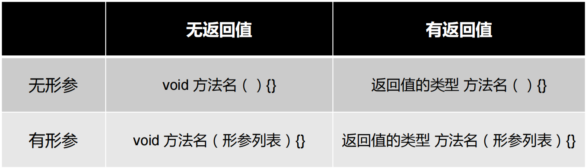

```shell
return关键字的使用:
1.使用范围:使用在方法体中
2.作用: 
	①结束方法
	②针对于有返回值类型的方法,使用"return 数据;"方法返回所要的数据。
3.注意点: return关键字后面不可以声明执行语句。
```

```shell
方法被调用一次，就会执行一次
没有具体返回值的情况，返回值类型用关键字void表示，那么方法体中可以不必使用return语句。如果使用，仅用来结束方法。
定义方法时，方法的结果应该返回给调用者，交由调用者处理。 
方法中只能调用方法或属性，不可以在方法内部定义方法
```

##### 方法的重载

```shell
重载的概念
在同一个类中，允许存在一个以上的同名方法，只要它们的参数个数或者参数类型不同即可。
两同一不同

重载的特点：
与返回值类型无关，只看参数列表，且参数列表必须不同。(参数个数或参数类型)。调用时，根据方法参数列表的不同来区别。

重载示例：
//返回两个整数的和
int add(int x,int y){return x+y;}
//返回三个整数的和
int add(int x,int y,int z){return x+y+z;}
//返回两个小数的和
double add(double x,double y){return x+y;}
```

##### 可变个数的形参

```shell
1. 声明格式：方法名(参数的类型名 ...参数名)
2. 可变参数：方法参数部分指定类型的参数个数是可变多个：0个，1个或多个
3. 可变个数形参的方法与同名的方法之间，彼此构成重载
4. 可变参数方法的使用与方法参数部分使用数组是一致的
5. 方法的参数部分有可变形参，需要放在形参声明的最后
6. 在一个方法的形参位置，最多只能声明一个可变个数形参
```

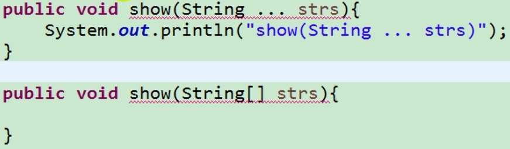

```shell
上图方法定义方式, 不可以共存, 存在历史遗留问题

//JDK 5.0以前：采用数组形参来定义方法，传入多个同一类型变量
public static void test(int a ,String[] books);
//JDK5.0：采用可变个数形参来定义方法，传入多个同一类型变量
public static void test(int a ,String…books);

方法形参:String…books , 实参可以写成数组 => new String[]{"A", "B"}
```

##### 方法参数的值传递机制

```shell
方法，必须由其所在类或对象调用才有意义。若方法含有参数：
	形参：方法声明时的参数
	实参：方法调用时实际传给形参的参数值
```

```shell
Java的实参值如何传入方法呢？
Java里方法的参数传递方式只有一种：值传递。 即将实际参数值的副本（复制品）传入方法内，而参数本身不受影响。
	形参是基本数据类型：将实参基本数据类型变量的“数据值”传递给形参
	形参是引用数据类型：将实参引用数据类型变量的“地址值”传递给形参
```

##### 递归

```shell
递归方法：一个方法体内调用它自身。
方法递归包含了一种隐式的循环，它会重复执行某段代码，但这种重复执行无须循环控制。
递归一定要向已知方向递归，否则这种递归就变成了无穷递归，类似于死循环。
```

### 封装与隐藏

```shell
高内聚 ：类的内部数据操作细节自己完成，不允许外部干涉
低耦合 ：仅对外暴露少量的方法用于使用

隐藏对象内部的复杂性，只对外公开简单的接口。便于外界调用，从而提高系统的可扩展性、可维护性。通俗的说，把该隐藏的隐藏起来，该暴露的暴露出来。这就是封装性的设计思想
```

```shell
Java中通过将数据声明为私有的(private)，再提供公共的（public）方法:getXxx()和setXxx()实现对该属性的操作

目的: 
隐藏一个类中不需要对外提供的实现细节
使用者只能通过事先定制好的方法来访问数据，可以方便地加入控制逻辑，限制对属性的不合理操作
便于修改，增强代码的可维护性
```

### 四种访问权限修饰符

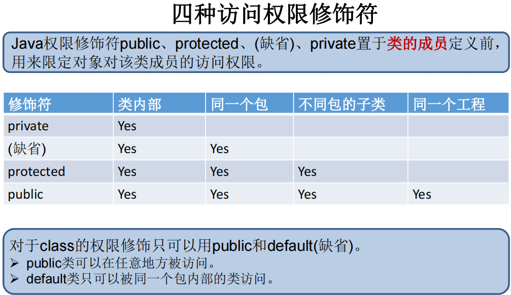

### 构造器

```shell
构造器的特征
	它具有与类相同的名称
	它不声明返回值类型。（与声明为void不同）
	不能被static、final、synchronized、abstract、native修饰，不能有return语句返回值
	
构造器的作用：创建对象；给对象进行初始化
	如：Order o = new Order(); Person p = new Person(“Peter”,15);
	
语法格式：
    修饰符 类名 (参数列表) {
    	初始化语句；
    }
```

```shell
根据参数不同，构造器可以分为如下两类：
	隐式无参构造器（系统默认提供）
	显式定义一个或多个构造器（无参、有参）

注 意：
	Java语言中，每个类都至少有一个构造器
	默认构造器的修饰符与所属类的修饰符一致
	一旦显式定义了构造器，则系统不再提供默认构造器 
	一个类可以创建多个重载的构造器
	父类的构造器不可被子类继承
```

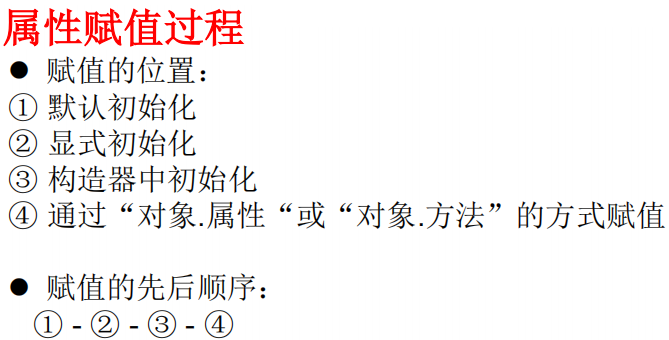

### JavaBean

```shell
JavaBean是一种Java语言写成的可重用组件。

所谓javaBean，是指符合如下标准的Java类：
	类是公共的
	有一个无参的公共的构造器
	有属性，且有对应的get、set方法
	
用户可以使用JavaBean将功能、处理、值、数据库访问和其他任何可以用Java代码创造的对象进行打包，并且其他的开发者可以通过内部的JSP页面、Servlet、其他JavaBean、applet程序或者应用来使用这些对象。用户可以认为JavaBean提供了一种随时随地的复制和粘贴的功能，而不用关心任何改变。
```

### this关键字

```shell
在Java中，this关键字比较难理解，它的作用和其词义很接近。
	它在方法内部使用，即这个方法所属对象的引用；
	它在构造器内部使用，表示该构造器正在初始化的对象。
this 可以调用类的属性、方法和构造器

什么时候使用this关键字呢？
	当在方法内需要用到调用该方法的对象时，就用this。
	具体的：我们可以用this来区分属性和局部变量。
		比如：this.name = name;
```

```shell
1. 在任意方法或构造器内，如果使用当前类的成员变量或成员方法可以在其前面添加this，增强程序的阅读性。不过，通常我们都习惯省略this。
2. 当形参与成员变量同名时，如果在方法内或构造器内需要使用成员变量，必须添加this来表明该变量是类的成员变量
3.使用this访问属性和方法时，如果在本类中未找到，会从父类中查找
4.this可以作为一个类中构造器相互调用的特殊格式 如: this();
```

```shell
可以在类的构造器中使用"this(形参列表)"的方式，调用本类中重载的其他的构造器！
明确：构造器中不能通过"this(形参列表)"的方式调用自身构造器	#理解递归
	如果一个类中声明了n个构造器，则最多有 n - 1个构造器中使用了"this(形参列表)"
"this(形参列表)"必须声明在类的构造器的首行！
在类的一个构造器中，最多只能声明一个"this(形参列表)"
```

### package关键字

```shell
package语句作为Java源文件的第一条语句，指明该文件中定义的类所在的包。(若缺省该语句，则指定为无名包)。
它的格式为：	package 顶层包名.子包名;

包对应于文件系统的目录，package语句中，用 “.” 来指明包(目录)的层次
包通常用小写单词标识。通常使用所在公司域名的倒置：com.xxx.xxx
```

```shell
包的作用：
包帮助管理大型软件系统：将功能相近的类划分到同一个包中。比如：MVC的设计模式
包可以包含类和子包，划分项目层次，便于管理
解决类命名冲突的问题
控制访问权限
```

### MVC设计模式

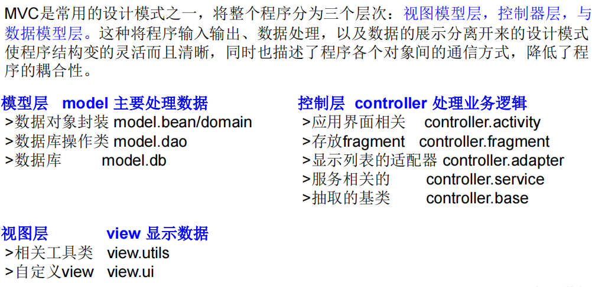

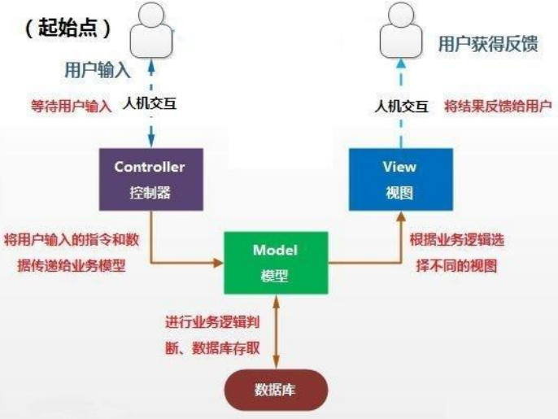

### import关键字

```shell
为使用定义在不同包中的Java类，需用import语句来引入指定包层次下所需要的类或全部类(.*)
import语句告诉编译器到哪里去寻找类

语法格式：import 包名.类名;
```

```shell
1. 在源文件中使用 import 显式的导入指定包下的类或接口
2. 声明在包的声明和类的声明之间。
3. 如果需要导入多个类或接口，那么就并列显式多个 import 语句即可
4. 举例：可以使用 java.util.* 的方式，一次性导入util包下所有的类或接口。
5. 如果导入的类或接口是 java.lang 包下的，或者是当前包下的，则可以省略此import语句。
6. 如果在代码中使用不同包下的同名的类。那么就需要使用类的全类名的方式指明调用的是哪个类。
7. 如果已经导入 java.a 包下的类。那么如果需要使用a包的子包下的类的话，仍然需要导入。
8. import static 组合的使用：调用指定类或接口下的静态的属性或方法	import static导入的不是类或接口, 而是下面的静态结构
```

### 继承性

```shell
为什么要有继承？
	多个类中存在相同属性和行为时，将这些内容抽取到单独一个类中，那么多个类无需再定义这些属性和行为，只要继承那个类即可。
	
此处的多个类称为子类(派生类)，单独的这个类称为父类(基类 或超类)。可以理解为:“子类 is a 父类”
类继承语法规则:	class Subclass extends SuperClass{}

作用：
	继承的出现减少了代码冗余，提高了代码的复用性。
	继承的出现，更有利于功能的扩展。
	继承的出现让类与类之间产生了关系，提供了多态的前提
	
注意：不要仅为了获取其他类中某个功能而去继承

子类继承了父类，就继承了父类的方法和属性。
在子类中，可以使用父类中定义的方法和属性，也可以创建新的数据和方法。
在Java 中，继承的关键字用的是“extends”，即子类不是父类的子集，而是对父类的“扩展”。

关于继承的规则：子类不能直接访问父类中私有的(private)的成员变量和方法。
	特别的,父类中声明为private的属性或方法,子类继承父类以后,仍然认为获取了父类中私有的结构。
	只有因为封装性的影响,使得子类不能直接调用父类的结构而已。

Java只支持单继承和多层继承，不允许多重继承
	一个子类只能有一个父类
	一个父类可以派生出多个子类
```

### 方法的重写

```shell
定义：在子类中可以根据需要对从父类中继承来的方法进行改造，也称为方法的重置、覆盖。在程序执行时，子类的方法将覆盖父类的方法

要求：
1. 子类重写的方法必须和父类被重写的方法具有 相同的方法名称、参数列表
2. 子类重写的方法的 返回值 类型 不能大于 父类被重写的方法的返回值类型
	>父类被重写的方法的返回值类型是void,则子类重写的方法的返回值类型只能是void
	>父类被重写的方法的返回值类型是A类型,则子类重写的方法的返回值类型可以是A类或A类的子类
	>父类被重写的方法的返回值类型是基本数据类型,则子类重写的方法的返回值类型必须是相同的基本数据类型
3. 子类重写的方法使用的 访问权限 不能小于 父类被重写的方法的访问权限
	子类不能重写父类中声明为private权限的方法
4. 子类方法抛出的异常 不能大于 父类被重写方法的异常

注意：
子类与父类中同名同参数的方法必须同时声明为非static的(即为重写)，或者同时声明为static的（不是重写）。
因为static方法是属于类的，子类无法覆盖父类的方法
```

### super关键字

```shell
在Java类中使用super来调用父类中的指定操作：
	super可用于访问父类中定义的属性
	super可用于调用父类中定义的成员方法
	super可用于在子类构造器中调用父类的构造器
	
注意：
	尤其当子父类出现同名成员时，可以用super表明调用的是父类中的成员
	super的追溯不仅限于直接父类
	super和this的用法相像，this代表本类对象的引用，super代表父类的内存空间的标识
```

```shell
子类中所有的构造器 默认 都会访问父类中空参数的构造器
当父类中没有空参数的构造器时，子类的构造器必须通过 this(参数列表) 或者 super(参数列表) 语句指定调用本类或者父类中相应的构造器。同时，只能”二选一”，且必须放在构造器的首行
如果子类构造器中既未显式调用父类或本类的构造器，且父类中又没有无参的构造器，则 编译出错
在类的多个构造器中,至少有一个类的构造器中使用了 super(形参列表) ,调用父类中的构造器
```

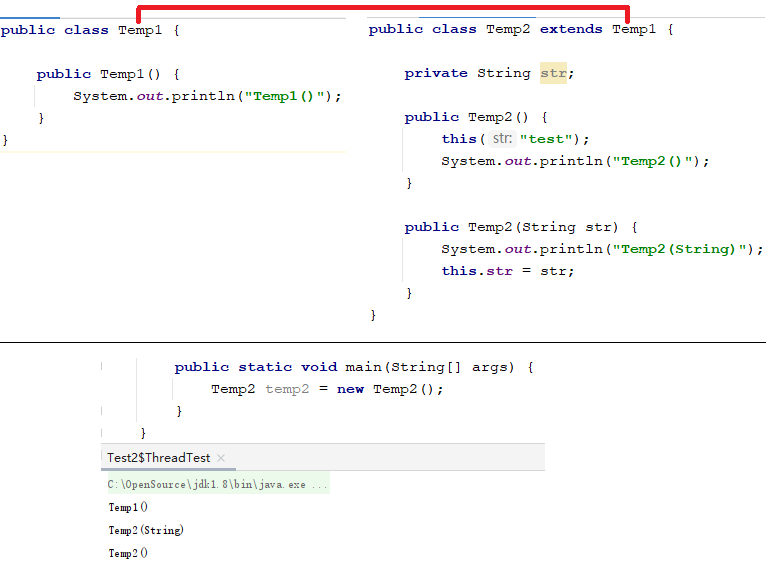

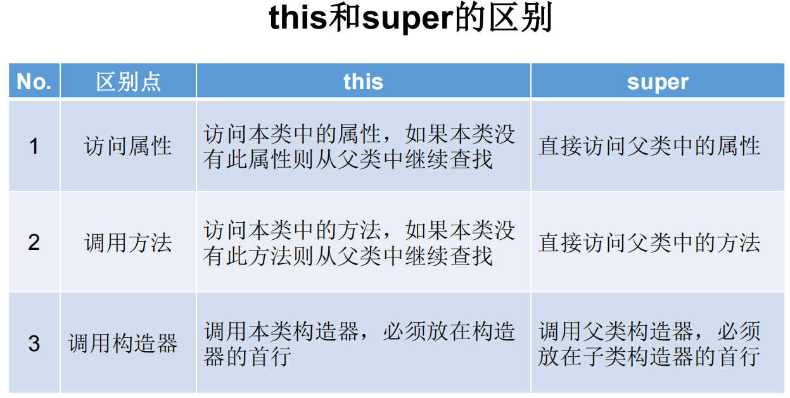

### 子类对象实例化过程

```shell
1.从结果上来看: (继承性)
	子类继承父类以后,就获取了父类中声明的属性或方法。
	创建子类的对象,在堆空间中,就会加载所有父类中声明的属性。

2.从过程上来看:
	当我们通过子类的构造器创建子类对象时,我们一定会直接或间接的调用其父类的构造器,进而调用父类的父类的构造器,直到调用了java.lang.Object类中空参的构造器为止。正因为加载过所有的父类的结构,所以才可以看到内存中有父类中的结构,子类对象才可以考虑进行调用。
	
明确: 虽然创建子类对象时,调用了父类的构造器,但是自始至终就创建过一个对象,即为new的子类对象
```

### 多态性

```shell
多态性，是面向对象中最重要的概念，在Java中的体现：
	对象的多态性：父类的引用指向子类的对象
		可以直接应用在抽象类和接口上

Java引用变量有两个类型：编译时类型和运行时类型。编译时类型由声明该变量时使用的类型决定，运行时类型由实际赋给该变量的对象决定。简称："编译时，看左边；运行时，看右边"
	若编译时类型和运行时类型不一致，就出现了对象的多态性(Polymorphism)
	多态情况下，
		"看左边"：看的是父类的引用（父类中不具备子类特有的方法）
		"看右边"：看的是子类的对象（实际运行的是子类重写父类的方法）
		
对象的多态性,只适用于方法,不适用于 属性(编译和运行都看左边)
```

```shell
对象的多态 —在Java中,子类的对象可以替代父类的对象使用
	一个变量只能有一种确定的数据类型
	一个引用类型变量可能指向(引用)多种不同类型的对象
	
子类可看做是特殊的父类，所以父类类型的引用可以指向子类的对象：向上转型(upcasting)
```

##### 虚拟方法调用

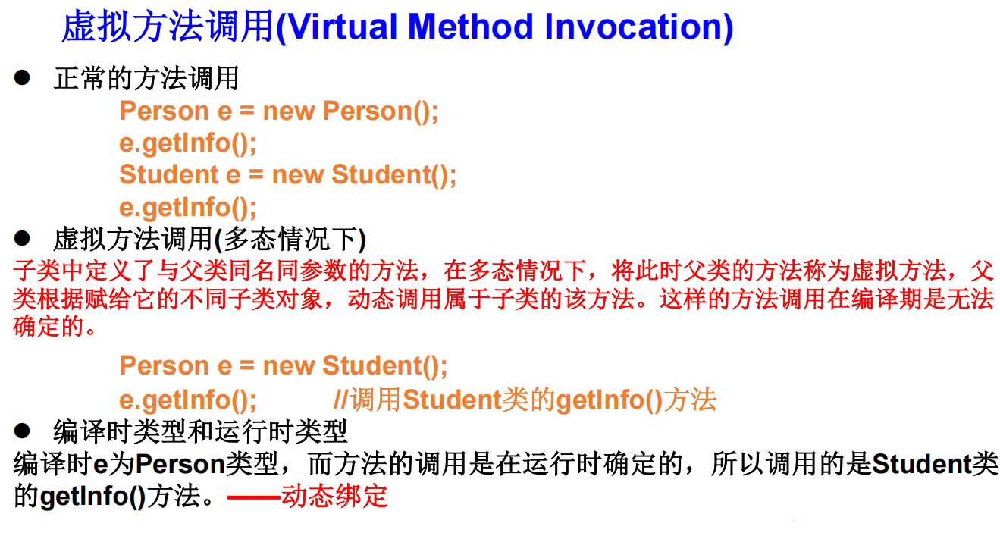

##### **instanceof** 操作符

```shell
x instanceof A：检验x是否为类A的对象，返回值为boolean型。
	要求x所属的类与类A必须是子类和父类的关系，否则编译错误。
	如果x属于类A的子类B，x instanceof A值也为true。
```

```shell
基本数据类型的 Casting：
	自动类型转换：小的数据类型可以自动转换成大的数据类型
		如 long g=20; double d=12.0f
	强制类型转换：可以把大的数据类型强制转换(casting)成小的数据类型
		如 float f=(float)12.0; int a=(int)1200L
```

```shell
对Java对象的强制类型转换称为造型
	从子类到父类的类型转换可以自动进行
	从父类到子类的类型转换必须通过造型(强制类型转换)实现
	无继承关系的引用类型间的转换是非法的
	在造型前可以使用instanceof操作符测试一个对象的类型
```

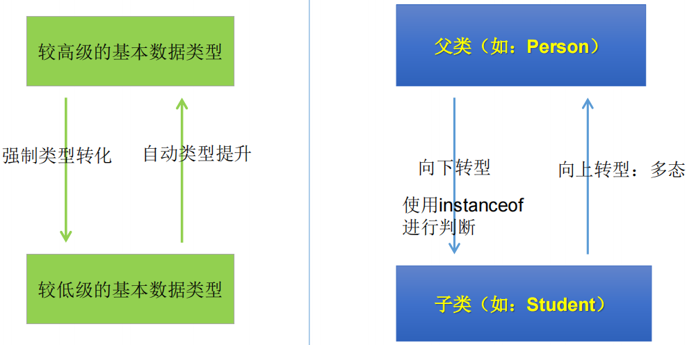

```shell
子类继承父类:
若子类重写了父类方法，就意味着子类里定义的方法彻底覆盖了父类里的同名方法，系统将不可能把父类里的方法转移到子类中。
对于实例变量则不存在这样的现象，即使子类里定义了与父类完全相同的实例变量，这个实例变量依然不可能覆盖父类中定义的实例变量
```

### Object类的使用

```shell
Object类是所有Java类的根父类
如果在类的声明中未使用extends关键字指明其父类，则默认父类 为java.lang.Object类
```

##### ==操作符

```shell
基本类型比较值:只要两个变量的值相等，即为true。
	int a=5; if(a==6){…} 

引用类型比较引用(是否指向同一个对象)：只有指向同一个对象时，==才返回true。
    Person p1=new Person();
    Person p2=new Person();
    if (p1==p2){…} 

用“==”进行比较时，符号两边的数据类型必须兼容(可自动转换的基本数据类型除外)，否则编译出错
```

##### equals方法

```shell
equals()：所有类都继承了Object，也就获得了equals()方法。还可以重写。
	只能比较引用类型，其作用与“==”相同,比较是否指向同一个对象。
	格式:obj1.equals(obj2)
	
特例：当用equals()方法进行比较时，对类File、String、Date及包装类（Wrapper Class）来说，是比较类型及内容而不考虑引用的是否是同一个对象
	原因：在这些类中重写了Object类的equals()方法
	
当自定义使用equals()时，可以重写。用于比较两个对象的“内容”是否都相等
```

```shell
重写equals()方法的原则:
    对称性：如果x.equals(y)返回是“true”，那么y.equals(x)也应该返回是“true”
    自反性：x.equals(x)必须返回是“true”
    传递性：如果x.equals(y)返回是“true”，而且y.equals(z)返回是“true”，那么z.equals(x)也应该返回是“true”
    一致性：如果x.equals(y)返回是“true”，只要x和y内容一直不变，不管你重复x.equals(y)多少次，返回都是“true”	

    任何情况下，x.equals(null)，永远返回是“false”； x.equals(和x不同类型的对象)永远返回是“false”。
```

##### toString方法

```shell
toString()方法在Object类中定义，其返回值是String类型，返回类名和它的引用地址。
在进行String与其它类型数据的连接操作时，自动调用toString()方法
	System.out.println(“now=”+now);
	相当于
	System.out.println(“now=”+now.toString());
可以根据需要在用户自定义类型中重写toString()方法
基本类型数据转换为String类型时，调用了对应包装类的toString()方法
```

### 包装类

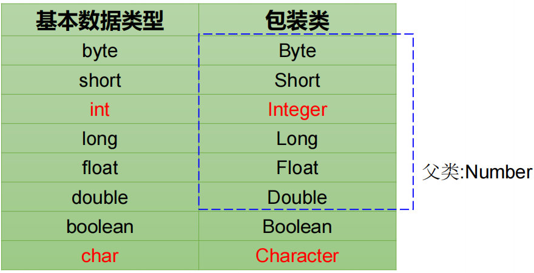

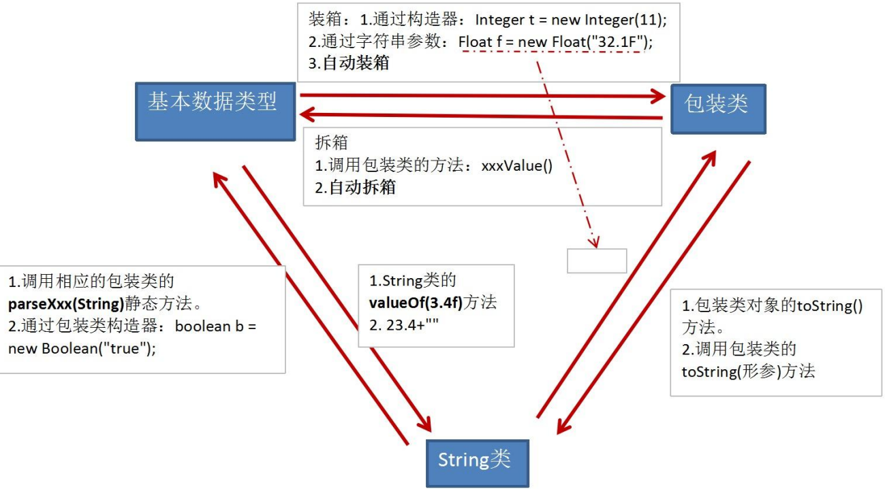

```shell
基本数据类型、包装类与String三者之间如何转换?
自动装箱、自动拆箱
Integer i = 10;

基本数据类型、包装类--->String: valueOf(Xxx xx)
String--->基本数据类型、包装类: parseXxx(String s)
```

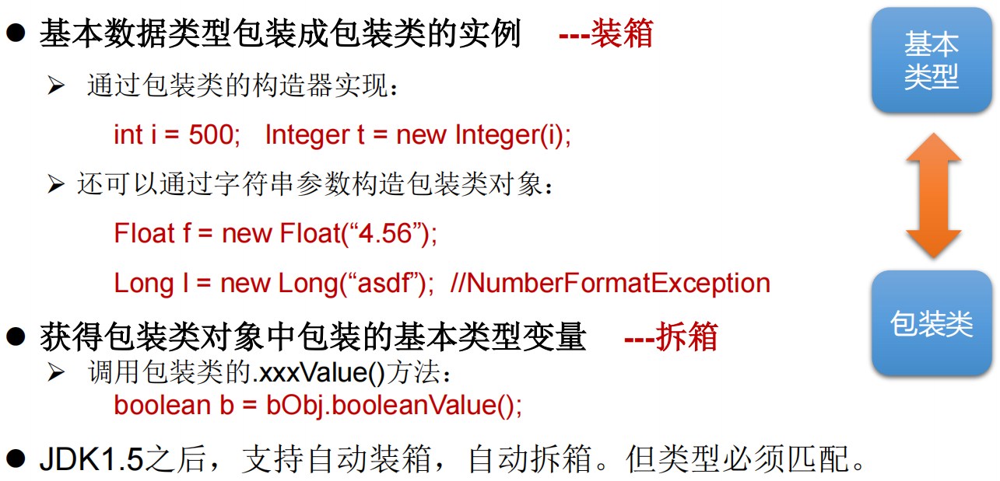

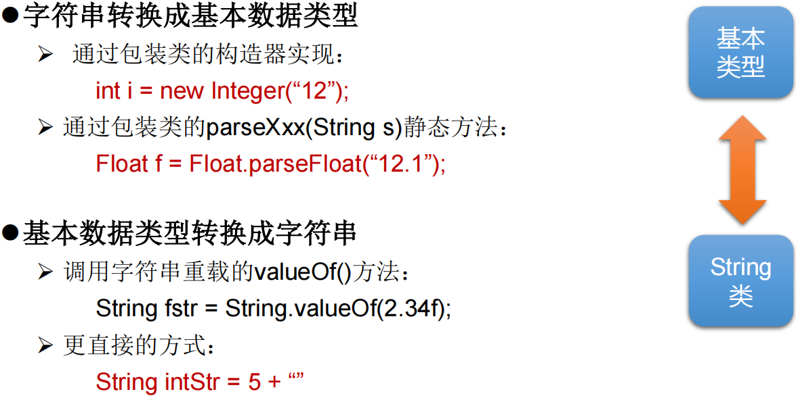

### static关键字

```shell
主要用来修饰类的内部结构
使用范围：
	在Java类中，可用static修饰属性、方法、代码块、内部类

被修饰后的成员具备以下特点：
	随着类的加载而加载
	优先于对象存在
	修饰的成员，被所有对象所共享
	访问权限允许时，可不创建对象，直接被类调用
```

```shell
开发中,如何确定一个属性是否要声明为static的?
	属性是可以被多个对象所共享的,不会随着对象的不同而不同的。
	类中的常量也常常声明为static
	
开发中,如何确定一个方法是否要声明为static的?
	操作静态属性的方法,通常设置为static的
	工具类中的方法,习惯上声明为static的。比如: Math、Arrays、Collections
```

##### 类属性

```shell
类属性作为该类各个对象之间共享的变量。在设计类时,分析哪些属性不因对象的不同而改变，将这些属性设置为类属性。相应的方法设置为类方法
类变量（类属性）由该类的所有实例共享
```

##### 类方法

```shell
如果方法与调用者无关，则这样的方法通常被声明为类方法，由于不需要创建对象就可以调用类方法，从而简化了方法的调用

没有对象的实例时，可以用类名.方法名()的形式访问由static修饰的类方法。
在static方法内部只能访问类的static修饰的属性或方法，不能访问类的非static的结构

因为不需要实例就可以访问static方法，因此static方法内部不能有this。也不能有super
static修饰的方法不能被重写
```

### 单例模式

```shell
单例模式的优点：
    由于单例模式只生成一个实例，减少了系统性能开销，当一个对象的产生需要比较多的资源时，如读取配置、产生其他依赖对象时，则可以通过在应用启动时直接产生一个单例对象，然后永久驻留内存的方式来解决
```

```shell
应用场景:
    网站的计数器，一般也是单例模式实现，否则难以同步。
    应用程序的日志应用，一般都使用单例模式实现，这一般是由于共享的日志文件一直处于打开状态，因为只能有一个实例去操作，否则内容不好追加。
    数据库连接池的设计一般也是采用单例模式，因为数据库连接是一种数据库资源。
    项目中，读取配置文件的类，一般也只有一个对象。没有必要每次使用配置文件数据，都生成一个对象去读取。
    Application 也是单例的典型应用
    Windows的Task Manager (任务管理器)就是很典型的单例模式
    Windows的Recycle Bin (回收站)也是典型的单例应用。在整个系统运行过程中，回收站一直维护着仅有的一个实例
```

### main方法

```shell
由于Java虚拟机需要调用类的main()方法，所以该方法的访问权限必须是public，又因为Java虚拟机在执行main()方法时不必创建对象，所以该方法必须是static的，该方法接收一个String类型的数组参数，该数组中保存执行Java命令时传递给所运行的类的参数
```

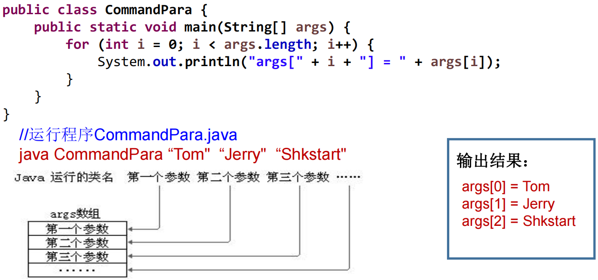

### 代码块

```shell
代码块(或初始化块)的作用：
	对Java类或对象进行初始化

代码块(或初始化块)的分类：
	一个类中代码块若有修饰符，则只能被static修饰，称为静态代码块(static block)，没有使用static修饰的，为非静态代码块
	
static代码块通常用于初始化static的属性
	class Person {
        public static int total;
        static {
        	total = 100;//为total赋初值
        }
        …… //其它属性或方法声明
    }
```

```shell
静态代码块：用static 修饰的代码块
1. 可以有输出语句。
2. 可以对类的属性、类的声明进行初始化操作。
3. 不可以对非静态的属性初始化。即：不可以调用非静态的属性和方法。
4. 若有多个静态的代码块，那么按照从上到下的顺序依次执行。
5. 静态代码块的执行要先于非静态代码块。
6. 静态代码块随着类的加载而加载，且只执行一次。
```

```shell
非静态代码块：没有static修饰的代码块
1. 可以有输出语句。 
2. 可以对类的属性、类的声明进行初始化操作。 
3. 除了调用非静态的结构外，还可以调用静态的变量或方法。 
4. 若有多个非静态的代码块，那么按照从上到下的顺序依次执行。 
5. 每次创建对象的时候，都会执行一次。且先于构造器执行。
```

```shell
(继承)执行顺序总结: 由父及子, 静态先行
```

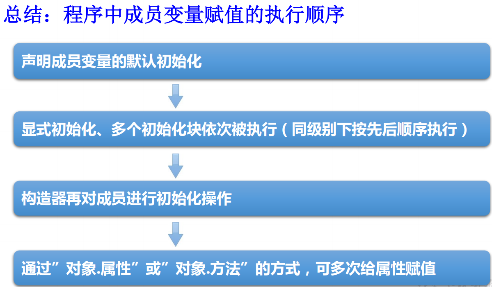

### final关键字

```shell
在Java中声明类、变量和方法时，可使用关键字final来修饰,表示“最终的”
	1.final标记的类不能被继承。提高安全性，提高程序的可读性
		String类、System类、StringBuffer类
	2.final标记的方法不能被子类重写
		比如：Object类中的getClass()
	3.final标记的变量(成员变量或局部变量)即称为常量。名称大写，且只
能被赋值一次
		final标记的成员变量必须在声明时或在每个构造器中或代码块中显式赋
值，然后才能使用
		成员变量可以考虑赋值的位置有:显式初始化、代码块中初始化、构造器中初始化
		final double MY_PI = 3.14;
	4.final修饰局部变量
		使用final修饰形参时,表明此形参是一个常量。当我们调用此方法时,给常量形参赋一个实参。一旦赋值以后,就只能在方法体内使用此形参,但不能进行重新赋值
```

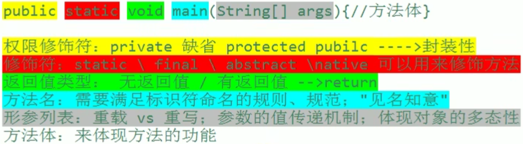

### 抽象

```shell
abstract: 抽象的
abstract可以用来修饰的结构: 类、方法
```

```shell
abstract修饰类:抽象类
	此类不能实例化
	抽象类中一定有构造器,便于子类实例化时调用(涉及:子类对象实例化的全过程)
	开发中,都会提供抽象类的子类,让子类对象实例化,完成相关的操作
	
abstract修饰方法:抽象方法
	抽象方法只有方法的声明,没有方法体
	包含抽象方法的类,一定是一个抽象类。反之,抽象类中可以没有抽象方法的。
	若子类重写了父类中的所有的抽象方法后,此子类方可实例化
	若子类没有重写父类中的所有的抽象方法,则此子类也是一个抽象类,需要使用abstract修饰
```

```shell
不能用abstract修饰变量、代码块、构造器；
不能用abstract修饰私有方法、静态方法、final的方法、final的类
```

### 接口

```shell
接口使用interface来定义
Java中,接口和类是并列的两个结构
接口就是规范，定义的是一组规则，体现了现实世界中“如果你是/要...则必须能...”的思想。继承是一个"是不是"的关系，而接口实现则是 "能不能"的关系
接口的本质是契约，标准，规范，就像我们的法律一样。制定好后大家都要遵守
```

```shell
接口(interface)是抽象方法和常量值定义的集合。

接口的特点：
    用interface来定义。
    接口中的所有成员变量都默认是由public static final修饰的。
    接口中的所有抽象方法都默认是由public abstract修饰的。
    接口中没有构造器。
    接口采用多继承机制
    
JDK7及以前:只能定义全局常量和抽象方法
    全局常量: public static final的.但是书写时,可以省略不写
    抽象方法: public abstract的
JDK8:除了定义全局常量和抽象方法之外,还可以定义静态方法、默认方法
```

```shell
Java 8中关于接口的改进
Java 8中，你可以为接口添加 静态方法 和 默认方法。
静态方法：使用 static 关键字修饰。可以通过接口直接调用静态方法，并执行其方法体。我们经常在相互一起使用的类中使用静态方法。你可以在标准库中找到像Collection/Collections或者Path/Paths这样成对的接口和类。"只能通过接口来调用(接口名.method())"
默认方法：默认方法使用 default 关键字修饰。可以通过实现类对象来调用。我们在已有的接口中提供新方法的同时，还保持了与旧版本代码的兼容性。 "通过实现类的对象, 可以调用接口中的默认方法"
	比如：java 8 API中对Collection、List、Comparator等接口提供了丰富的默认方法。
```

```shell
接口中的默认方法
1. 若一个接口中定义了一个默认方法，而另外一个接口中也定义了一个同名同参数的方法（不管此方法是否是默认方法），在实现类同时实现了这两个接口时，会出现："接口冲突"。
	解决办法：实现类必须覆盖接口中同名同参数的方法，来解决冲突
2. 若一个接口中定义了一个默认方法，而父类中也定义了一个同名同参数的非抽象方法，则不会出现冲突问题。因为此时遵守："类优先原则"。接口中具有相同名称和参数的默认方法会被忽略
```

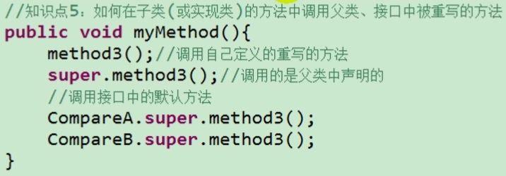

```shell
定义Java类的语法格式：先写extends，后写implements
	class SubClass extends SuperClass implements InterfaceA{}
一个类可以实现多个接口，接口也可以继承其它接口。
实现接口的类中必须提供接口中所有方法的具体实现内容，方可实例化。否则，仍为抽象类。
接口的主要用途就是被实现类实现。（面向接口编程）
与继承关系类似，接口与实现类之间存在多态性
```

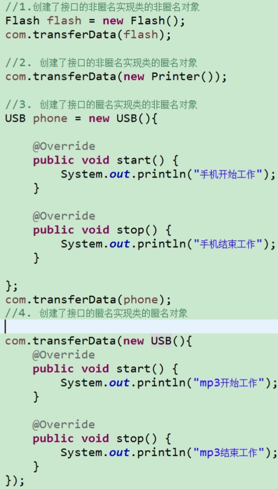

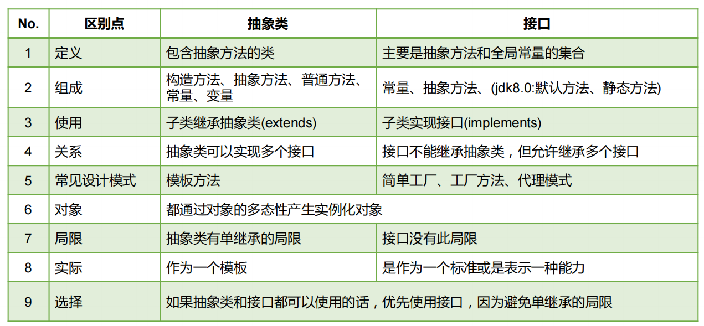

### 内部类

```shell
在Java中，允许一个类的定义位于另一个类的内部，前者称为内部类，后者称为外部类
Inner class一般用在定义它的类或语句块之内，在外部引用它时必须给出完整的名称。
	Inner class的名字不能与包含它的外部类类名相同
	
成员内部类（static成员内部类和非static成员内部类）
局部内部类（不谈修饰符）、匿名内部类
```

##### 成员内部类

```shell
成员内部类作为类的成员的角色：
	和外部类不同，Inner class还可以声明为private或protected
	可以调用外部类的结构
	Inner class 可以声明为static的，但此时就不能再使用外层类的非static的成员变量
	
成员内部类作为类的角色：
    可以在内部定义属性、方法、构造器等结构
    可以声明为abstract类 ，因此可以被其它的内部类继承
    可以声明为final的
    编译以后生成OuterClass$InnerClass.class字节码文件（也适用于局部内部类）
```

```shell
1. 非static的成员内部类中的成员不能声明为static的，只有在外部类或static的成员内部类中才可声明static成员。
2. 外部类访问成员内部类的成员，需要“内部类.成员”或“内部类对象.成员”的方式
3. 成员内部类可以直接使用外部类的所有成员，包括私有的数据
4. 当想要在外部类的静态成员部分使用内部类时，可以考虑内部类声明为静态的
```

##### 局部内部类

```shell
class 外部类{
    方法(){
    	class 局部内部类{ } 
    }
    {
    	class 局部内部类{ } 
    } 
}
```

```shell
如何使用局部内部类
	只能在 声明它的方法或代码块 中使用，而且是先声明后使用。除此之外的任何地方都不能使用该类
	但是它的对象可以通过外部方法的返回值返回使用，返回值类型只能是局部内部类的父类或父接口类型
```

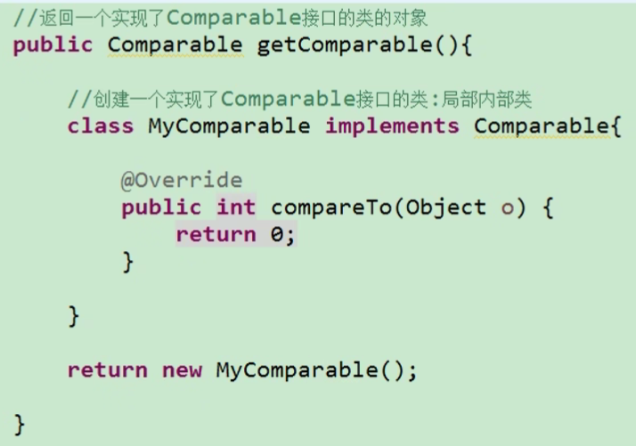

```shell
局部内部类的特点
	内部类仍然是一个独立的类，在编译之后内部类会被编译成独立的.class文件，但是前面冠以外部类的类名和$符号，以及数字编号
	只能在声明它的方法或代码块中使用，而且是先声明后使用。除此之外的任何地方都不能使用该类
	局部内部类可以使用外部类的成员，包括私有的
	"局部内部类可以使用外部方法的局部变量，但是必须是final的"。由局部内部类和局部变量的声明周期不同所致
	局部内部类和局部变量地位类似，"不能使用public,protected,缺省,private"
	局部内部类"不能使用static修饰"，因此也不能包含静态成员
```

##### 匿名内部类

```shell
匿名内部类不能定义任何静态成员、方法和类，只能创建匿名内部类的一个实例

格式：
new 父类构造器（实参列表）| 实现接口(){
	//匿名内部类的类体部分
}
```

```shell
匿名内部类的特点
	匿名内部类必须继承父类或实现接口
	匿名内部类只能有一个对象
	匿名内部类对象只能使用多态形式引用
```

