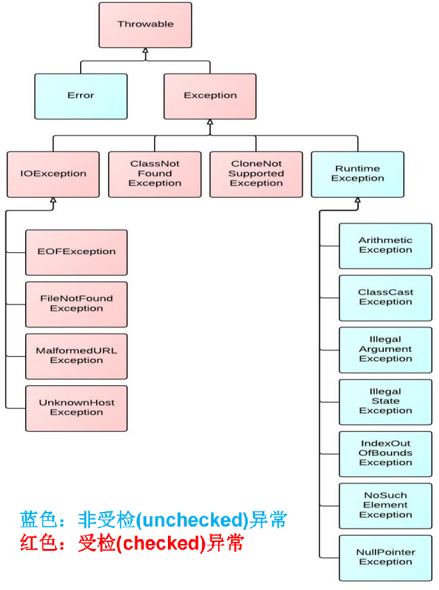
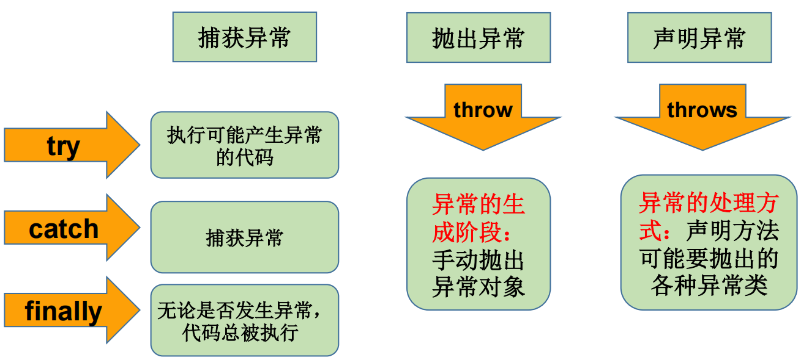

```shell
异常：在Java语言中，将程序执行中发生的不正常情况称为“异常”。 (开发过程中的语法错误和逻辑错误不是异常)

Java程序在执行过程中所发生的异常事件可分为两类：
Error：Java虚拟机无法解决的严重问题。如：JVM系统内部错误、资源耗尽等严重情况。比如：StackOverflowError和OOM。一般不编写针对性的代码进行处理。
Exception: 其它因编程错误或偶然的外在因素导致的一般性问题，可以使用针对性的代码进行处理
```



```shell
1.运行时异常
是指编译器不要求强制处置的异常。一般是指编程时的逻辑错误，是程序员应该积极避免其出现的异常。"java.lang.RuntimeException类及它的子类"都是运行时异常。
对于这类异常，可以不作处理，因为这类异常很普遍，若全处理可能会对程序的可读性和运行效率产生影响。

2.编译时异常
是指编译器要求必须处置的异常。即程序在运行时由于外界因素造成的一般性异常。"编译器要求Java程序必须捕获或声明所有编译时异常。"
对于这类异常，如果程序不处理，可能会带来意想不到的结果。
```

```shell
Java采用的异常处理机制，是将异常处理的程序代码集中在一起，与正常的程序代码分开，使得程序简洁、优雅，并易于维护。

Java异常处理的方式：
	try-catch-finally
	throws + 异常类型
```

```shell
Java提供的是异常处理的抓抛模型
Java程序的执行过程中如出现异常，会生成一个异常类对象，该异常对象将被提交给Java运行时系统，这个过程称为抛出(throw)异常。

异常对象的生成
	由虚拟机"自动生成"：程序运行过程中，虚拟机检测到程序发生了问题，如果在当前代码中没有找到相应的处理程序，就会在后台自动创建一个对应异常类的实例对象并抛出——自动抛出
	由开发人员"手动创建"：Exception exception = new ClassCastException();——创建好的异常对象不抛出对程序没有任何影响，和创建一个普通对象一样
```

### try-catch

```java
try{
	...... //可能产生异常的代码
}
catch( ExceptionName1 e ){
	...... //当产生ExceptionName1型异常时的处置措施
}
catch( ExceptionName2 e ){
	...... //当产生ExceptionName2型异常时的处置措施
}[ finally{
	...... //无论是否发生异常，都无条件执行的语句
} ]
```

```shell
try
	捕获异常的第一步是用try{…}语句块选定捕获异常的范围，将可能出现异常的代码放在try语句块中

catch (Exceptiontype e)
	在catch语句块中是对异常对象进行处理的代码。每个try语句块可以伴随一个或多个catch语句，用于处理可能产生的不同类型的异常对象
	如果明确知道产生的是何种异常，可以用该异常类作为catch的参数；也可以用其父类作为catch的参数
	catch中的异常类型如果没有子父类关系,则谁声明在上,谁声明在下无所谓。
	catch中的异常类型如果满足子父类关系,则要求子类一定声明在父类的上面。否则,报错
	
finally
	捕获异常的最后一步是通过finally语句为异常处理提供一个"统一的出口"，使得在控制流转到程序的其它部分以前，能够对程序的状态作统一的管理。
	不论在try代码块中是否发生了异常事件，catch语句是否执行，catch语句是否有异常，catch语句中是否有return，"finally块中的语句都会被执行"。
	finally语句和catch语句是任选的
	
捕获异常的有关信息：
与其它对象一样，可以访问一个异常对象的成员变量或调用它的方法。
	getMessage() 获取异常信息，返回字符串
	printStackTrace() 获取异常类名和异常信息，以及异常出现在程序中的位置。返回值void
```


### throws

```shell
如果一个方法(中的语句执行时)可能生成某种异常，但是并不能确定如何处理这种异常，则此方法应显示地声明抛出异常，表明该方法将不对这些异常进行处理，而由该方法的"调用者"负责处理
在方法声明中用throws语句可以声明抛出异常的列表，throws后面的异常类型可以是方法中产生的异常类型，也可以是它的父类

public void readFile(String file) throws FileNotFoundException {
    ……
    // 读文件的操作可能产生FileNotFoundException类型的异常
    FileInputStream fis = new FileInputStream(file);
    ..……
}
```

### 手动抛出异常

```shell
Java异常类对象除在程序执行过程中出现异常时由系统自动生成并抛出，也可根据需要使用人工创建并抛出

首先要生成异常类对象，然后通过throw语句实现抛出操作(提交给Java运行环境)
    IOException e = new IOException();
    throw e;
    
可以抛出的异常必须是Throwable或其子类的实例。
	下面的语句在编译时将会产生语法错误: throw new String("want to throw");
```

### 用户自定义异常

```shell
一般地，用户自定义异常类都是"RuntimeException的子类"
自定义异常类通常需要编写几个"重载的构造器"
自定义异常需要提供"serialVersionUID"
自定义的异常通过"throw抛出"
```

```java
# 用户自定义异常类MyException，用于描述数据取值范围错误信息。用户自己的异常类必须"继承现有的异常类"
class MyException extends Exception {
	static final long serialVersionUID = 13465653435L;
	private int idnumber;
    public MyException(String message, int id) {
    	super(message);
    	this.idnumber = id;
    }
    public int getId() {
    	return idnumber; 
    }
}
```

### 总结

