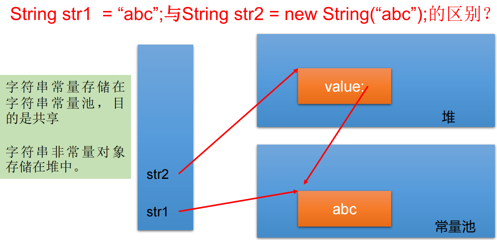
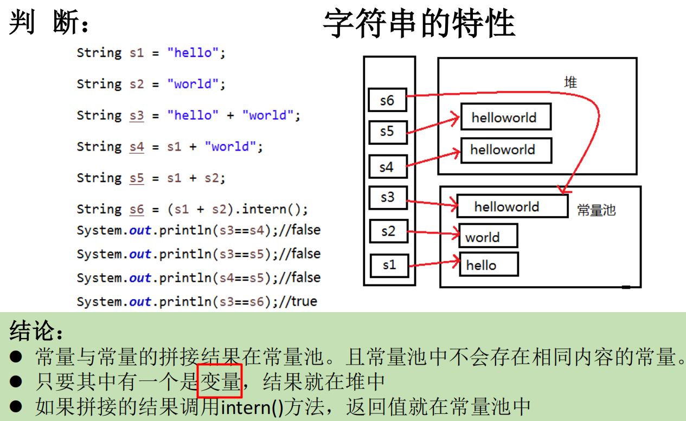
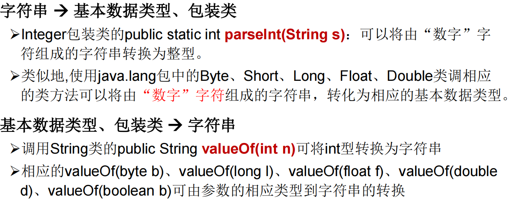
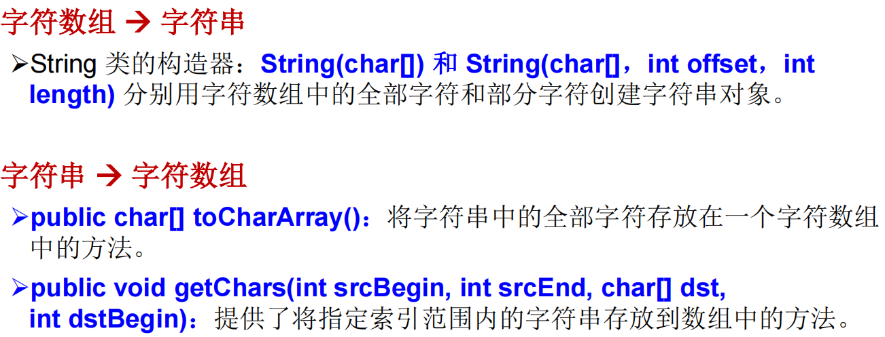
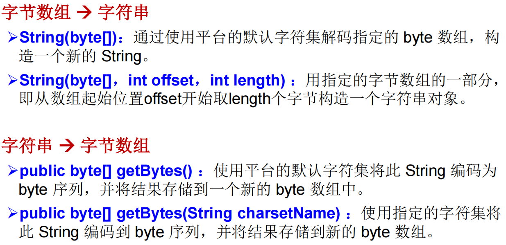

### String

```shell
String类：代表字符串。Java 程序中的所有字符串字面值（如 "abc" ）都作为此类的实例实现
String是一个final类，代表"不可变的字符序列"
字符串是常量，用双引号引起来表示。它们的值在创建之后不能更改
String对象的字符内容是存储在一个字符数组value[]中的。
```

```java
public final class String implements java.io.Serializable, Comparable<String>, CharSequence {
    /** The value is used for character storage. */
    private final char value[];
    /** Cache the hash code for the string */
    private int hash; // Default to 0
```





```java
public class StringTest {
    String str = new String("good");
    char[] ch = { 't', 'e', 's', 't' };
    public void change(String str, char ch[]) {
        str = "test ok";
        ch[0] = 'b'; 
    }
    public static void main(String[] args) {
        StringTest ex = new StringTest();
        ex.change(ex.str, ex.ch);
        System.out.print(ex.str);//good
        System.out.println(ex.ch);//best
    } 
}
```

```shell
JVM中字符串常量池存放位置说明:
    jdk 1.6 (jdk 6.0 ,java 6.0): 字符串常量池存储在方法区(永久区)
    jdk 1.7: 字符串常量池存储在堆空间
    jdk 1.8: 字符串常量池存储在方法区(元空间)
```

##### 常用方法

```shell
"int length()"：返回字符串的长度： return value.length
"char charAt(int index)"： 返回某索引处的字符return value[index]  boolean isEmpty()：判断是否是空字符串：return value.length == 0  String toLowerCase()：使用默认语言环境，将 String 中的所有字符转换为小写
"String toUpperCase()"：使用默认语言环境，将 String 中的所有字符转换为大写
"String trim()"：返回字符串的副本，忽略前导空白和尾部空白
"boolean equals(Object obj)"：比较字符串的内容是否相同
"boolean equalsIgnoreCase(String anotherString)"：与equals方法类似，忽略大小写
"String concat(String str)"：将指定字符串连接到此字符串的结尾。 等价于用“+”
"int compareTo(String anotherString)"：比较两个字符串的大小
"String substring(int beginIndex)"：返回一个新的字符串，它是此字符串的从beginIndex开始截取到最后的一个子字符串。
"String substring(int beginIndex, int endIndex)"：返回一个新字符串，它是此字符串从beginIndex开始截取到endIndex(不包含)的一个子字符串。

"boolean endsWith(String suffix)"：测试此字符串是否以指定的后缀结束
"boolean startsWith(String prefix)"：测试此字符串是否以指定的前缀开始
"boolean startsWith(String prefix, int toffset)"：测试此字符串从指定索引开始的子字符串是否以指定前缀开始

"boolean contains(CharSequence s)"：当且仅当此字符串包含指定的 char 值序列时，返回 true
"int indexOf(String str)"：返回指定子字符串在此字符串中第一次出现处的索引
"int indexOf(String str, int fromIndex)"：返回指定子字符串在此字符串中第一次出现处的索引，从指定的索引开始
"int lastIndexOf(String str)"：返回指定子字符串在此字符串中最右边出现处的索引
"int lastIndexOf(String str, int fromIndex)"：返回指定子字符串在此字符串中最后一次出现处的索引，从指定的索引开始反向搜索
注：indexOf和lastIndexOf方法如果未找到都是返回-1

"String replace(char oldChar, char newChar)"：返回一个新的字符串，它是通过用 newChar 替换此字符串中出现的所有 oldChar 得到的。
"String replace(CharSequence target, CharSequence replacement)"：使用指定的字面值替换序列替换此字符串所有匹配字面值目标序列的子字符串。
"String replaceAll(String regex, String replacement)"：使用给定的replacement 替换此字符串所有匹配给定的正则表达式的子字符串。
"String replaceFirst(String regex, String replacement)"：使用给定的replacement 替换此字符串匹配给定的正则表达式的第一个子字符串。

"boolean matches(String regex)"：告知此字符串是否匹配给定的正则表达式

"String[] split(String regex)"：根据给定正则表达式的匹配拆分此字符串。
"String[] split(String regex, int limit)"：根据匹配给定的正则表达式来拆分此字符串，最多不超过limit个，如果超过了，剩下的全部都放到最后一个元素中
```

##### 类型转换





### StringBuffer

```shell
java.lang.StringBuffer代表"可变的字符序列"，JDK1.0中声明，可以对字符串内容进行增删，此时不会产生新的对象
很多方法与String相同
作为参数传递时，方法内部可以改变值

StringBuffer类不同于String，其对象必须使用构造器生成。有三个构造器：
    StringBuffer()：初始容量为16的字符串缓冲区
    StringBuffer(int size)：构造指定容量的字符串缓冲区
    StringBuffer(String str)：将内容初始化为指定字符串内容
```

##### 常用方法

```shell
"StringBuffer append(xxx)"：提供了很多的append()方法，用于进行字符串拼接
"StringBuffer delete(int start,int end)"：删除指定位置的内容
"StringBuffer replace(int start, int end, String str)"：把[start,end)位置替换为str
"StringBuffer insert(int offset, xxx)"：在指定位置插入xxx
"StringBuffer reverse()"：把当前字符序列逆转

当append和insert时，如果原来value数组长度不够，可扩容
如上这些方法支持"方法链"操作

public "int indexOf(String str)"
public "String substring(int start,int end)"
public "int length()"
public "char charAt(int n )"
public "void setCharAt(int n ,char ch)"
```

### StringBuilder

```shell
StringBuilder 和 StringBuffer 非常类似，均代表可变的字符序列，而且提供相关功能的方法也一样

对比String、StringBuffer、StringBuilder
    String(JDK1.0)：不可变字符序列
    StringBuffer(JDK1.0)：可变字符序列、效率低、线程安全
    StringBuilder(JDK 5.0)：可变字符序列、效率高、线程不安全
    
注意：作为参数传递的话，方法内部String不会改变其值，StringBuffer和StringBuilder会改变其值。
```

### JDK8之前日期时间API

