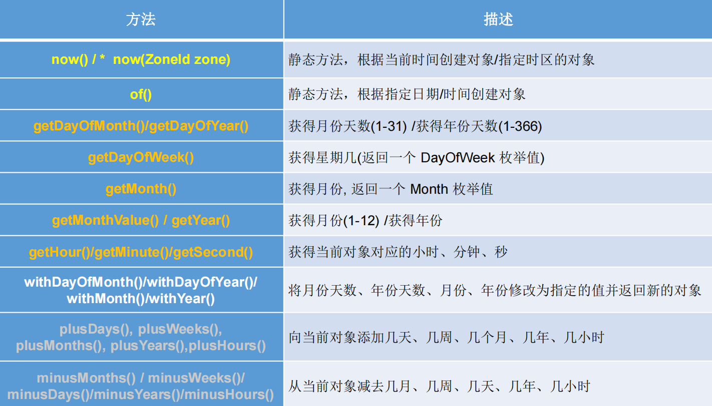
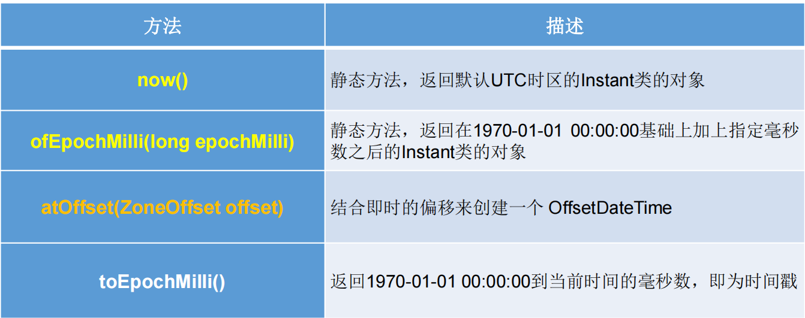
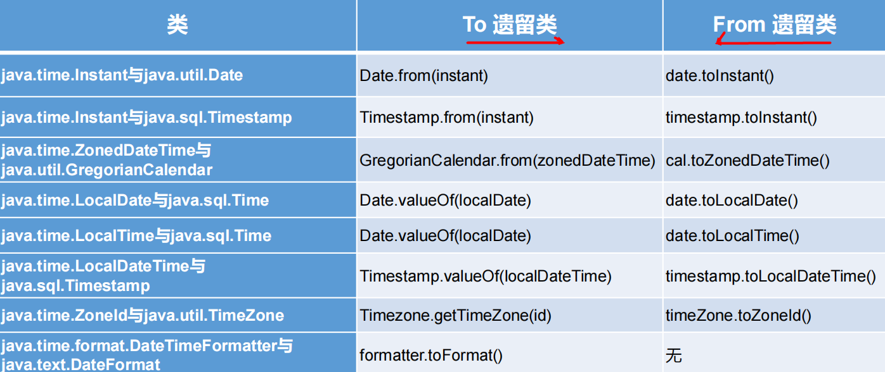
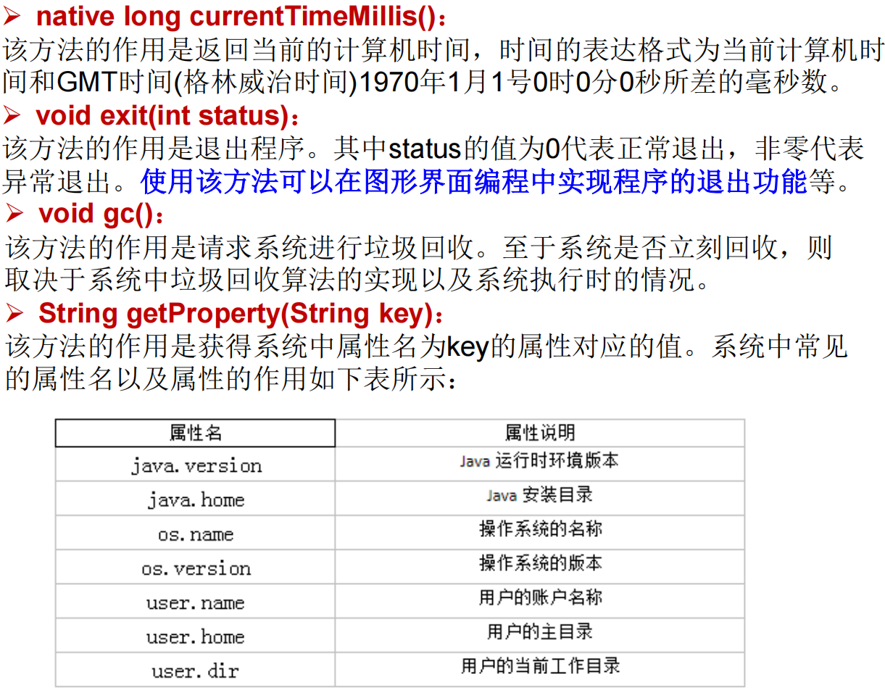
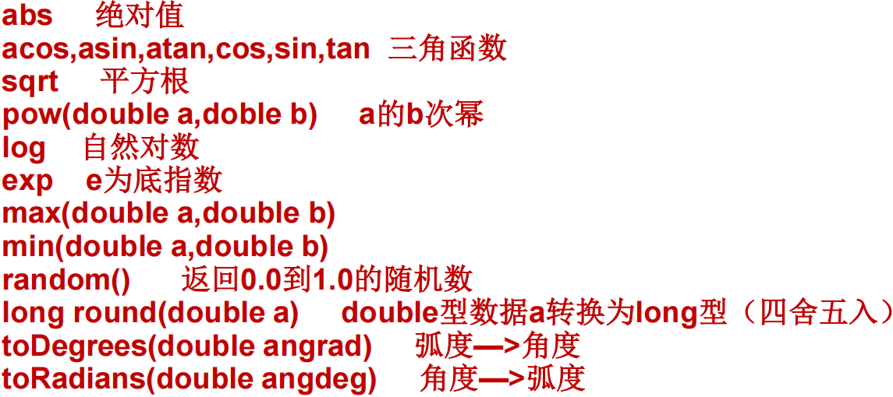
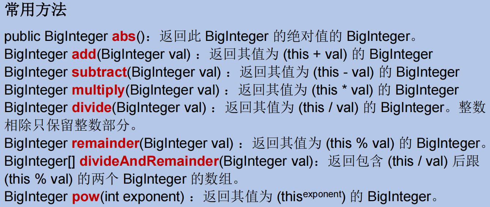

### String

```shell
String类：代表字符串。Java 程序中的所有字符串字面值（如 "abc" ）都作为此类的实例实现
String是一个final类，代表"不可变的字符序列"
字符串是常量，用双引号引起来表示。它们的值在创建之后不能更改
String对象的字符内容是存储在一个字符数组value[]中的。
```

```java
public final class String implements java.io.Serializable, Comparable<String>, CharSequence {
    /** The value is used for character storage. */
    private final char value[];
    /** Cache the hash code for the string */
    private int hash; // Default to 0
```


```java
public class StringTest {
    String str = new String("good");
    char[] ch = { 't', 'e', 's', 't' };
    public void change(String str, char ch[]) {
        str = "test ok";
        ch[0] = 'b'; 
    }
    public static void main(String[] args) {
        StringTest ex = new StringTest();
        ex.change(ex.str, ex.ch);
        System.out.print(ex.str);//good
        System.out.println(ex.ch);//best
    } 
}
```

```shell
JVM中字符串常量池存放位置说明:
    jdk 1.6 (jdk 6.0 ,java 6.0): 字符串常量池存储在方法区(永久区)
    jdk 1.7: 字符串常量池存储在堆空间
    jdk 1.8: 字符串常量池存储在方法区(元空间)
```

##### 常用方法

```shell
"int length()"：返回字符串的长度： return value.length
"char charAt(int index)"： 返回某索引处的字符return value[index]  boolean isEmpty()：判断是否是空字符串：return value.length == 0  String toLowerCase()：使用默认语言环境，将 String 中的所有字符转换为小写
"String toUpperCase()"：使用默认语言环境，将 String 中的所有字符转换为大写
"String trim()"：返回字符串的副本，忽略前导空白和尾部空白
"boolean equals(Object obj)"：比较字符串的内容是否相同
"boolean equalsIgnoreCase(String anotherString)"：与equals方法类似，忽略大小写
"String concat(String str)"：将指定字符串连接到此字符串的结尾。 等价于用“+”
"int compareTo(String anotherString)"：比较两个字符串的大小
"String substring(int beginIndex)"：返回一个新的字符串，它是此字符串的从beginIndex开始截取到最后的一个子字符串。
"String substring(int beginIndex, int endIndex)"：返回一个新字符串，它是此字符串从beginIndex开始截取到endIndex(不包含)的一个子字符串。

"boolean endsWith(String suffix)"：测试此字符串是否以指定的后缀结束
"boolean startsWith(String prefix)"：测试此字符串是否以指定的前缀开始
"boolean startsWith(String prefix, int toffset)"：测试此字符串从指定索引开始的子字符串是否以指定前缀开始

"boolean contains(CharSequence s)"：当且仅当此字符串包含指定的 char 值序列时，返回 true
"int indexOf(String str)"：返回指定子字符串在此字符串中第一次出现处的索引
"int indexOf(String str, int fromIndex)"：返回指定子字符串在此字符串中第一次出现处的索引，从指定的索引开始
"int lastIndexOf(String str)"：返回指定子字符串在此字符串中最右边出现处的索引
"int lastIndexOf(String str, int fromIndex)"：返回指定子字符串在此字符串中最后一次出现处的索引，从指定的索引开始反向搜索
注：indexOf和lastIndexOf方法如果未找到都是返回-1

"String replace(char oldChar, char newChar)"：返回一个新的字符串，它是通过用 newChar 替换此字符串中出现的所有 oldChar 得到的。
"String replace(CharSequence target, CharSequence replacement)"：使用指定的字面值替换序列替换此字符串所有匹配字面值目标序列的子字符串。
"String replaceAll(String regex, String replacement)"：使用给定的replacement 替换此字符串所有匹配给定的正则表达式的子字符串。
"String replaceFirst(String regex, String replacement)"：使用给定的replacement 替换此字符串匹配给定的正则表达式的第一个子字符串。

"boolean matches(String regex)"：告知此字符串是否匹配给定的正则表达式

"String[] split(String regex)"：根据给定正则表达式的匹配拆分此字符串。
"String[] split(String regex, int limit)"：根据匹配给定的正则表达式来拆分此字符串，最多不超过limit个，如果超过了，剩下的全部都放到最后一个元素中
```

##### 类型转换


### StringBuffer

```shell
java.lang.StringBuffer代表"可变的字符序列"，JDK1.0中声明，可以对字符串内容进行增删，此时不会产生新的对象
很多方法与String相同
作为参数传递时，方法内部可以改变值

StringBuffer类不同于String，其对象必须使用构造器生成。有三个构造器：
    StringBuffer()：初始容量为16的字符串缓冲区
    StringBuffer(int size)：构造指定容量的字符串缓冲区
    StringBuffer(String str)：将内容初始化为指定字符串内容
```

##### 常用方法

```shell
"StringBuffer append(xxx)"：提供了很多的append()方法，用于进行字符串拼接
"StringBuffer delete(int start,int end)"：删除指定位置的内容
"StringBuffer replace(int start, int end, String str)"：把[start,end)位置替换为str
"StringBuffer insert(int offset, xxx)"：在指定位置插入xxx
"StringBuffer reverse()"：把当前字符序列逆转

当append和insert时，如果原来value数组长度不够，可扩容
如上这些方法支持"方法链"操作

public "int indexOf(String str)"
public "String substring(int start,int end)"
public "int length()"
public "char charAt(int n )"
public "void setCharAt(int n ,char ch)"
```

### StringBuilder

```shell
StringBuilder 和 StringBuffer 非常类似，均代表可变的字符序列，而且提供相关功能的方法也一样

对比String、StringBuffer、StringBuilder
    String(JDK1.0)：不可变字符序列
    StringBuffer(JDK1.0)：可变字符序列、效率低、线程安全
    StringBuilder(JDK 5.0)：可变字符序列、效率高、线程不安全
    
注意：作为参数传递的话，方法内部String不会改变其值，StringBuffer和StringBuilder会改变其值。
```

### JDK8之前日期时间API

#####  java.lang.System类

```shell
System类提供的public static "long currentTimeMillis()"用来返回当前时间与1970年1月1日0时0分0秒之间以毫秒为单位的时间差。
	此方法适于计算时间差

计算世界时间的主要标准有：
    UTC(Coordinated Universal Time)
    GMT(Greenwich Mean Time)
    CST(Central Standard Time)
```

##### java.util.Date类

```shell
表示特定的瞬间，精确到毫秒

构造器：
    Date()：使用无参构造器创建的对象可以获取本地当前时间。
    Date(long date)
    
常用方法
    "getTime()":返回自 1970年1月1日 00:00:00 GMT 以来此 Date 对象表示的毫秒数。
    "toString()":把此 Date 对象转换为以下形式的 String： dow mon dd hh:mm:ss zzz yyyy 其中： dow 是一周中的某一天 (Sun, Mon, Tue, Wed, Thu, Fri, Sat)，zzz是时间标准。
    其它很多方法都过时了。
```

#####  java.text.SimpleDateFormat类

```shell
Date类的API不易于国际化，大部分被废弃了，java.text.SimpleDateFormat类是一个不与语言环境有关的方式来格式化和解析日期的具体类
它允许进行"格式化：日期->文本"、"解析：文本->日期"

格式化：
"SimpleDateFormat()"：默认的模式和语言环境创建对象
"public SimpleDateFormat(String pattern)"：该构造方法可以用参数pattern指定的格式创建一个对象，该对象调用：
"public String format(Date date)"：方法格式化时间对象date

解析：
"public Date parse(String source)"：从给定字符串的开始解析文本，以生成一个日期。
```

```java
Date date = new Date();// 产生一个Date实例
// 产生一个formater格式化的实例
SimpleDateFormat formater = new SimpleDateFormat();
System.out.println(formater.format(date));// 打印输出默认的格式
SimpleDateFormat formater2 = new SimpleDateFormat("yyyy年MM月dd日 EEE HH:mm:ss");
System.out.println(formater2.format(date));

try {
    // 实例化一个指定的格式对象
    Date date2 = formater2.parse("2008年08月08日 星期一 08:08:08");
    // 将指定的日期解析后格式化按指定的格式输出
    System.out.println(date2.toString());
} catch (ParseException e) {
	e.printStackTrace();
}
```

#####  java.util.Calendar(日历)类

```shell
Calendar是一个抽象基类，主用用于完成日期字段之间相互操作的功能

获取Calendar实例的方法
	使用"Calendar.getInstance()"方法
	调用它的子类"GregorianCalendar的构造器"
```

```shell
一个Calendar的实例是系统时间的抽象表示，通过get(int field)方法来取得想要的时间信息。比如YEAR、MONTH、DAY_OF_WEEK、HOUR_OF_DAY 、MINUTE、SECOND
    public void set(int field,int value)
    public void add(int field,int amount)
    public final Date getTime()
    public final void setTime(Date date)
    
注意:
	获取月份时：一月是0，二月是1，以此类推，12月是11
	获取星期时：周日是1，周二是2 ， 。。。。周六是7
```

```java
Calendar calendar = Calendar.getInstance();
// 从一个 Calendar 对象中获取 Date 对象
Date date = calendar.getTime();
// 使用给定的 Date 设置此 Calendar 的时间
date = new Date(234234235235L);
System.out.println(date);//Sat Jun 04 09:03:55 CST 1977
calendar.setTime(date);
calendar.set(Calendar.DAY_OF_MONTH, 8);
System.out.println("当前时间日设置为8后,时间是:" + calendar.getTime());//Wed Jun 08 09:03:55 CST 1977
calendar.add(Calendar.HOUR, 2);
System.out.println("当前时间加2小时后,时间是:" + calendar.getTime());//Wed Jun 08 11:03:55 CST 1977
calendar.add(Calendar.MONTH, -2);
System.out.println("当前日期减2个月后,时间是:" + calendar.getTime());//Fri Apr 08 11:03:55 CST 1977
```

### JDK8新日期时间API

```shell
它们面临的问题是：
    可变性：像日期和时间这样的类应该是不可变的。
    偏移性：Date中的年份是从1900开始的，而月份都从0开始。
    格式化：格式化只对Date有用，Calendar则不行。
    此外，它们也不是线程安全的；不能处理闰秒等。
```

##### LocalDate、LocalTime、LocalDateTime

```shell
LocalDate、LocalTime、LocalDateTime 类是其中较重要的几个类，它们的实例是"不可变的对象"，分别表示使用 ISO-8601日历系统的日期、时间、日期和时间。它们提供了简单的本地日期或时间，并不包含当前的时间信息，也不包含与时区相关的信息

LocalDate代表IOS格式（yyyy-MM-dd）的日期,可以存储 生日、纪念日等日期。
LocalTime表示一个时间，而不是日期。 
LocalDateTime是用来表示日期和时间的，这是一个最常用的类之一。

注：ISO-8601日历系统是国际标准化组织制定的现代公民的日期和时间的表示法，也就是公历。
```



##### Instant

```shell
Instant：时间线上的一个瞬时点。 这可能被用来记录应用程序中的事件时间戳。
在此模型中，时间线中的一个点表示为一个很大的数，这有利于计算机处理。"在UNIX中，这个数从1970年开始，以秒为的单位；同样的，在Java中，也是从1970年开始，但以毫秒为单位"
java.time包通过值类型Instant提供机器视图，不提供处理人类意义上的时间单位。它只是简单的表示自1970年1月1日0时0分0秒（UTC）开始的秒数。
java.time包是基于纳秒计算的，所以Instant的精度可以达到纳秒级
```



##### java.time.format.DateTimeFormatter

```shell
该类提供了三种格式化方法：
    预定义的标准格式。如：ISO_LOCAL_DATE_TIME;ISO_LOCAL_DATE;ISO_LOCAL_TIME
    本地化相关的格式。如：ofLocalizedDateTime(FormatStyle.LONG)
    自定义的格式。如：ofPattern(“yyyy-MM-dd hh:mm:ss”)
    	"ofPattern(String pattern)": 静态方法, 返回一个指定字符串格式的DateTimeFormatter
    	"format(TemporalAccessor t)": 格式化一个日期、时间, 返回字符串
    	"parse(CharSequence text)": 将指定格式的字符序列解析为一个日期、时间
```

### 日期类的转换



### Java比较器

```shell
在Java中经常会涉及到对象数组的排序问题，那么就涉及到对象之间的比较问题。

Java实现对象排序的方式有两种：
    自然排序：java.lang.Comparable
    定制排序：java.util.Comparator
```

##### java.lang.Comparable

```shell
Comparable接口强行对实现它的每个类的对象进行整体排序。这种排序被称为类的"自然排序"。
实现 Comparable 的类必须实现 compareTo(Object obj) 方法，两个对象即通过 compareTo(Object obj) 方法的返回值来比较大小

规则: "如果当前对象this大 于形参对象obj，则返回正整数，如果当前对象this小于形参对象obj，则返回负整数，如果当前对象this等于形参对象obj，则返回零。"

实现Comparable接口的对象列表（和数组）可以通过 Collections.sort 或Arrays.sort进行自动排序。实现此接口的对象可以用作有序映射中的键或有序集合中的元素，无需指定比较器。
建议（虽然不是必需的）"最好使自然排序与 equals 一致"。
```

```shell
Comparable 的典型实现：("默认都是从小到大排列的") 
    String：按照字符串中字符的Unicode值进行比较
    Character：按照字符的Unicode值来进行比较
    数值类型对应的包装类以及BigInteger、BigDecimal：按照它们对应的数值大小进行比较
    Boolean：true 对应的包装类实例大于 false 对应的包装类实例
    Date、Time等：后面的日期时间比前面的日期时间大
```

##### java.util.Comparator

```shell
"定制排序"
当元素的类型没有实现java.lang.Comparable接口而又不方便修改代码，或者实现了java.lang.Comparable接口的排序规则不适合当前的操作，那么可以考虑使用 Comparator 的对象来排序

规则: 重写compare(Object o1,Object o2)方法,"：如果方法返回正整数，则表示o1大于o2；如果返回0，表示相等；返回负整数，表示o1小于o2。"

可以将 Comparator 传递给 sort 方法（如 Collections.sort 或 Arrays.sort），从而允许在排序顺序上实现精确控制。
还可以使用 Comparator 来控制某些数据结构（如有序 set或有序映射）的顺序，或者为那些没有自然顺序的对象 collection 提供排序。
```

### System类

```shell
System类代表系统，系统级的很多属性和控制方法都放置在该类的内部。该类位于java.lang包
```

### Math类

```shell
java.lang.Math提供了一系列静态方法用于科学计算。其方法的参数和返回值类型一般为double型。
```

### BigInteger

```shell
java.math包的BigInteger可以表示不可变的任意精度的整数
BigInteger 还提供以下运算：模算术、GCD 计算、质数测试、素数生成、位操作以及一些其他操作
构造器: "BigInteger(String val)"：根据字符串构建BigInteger对象
```

### BigDecimal

```shell
一般的Float类和Double类可以用来做科学计算或工程计算商业计算中，
要求数字精度比较高，故用到"java.math.BigDecimal"类

BigDecimal类支持不可变的、任意精度的有符号十进制定点数

构造器:
    public BigDecimal(double val)
    public BigDecimal(String val)
    
常用方法:
    public BigDecimal add(BigDecimal augend)
    public BigDecimal subtract(BigDecimal subtrahend)
    public BigDecimal multiply(BigDecimal multiplicand)
    public BigDecimal divide(BigDecimal divisor, int scale, int roundingMode)
```

