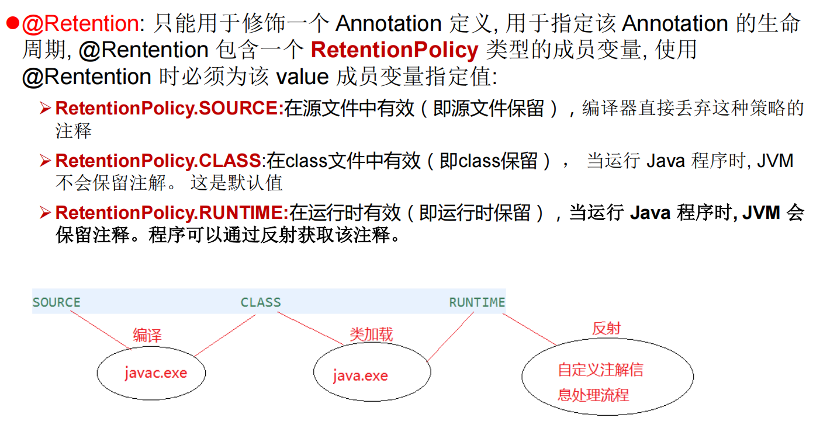
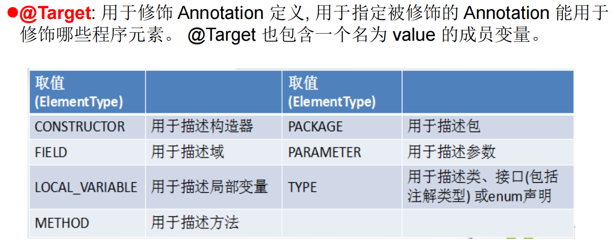
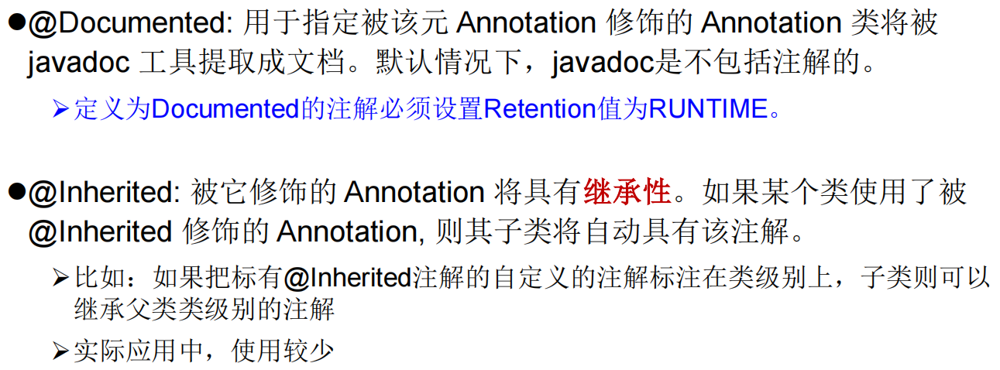
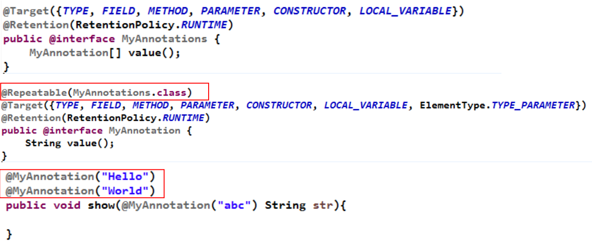

```shell
在JavaSE中，注解的使用目的比较简单，例如标记过时的功能，忽略警告等。在JavaEE/Android中注解占据了更重要的角色，例如用来配置应用程序的任何切面，代替JavaEE旧版中所遗留的繁冗代码和XML配置等
未来的开发模式都是基于注解的，注解是一种趋势，一定程度上可以说："框架 = 注解 + 反射 + 设计模式"。
```

```shell
常见的Annotation示例:
	示例一：生成文档相关的注解
	示例二：在编译时进行格式检查(JDK内置的三个基本注解)
        @Override: 限定重写父类方法, 该注解只能用于方法
        @Deprecated: 用于表示所修饰的元素(类, 方法等)已过时。通常是因为所修饰的结构危险或存在更好的选择
        @SuppressWarnings: 抑制编译器警告
	示例三：跟踪代码依赖性，实现替代配置文件功能
```

### **自定义** Annotation

```shell
参照@SuppressWarnings定义
    1. 注解声明为：@interface
    2. 内部定义成员，通常使用value表示
    3. 可以指定成员的默认值，使用default定义
    4. 如果自定义注解没有成员，表明是一个标识作用。
    
如果注解有成员，在使用注解时，需要指明成员的值。
没有成员定义的 Annotation 称为"标记"
自定义注解必须配上注解的信息处理流程(使用反射)才有意义。
自定义注解通过都会指明两个元注解：Retention、Target
```

### jdk 提供的4种元注解





### JDK8中注解的新特性

```shell
Java 8对注解处理提供了两点改进："可重复的注解"及"可用于类型的注解"

1. 在MyAnnotation上声明@Repeatable，成员值为MyAnnotations.class
2. MyAnnotation的Target和Retention等元注解与MyAnnotations相同。
```



```shell
JDK1.8之后，关于元注解"@Target"的参数类型ElementType枚举值多了两个："TYPE_PARAMETER","TYPE_USE"

在Java 8之前，注解只能是在声明的地方所使用，Java8开始，注解可以应用在任何地方。
    "ElementType.TYPE_PARAMETER" 表示该注解能写在类型变量的声明语句中（如：泛型声明）
    "ElementType.TYPE_USE" 表示该注解能写在使用类型的任何语句中
```

