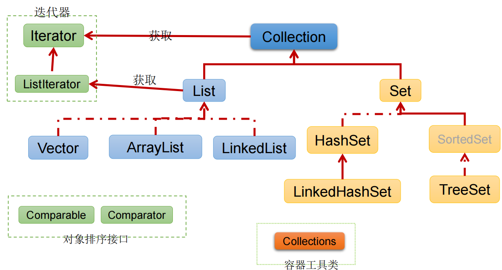
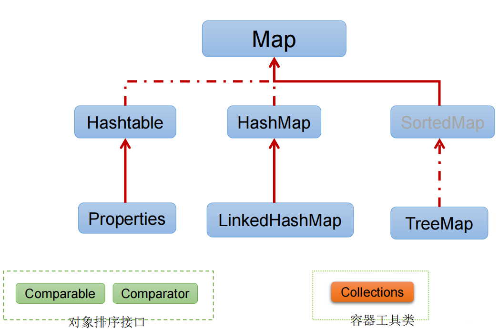
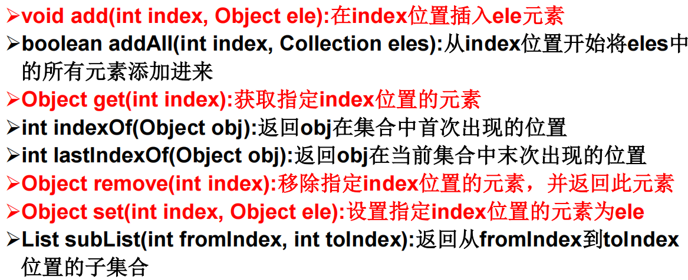
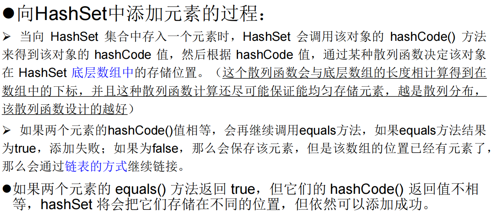
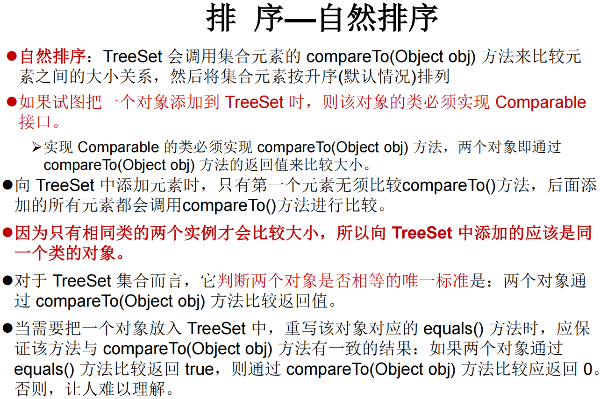
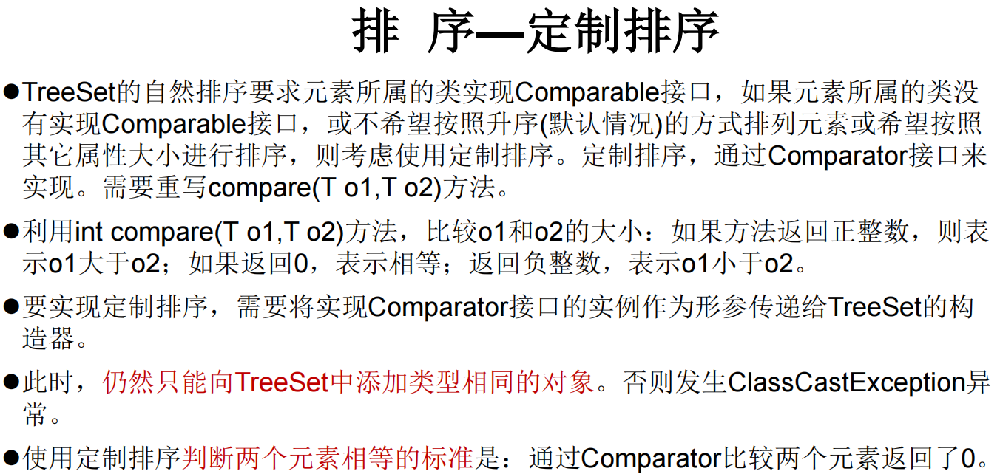
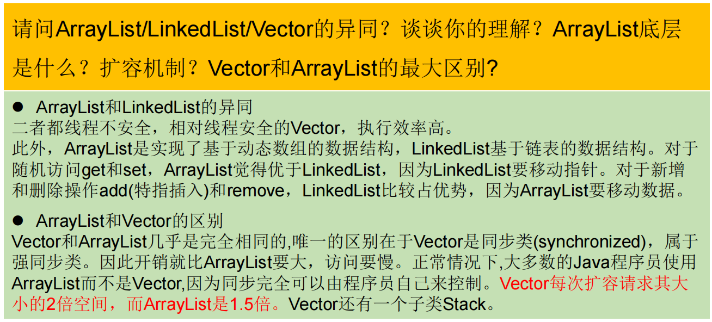

```shell
Java 集合就像一种容器，可以动态地把多个对象的引用放入容器中

数组在内存存储方面的特点：
    数组初始化以后，长度就确定了。
    数组声明的类型，就决定了进行元素初始化时的类型
    
数组在存储数据方面的弊端：
    数组初始化以后，长度就不可变了，不便于扩展
    数组中提供的属性和方法少，不便于进行添加、删除、插入等操作，且效率不高。同时无法直接获取存储元素的个数
    数组存储的数据是有序的、可以重复的。---->存储数据的特点单一
    
Java 集合类可以用于存储数量不等的多个"对象"，还可用于保存具有映射关系的关联数组
```

```shell
Java 集合可分为 "Collection" 和 "Map" 两种体系
Collection接口：单列数据，定义了存取一组对象的方法的集合
    List：元素有序、可重复的集合
    Set：元素无序、不可重复的集合
Map接口：双列数据，保存具有映射关系“key-value对”的集合
```





### Collection接口

```shell
Collection 接口是 List、Set 和 Queue 接口的父接口
JDK不提供此接口的任何直接实现，而是提供更具体的子接口(如：Set和List)实现。
从 JDK 5.0 增加了泛型以后，Java 集合可以记住容器中对象的数据类型
```

```shell
接口方法:
1、添加
    add(Object obj)
    addAll(Collection coll) 
2、获取有效元素的个数
	int size()
3、清空集合
	void clear()
4、是否是空集合
	boolean isEmpty()
5、是否包含某个元素
    boolean contains(Object obj)：是通过元素的equals方法来判断是否是同一个对象
    boolean containsAll(Collection c)：也是调用元素的equals方法来比较的。拿两个集合的元素挨个比较。
6、删除
    boolean remove(Object obj) ：通过元素的equals方法判断是否是要删除的那个元素。只会删除找到的第一个元素
    boolean removeAll(Collection coll)：取当前集合的差集
7、取两个集合的交集
	boolean retainAll(Collection c)：把交集的结果存在当前集合中，不影响c 
8、集合是否相等
	boolean equals(Object obj)
9、转成对象数组
	Object[] toArray()
10、获取集合对象的哈希值
	hashCode()
11、遍历
	iterator()：返回迭代器对象，用于集合遍历
```

### Iterator迭代器接口

```shell
Iterator对象称为迭代器(设计模式的一种)，主要用于遍历 Collection 集合中的元素
"GOF给迭代器模式的定义为：提供一种方法访问一个容器(container)对象中各个元素，而又不需暴露该对象的内部细节。迭代器模式，就是为容器而生"
Collection接口继承了java.lang.Iterable接口, 都有一个iterator()方法，用以返回一个实现了Iterator接口的对象
"Iterator 仅用于遍历集合"
"集合对象每次调用iterator()方法都得到一个全新的迭代器对象"，默认游标都在集合的第一个元素之前
```

```java
//hasNext():判断是否还有下一个元素
while(iterator.hasNext()){
    //next():1.指针下移 2.将下移以后集合位置上的元素返回
    System.out.println(iterator.next());
}
```

```shell
remove()方法:
    Iterator可以删除集合的元素，但是是遍历过程中通过迭代器对象的remove方法，不是集合对象的remove方法
    如果还未调用next()或在上一次调用 next 方法之后已经调用了 remove 方法，再调用remove都会报IllegalStateException
```

### List接口

```shell
鉴于Java中数组用来存储数据的局限性，我们通常使用List替代数组
List集合类中"元素有序、且可重复"，集合中的每个元素都有其对应的顺序索引
List容器中的元素都对应一个整数型的序号记载其在容器中的位置，可以根据序号存取容器中的元素
JDK API中List接口的实现类常用的有："ArrayList、LinkedList和Vector"
```

##### 接口方法



##### ArrayList

```shell
ArrayList 是 List 接口的典型实现类、主要实现类
本质上，ArrayList是对象引用的一个”变长”数组
"Arrays.asList(…)" 方法返回的 List 集合，既不是 ArrayList 实例，也不是Vector 实例。 Arrays.asList(…) 返回值是一个固定长度的 List 集合

ArrayList的JDK1.8之前与之后的实现区别？
	JDK1.7：ArrayList像饿汉式，直接创建一个初始容量为10的数组
	JDK1.8：ArrayList像懒汉式，一开始创建一个长度为0的数组，当添加第一个元素时再创建一个始容量为10的数组
```

##### LinkedList

```shell
对于频繁的插入或删除元素的操作，建议使用LinkedList类，效率较高

新增方法：
    void addFirst(Object obj) 
    void addLast(Object obj) 
    Object getFirst()
    Object getLast()
    Object removeFirst()
    Object removeLast()
```

```shell
LinkedList："双向链表"，内部没有声明数组，而是定义了Node类型的first和last，用于记录首末元素。同时，定义内部类Node，作为LinkedList中保存数据的基本结构。
Node除了保存数据，还定义了两个变量：
	prev变量记录前一个元素的位置
	next变量记录下一个元素的位置
```

##### Vector

```shell
Vector 是一个古老的集合，JDK1.0就有了。大多数操作与ArrayList相同，区别之处在于Vector是"线程安全的"
当插入、删除频繁时，使用LinkedList；Vector总是比ArrayList慢，所以尽量避免使用

新增方法：
	void addElement(Object obj) 
	void insertElementAt(Object obj,int index)
	void setElementAt(Object obj,int index)
	void removeElement(Object obj) 
	void removeAllElements()
```

### Set接口

```shell
Set接口是Collection的子接口，set接口没有提供额外的方法
Set 集合不允许包含相同的元素，如果试把两个相同的元素加入同一个Set 集合中，则添加操作失败。
Set 判断两个对象是否相同不是使用 == 运算符，而是根据 equals() 方法
```

##### HashSet

```shell
HashSet 是 Set 接口的典型实现，大多数时候使用 Set 集合时都使用这个实现类
HashSet 按 Hash 算法来存储集合中的元素，因此具有很好的存取、查找、删除性能

HashSet 具有以下特点：
    不能保证元素的排列顺序
    HashSet 不是线程安全的
    集合元素可以是 null
    
"HashSet 集合判断两个元素相等的标准"：两个对象通过 hashCode() 方法比较相等，并且两个对象的 equals() 方法返回值也相等
对于存放在Set容器中的对象，对应的类一定要重写equals()和hashCode(Object obj)方法，以实现对象相等规则。"即：“相等的对象必须具有相等的散列码”"
```



##### **重写** hashCode() 方法的基本原则

```shell
在程序运行时，同一个对象多次调用 hashCode() 方法应该返回相同的值。
当两个对象的 equals() 方法比较返回 true 时，这两个对象的 hashCode() 方法的返回值也应相等。
对象中用作 equals() 方法比较的 Field，都应该用来计算 hashCode 值
```

##### **重写** equals() 方法的基本原则

```shell
相等的对象必须具有相等的散列码
复写equals方法的时候一般都需要同时复写hashCode方法。通常参与计算hashCode的对象的属性也应该参与到equals()中进行计算。
```

##### LinkedHashSet

```shell
LinkedHashSet 是 HashSet 的子类
LinkedHashSet 根据元素的 hashCode 值来决定元素的存储位置，但它同时使用"双向链表"维护元素的次序，这使得元素看起来是以"插入顺序保存"的
"LinkedHashSet插入性能略低于 HashSet"，但在迭代访问 Set 里的全部元素时有很好的性能
LinkedHashSet 不允许集合元素重复
```

##### TreeSet

```shell
TreeSet 是 SortedSet 接口的实现类，TreeSet 可以确保集合元素处于排序状态。
TreeSet底层使用红黑树结构存储数据
TreeSet 两种排序方法："自然排序"和"定制排序"。默认情况下，TreeSet 采用自然排序

新增的方法如下： (了解)
	Comparator comparator()
	Object first()
	Object last()
	Object lower(Object e)
	Object higher(Object e)
	SortedSet subSet(fromElement, toElement) 
	SortedSet headSet(toElement) 
	SortedSet tailSet(fromElement)
```





### 面试题



```shell
集合Collection中存储的如果是自定义类的对象，需要自定义类重写哪个方法？为什么？
equals()方法。  
List：equals()方法
Set：(HashSet、LinkedHashSet为例)：equals()、hashCode()
     (TreeSet为例)：Comparable：compareTo(Object obj)
     				Comparator：compare(Object o1,Object o2)
				
因为: contains() /remove()/retainsAll()….用到
```

