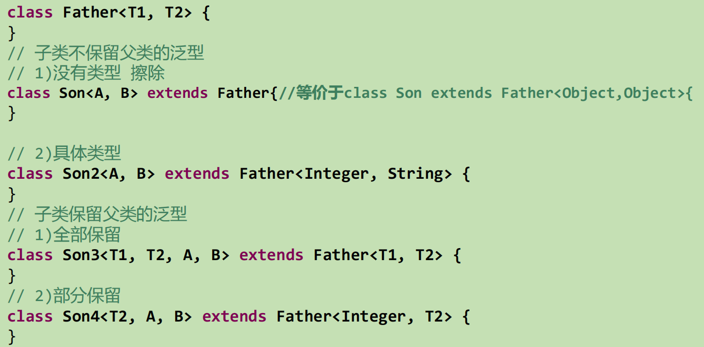

### 泛型


```shell
集合容器类在设计阶段/声明阶段不能确定这个容器到底实际存的是什么类型的对象，所以在"JDK1.5之前只能把元素类型设计为Object，JDK1.5之后使用泛型来解决"
把元素的类型设计成一个参数，这个类型参数叫做泛型

所谓泛型，就是允许在定义类、接口时通过一个标识表示类中某个属性的类型或者是某个方法的返回值及参数类型。这个类型参数将在使用时（例如，继承或实现这个接口，用这个类型声明变量、创建对象时）确定（即传入实际的类型参数，也称为类型实参）
```

```shell
为什么要有泛型呢，直接Object不是也可以存储数据吗？
1. 解决元素存储的安全性问题，好比商品、药品标签，不会弄错。
2. 解决获取数据元素时，需要类型强制转换的问题，好比不用每回拿商品、药品都要辨别。
```


### 自定义泛型结构

```shell
泛型的声明:
    interface List<T> 和 class GenTest<K,V> 
    其中，T,K,V不代表值，而是表示类型。这里使用任意字母都可以。
    常用T表示，是Type的缩写。
    
泛型的实例化:
    一定要在类名后面指定类型参数的值（类型）。如：
    List<String> strList = new ArrayList<String>();
    Iterator<Customer> iterator = customers.iterator();
    1."T只能是类，不能用基本数据类型填充。但可以使用包装类填充"
    2.把一个集合中的内容限制为一个特定的数据类型，这就是泛型背后的核心思想
```

##### 泛型类、泛型接口




##### 泛型方法

```shell
方法，也可以被泛型化，不管此时定义在其中的类是不是泛型类。在泛型方法中可以定义泛型参数，此时，参数的类型就是传入数据的类型。

泛型方法的格式：
[访问权限] <泛型> 返回类型 方法名([泛型标识 参数名称]) 抛出的异常
```

### 继承上的体现

```shell
如果B是A的一个子类型（子类或者子接口），而G是具有泛型声明的类或接口，G<B>并不是G<A>的子类型
比如：String是Object的子类，但是List<String >并不是List<Object>的子类。
```


### 通配符

```shell
1.使用类型通配符：?
比如：List<?> ，Map<?,?>
List<?>是List<String>、List<Object>等各种泛型List的父类。
2.读取List<?>的对象list中的元素时，永远是安全的，因为不管list的真实类型是什么，它包含的都是Object
3.写入list中的元素时，不行。因为我们不知道c的元素类型，我们不能向其中添加对象。
	唯一的例外是null，它是所有类型的成员
	将任意元素加入到其中不是类型安全的：
		Collection<?> c = new ArrayList<String>();
		//add(new Object()); // 编译时错误
		c.add(null);
	另一方面，我们可以调用get()方法并使用其返回值。返回值是一个未知的类型，但是我们知道，它总是一个Object
```


##### 有限制的通配符


