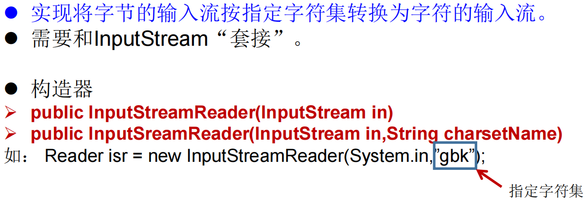

### File

```shell
java.io.File类："文件和文件目录路径"的抽象表示形式，与平台无关
File 能新建、删除、重命名文件和目录，但 File 不能访问文件内容本身。如果需要访问文件内容本身，则需要使用输入/输出流。
"想要在Java程序中表示一个真实存在的文件或目录，那么必须有一个File对象，但是Java程序中的一个File对象，可能没有一个真实存在的文件或目录"
File对象可以作为参数传递给流的构造器
```

##### 常用构造器


##### 路径分隔符


##### 常用方法


###  IO流原理及流的分类

##### IO原理

```shell
I/O是Input/Output的缩写， I/O技术是非常实用的技术，用于"处理设备之间的数据传输"。如读/写文件，网络通讯等。
Java程序中，对于数据的输入/输出操作以"流(stream)"方式进行。
java.io包下提供了各种“流”类和接口，用以获取不同种类的数据，并通过"标准的方法"或输出数据
```


##### 流的分类

```shell
按操作"数据单位"不同分为：字节流(8 bit)，字符流(16 bit)
按数据流的"流向"不同分为：输入流，输出流
按流的"角色"的不同分为：节点流，处理流
```


##### InputStream & Reader


##### OutputStream & Writer


### 节点流(或文件流)

```shell
定义文件路径时，注意：可以用“/”或者“\\”。
在"写入"一个文件时，如果使用构造器FileOutputStream(file)，则"目录下有同名文件将被覆盖"。
如果使用构造器FileOutputStream(file,true)，则目录下的同名文件不会被覆盖，"在文件内容末尾追加内容"。
在"读取"文件时，必须保证该文件已存在，否则报异常。 
字节流操作字节，比如：.mp3，.avi，.rmvb，mp4，.jpg，.doc，.ppt
字符流操作字符，只能操作普通文本文件。最常见的文本文件：.txt，.java，.c，.cpp 等语言的源代码。尤其注意.doc,excel,ppt这些不是文本文件
```

### 缓冲流(处理流)

```shell
为了提高数据读写的速度，Java API提供了带缓冲功能的流类，在使用这些流类时，会创建一个内部缓冲区数组，缺省使用8192个字节(8Kb)的缓冲区

缓冲流要“套接”在相应的节点流之上，根据数据操作单位可以把缓冲流分为:
    BufferedInputStream 和 BufferedOutputStream
    BufferedReader 和 BufferedWriter
```

```shell
1. 当读取数据时，数据按块读入缓冲区，其后的读操作则直接访问缓冲区
2. 当使用BufferedInputStream读取字节文件时，BufferedInputStream会一次性从文件中读取8192个(8Kb)，存在缓冲区中，直到缓冲区装满了，才重新从文件中读取下一个8192个字节数组。
3. 向流中写入字节时，不会直接写到文件，先写到缓冲区中直到缓冲区写满，BufferedOutputStream才会把缓冲区中的数据一次性写到文件里。使用方法"flush()可以强制将缓冲区的内容全部写入输出流"
4. 关闭流的顺序和打开流的顺序相反。只要关闭最外层流即可，关闭最外层流也会相应关闭内层节点流
5. flush()方法的使用：手动将buffer中内容写入文件
6. 如果是带缓冲区的流对象的close()方法，不但会关闭流，还会在关闭流之前刷新缓冲区，关闭后不能再写出
```


### 转换流(处理流)

```shell
转换流提供了在字节流和字符流之间的转换
Java API提供了两个转换流：
	InputStreamReader：将InputStream转换为Reader
	OutputStreamWriter：将Writer转换为OutputStream
字节流中的数据都是字符时，转成字符流操作更高效。
很多时候我们使用转换流来处理文件乱码问题。实现编码和解码的功能。
```

##### InputStreamReader



##### OutputStreamWriter


### 字符编码

```shell
编码：字符串 --> 字节数组
解码：字节数组 --> 字符串

转换流的编码应用
    可以将字符按指定编码格式存储
    可以对文本数据按指定编码格式来解读
    指定编码表的动作由构造器完成
```

### 标准输入、输出流(处理流)


### 打印流(处理流)


### 数据流(处理流)


```shell
注意点：读取不同类型的数据的顺序要与当初写入文件时，保存的数据的顺序一致！
```

