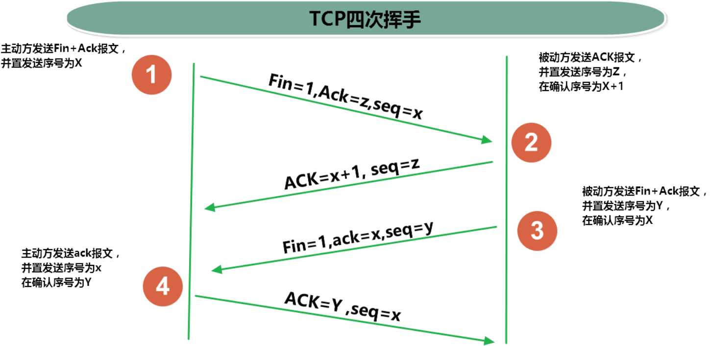

### IP


### 端口号


### InetAddress类

```shell
Internet上的主机有两种方式表示地址：
	域名(hostName)
	IP 地址(hostAddress)

InetAddress类主要表示IP地址，两个子类：Inet4Address、Inet6Address
域名容易记忆，当在连接网络时输入一个主机的域名后，域名服务器(DNS)负责将域名转化成IP地址，这样才能和主机建立连接。 --"域名解析"
```


### 网络协议

```shell
网络通信协议
计算机网络中实现通信必须有一些约定，即通信协议，对速率、传输代码、代码结构、传输控制步骤、出错控制等制定标准

通信协议分层的思想
在制定协议时，把复杂成份分解成一些简单的成份，再将它们复合起来。最常用的复合方式是层次方式，即"同层间可以通信、上一层可以调用下一层，而与再下一层不发生关系"。各层互不影响，利于系统的开发和扩展。
```


##### TCP


##### UDP


##### 三次握手


##### 四次挥手



##### Socket


### TCP网络编程


##### 客户端


##### 服务端


### UDP网络编程

```shell
类 DatagramSocket 和 DatagramPacket 实现了基于 UDP 协议网络程序。
UDP数据报通过数据报套接字 DatagramSocket 发送和接收，"系统不保证UDP数据报一定能够安全送到目的地，也不能确定什么时候可以抵达"。
DatagramPacket 对象封装了UDP数据报，在数据报中包含了发送端的IP地址和端口号以及接收端的IP地址和端口号。
UDP协议中每个数据报都给出了完整的地址信息，因此无须建立发送方和接收方的连接。如同发快递包裹一样。
```


### URL编程


##### URLConnection类


##### URI、URL和URN的区别

