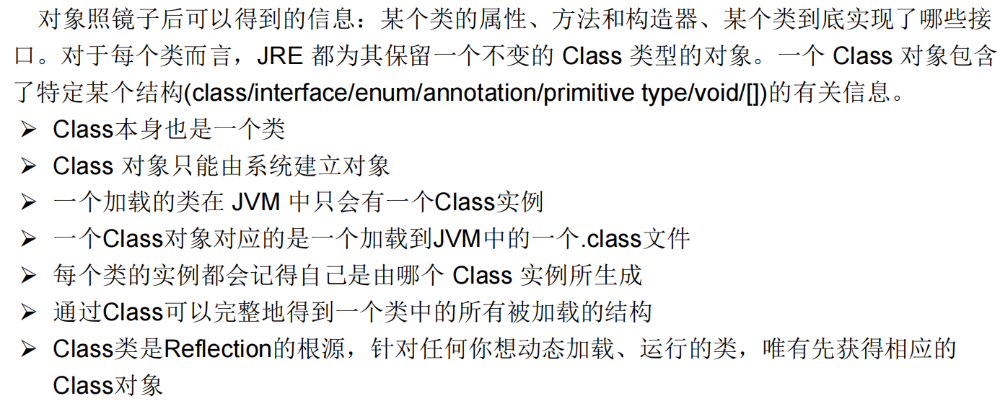

### 动态语言 & 静态语言


### Class类



##### 常用方法


##### 获取实例


```shell
哪些类型可以有Class对象？
1. class： 外部类，成员(成员内部类，静态内部类)，局部内部类，匿名内部类
2. interface：接口
3. []：数组
4. enum：枚举
5. annotation：注解@interface
6. primitive type：基本数据类型
7. void
```


### 类的加载(了解)


### 类初始化(了解)


### ClassLoader(了解)


```shell
类加载器的作用：
类加载的作用：将class文件字节码内容加载到内存中，并将这些静态数据"转换成方法区的运行时数据结构"，然后在堆中生成一个代表这个类的java.lang.Class对象，作为方法区中类数据的访问入口。
类缓存：标准的JavaSE类加载器可以按要求查找类，但一旦某个类被加载到类加载器中，它将维持加载（缓存）一段时间。不过JVM垃圾回收机制可以回收这些Class对象。
```


```java
//1.获取一个系统类加载器
ClassLoader classloader = ClassLoader.getSystemClassLoader();
System.out.println(classloader);
//2.获取系统类加载器的父类加载器，即扩展类加载器
classloader = classloader.getParent();
System.out.println(classloader);
//3.获取扩展类加载器的父类加载器，即引导类加载器
classloader = classloader.getParent();
System.out.println(classloader);
//4.测试当前类由哪个类加载器进行加载
classloader = Class.forName("exer2.ClassloaderDemo").getClassLoader();
System.out.println(classloader);
//5.测试JDK提供的Object类由哪个类加载器加载
classloader = 
Class.forName("java.lang.Object").getClassLoader();
System.out.println(classloader);
//*6.关于类加载器的一个主要方法：getResourceAsStream(String str):获取类路径下的指定文件的输入流
InputStream in = null;
in = this.getClass().getClassLoader().getResourceAsStream("exer2\\test.properties");
System.out.println(in);
```

### 创建运行时类的对象


```java
//1.根据全类名获取对应的Class对象
String name = “xxx.xxx.Person";
Class clazz = null;
clazz = Class.forName(name);
//2.调用指定参数结构的构造器，生成Constructor的实例
Constructor con = clazz.getConstructor(String.class,Integer.class);
//3.通过Constructor的实例创建对应类的对象，并初始化类属性
Person p2 = (Person) con.newInstance("Peter",20);
System.out.println(p2);
```

### 获取运行时类的完整结构


### 调用运行时类的指定结构


### 动态代理


```java
import java.lang.reflect.InvocationHandler;
import java.lang.reflect.Method;
import java.lang.reflect.Proxy;

/**
 *
 * 动态代理的举例
 */

interface Human{
    String getBelief();
    void eat(String food);
}
//被代理类
class SuperMan implements Human{

    @Override
    public String getBelief() {
        return "I believe I can fly!";
    }

    @Override
    public void eat(String food) {
        System.out.println("我喜欢吃" + food);
    }
}

class HumanUtil{
    public void method1(){
        System.out.println("====================通用方法一====================");

    }
    public void method2(){
        System.out.println("====================通用方法二====================");
    }
}

/*
要想实现动态代理，需要解决的问题？
问题一：如何根据加载到内存中的被代理类，动态的创建一个代理类及其对象。
问题二：当通过代理类的对象调用方法a时，如何动态的去调用被代理类中的同名方法a。
 */

class ProxyFactory{
    //调用此方法，返回一个代理类的对象。解决问题一
    public static Object getProxyInstance(Object obj){//obj:被代理类的对象
        MyInvocationHandler handler = new MyInvocationHandler();
        handler.bind(obj);
   
        return Proxy.newProxyInstance(obj.getClass().getClassLoader(),obj.getClass().getInterfaces(),handler);
    }

}

class MyInvocationHandler implements InvocationHandler{

    private Object obj;//需要使用被代理类的对象进行赋值

    public void bind(Object obj){
        this.obj = obj;
    }

    //当我们通过代理类的对象，调用方法a时，就会自动的调用如下的方法：invoke()
    //将被代理类要执行的方法a的功能就声明在invoke()中
    @Override
    public Object invoke(Object proxy, Method method, Object[] args) throws Throwable {
        HumanUtil util = new HumanUtil();
        util.method1();

        //method:即为代理类对象调用的方法，此方法也就作为了被代理类对象要调用的方法
        //obj:被代理类的对象
        Object returnValue = method.invoke(obj,args);

        util.method2();

        //上述方法的返回值就作为当前类中的invoke()的返回值。
        return returnValue;
    }
}

public class ProxyTest {
    public static void main(String[] args) {
        SuperMan superMan = new SuperMan();
        //proxyInstance:代理类的对象
        Human proxyInstance = (Human) ProxyFactory.getProxyInstance(superMan);
        //当通过代理类对象调用方法时，会自动的调用被代理类中同名的方法
        String belief = proxyInstance.getBelief();
        System.out.println(belief);
        proxyInstance.eat("xxx");
    }
}
```

