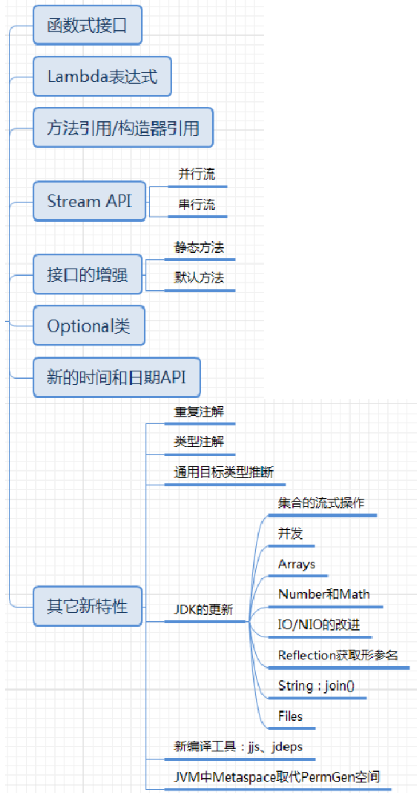

```shell
Java 8 中将并行进行了优化，我们可以很容易的对数据进行并行操作。
Stream API 可以声明性地通过 parallel() 与 sequential() 在并行流与顺序流之间进行切换
```

### Lambda表达式

```shell
Lambda 是一个"匿名函数"，我们可以把 Lambda 表达式理解为是"一段可以传递的代码"（将代码像数据一样进行传递）。

Lambda 表达式：在Java 8 语言中引入的一种新的语法元素和操作符。这个操作符为 "->" ， 该操作符被称为 "Lambda 操作符或箭头操作符"
Lambda 分为两个部分：
"左侧"：指定了 Lambda 表达式需要的参数列表
"右侧"：指定了 Lambda 体，是抽象方法的实现逻辑，也即Lambda 表达式要执行的功能

总结：
"左边"：lambda形参列表的参数类型可以省略(类型推断)；如果lambda形参列表只有一个参数，其一对()也可以省略
"右边"：lambda体应该使用一对{}包裹；如果lambda体只有一条执行语句（可能是return语句），省略这一对{}和return关键字

Lambda表达式的本质：作为"函数式接口"的实例

```

```java
public class LambdaTest1 {
    //语法格式一：无参，无返回值
    @Test
    public void test1(){
        Runnable r1 = new Runnable() {
            @Override
            public void run() {
                System.out.println("我爱北京天安门");
            }
        };
        r1.run();

        System.out.println("***********************");

        Runnable r2 = () -> {
            System.out.println("我爱北京故宫");
        };
        r2.run();
    }
    //语法格式二：Lambda 需要一个参数，但是没有返回值。
    @Test
    public void test2(){
        Consumer<String> con = new Consumer<String>() {
            @Override
            public void accept(String s) {
                System.out.println(s);
            }
        };
        con.accept("谎言和誓言的区别是什么？");

        System.out.println("*******************");

        Consumer<String> con1 = (String s) -> {
            System.out.println(s);
        };
        con1.accept("一个是听得人当真了，一个是说的人当真了");
    }

    //语法格式三：数据类型可以省略，因为可由编译器推断得出，称为“类型推断”
    @Test
    public void test3(){
        Consumer<String> con1 = (String s) -> {
            System.out.println(s);
        };
        con1.accept("一个是听得人当真了，一个是说的人当真了");

        System.out.println("*******************");

        Consumer<String> con2 = (s) -> {
            System.out.println(s);
        };
        con2.accept("一个是听得人当真了，一个是说的人当真了");
    }

    @Test
    public void test4(){
        ArrayList<String> list = new ArrayList<>();//类型推断
        int[] arr = {1,2,3};//类型推断
    }

    //语法格式四：Lambda 若只需要一个参数时，参数的小括号可以省略
    @Test
    public void test5(){
        Consumer<String> con1 = (s) -> {
            System.out.println(s);
        };
        con1.accept("一个是听得人当真了，一个是说的人当真了");

        System.out.println("*******************");

        Consumer<String> con2 = s -> {
            System.out.println(s);
        };
        con2.accept("一个是听得人当真了，一个是说的人当真了");
    }

    //语法格式五：Lambda 需要两个或以上的参数，多条执行语句，并且可以有返回值
    @Test
    public void test6(){
        Comparator<Integer> com1 = new Comparator<Integer>() {
            @Override
            public int compare(Integer o1, Integer o2) {
                System.out.println(o1);
                System.out.println(o2);
                return o1.compareTo(o2);
            }
        };
        System.out.println(com1.compare(12,21));

        System.out.println("*****************************");
        
        Comparator<Integer> com2 = (o1,o2) -> {
            System.out.println(o1);
            System.out.println(o2);
            return o1.compareTo(o2);
        };
        System.out.println(com2.compare(12,6));
    }

    //语法格式六：当 Lambda 体只有一条语句时，return 与大括号若有，都可以省略
    @Test
    public void test7(){
        Comparator<Integer> com1 = (o1,o2) -> {
            return o1.compareTo(o2);
        };
        System.out.println(com1.compare(12,6));

        System.out.println("*****************************");

        Comparator<Integer> com2 = (o1,o2) -> o1.compareTo(o2);
        System.out.println(com2.compare(12,21));

    }

    @Test
    public void test8(){
        Consumer<String> con1 = s -> {
            System.out.println(s);
        };
        con1.accept("一个是听得人当真了，一个是说的人当真了");

        System.out.println("*****************************");

        Consumer<String> con2 = s -> System.out.println(s);
        con2.accept("一个是听得人当真了，一个是说的人当真了");
    }
}
```

### 函数式(Functional)接口


##### Java内置四大核心函数式接口


##### Java其它函数式接口


### 方法引用与构造器引用

##### 方法引用


```shell
具体分为如下的三种情况：
	情况1     对象 :: 非静态方法
	情况2     类 :: 静态方法
	
	情况3     类 :: 非静态方法
	
方法引用使用的要求：要求接口中的抽象方法的形参列表和返回值类型与方法引用的方法的形参列表和返回值类型相同（针对于情况1和情况2）
```

```java
public class MethodRefTest {

	// 情况一：对象 :: 实例方法
	//Consumer中的void accept(T t)
	//PrintStream中的void println(T t)
	@Test
	public void test1() {
		Consumer<String> con1 = str -> System.out.println(str);
		con1.accept("北京");

		System.out.println("*******************");
		PrintStream ps = System.out;
		Consumer<String> con2 = ps::println;
		con2.accept("beijing");
	}
	
	//Supplier中的T get()
	//Employee中的String getName()
	@Test
	public void test2() {
		Employee emp = new Employee(1001,"Tom",23,5600);
		Supplier<String> sup1 = () -> emp.getName();
		System.out.println(sup1.get());

		System.out.println("*******************");
		Supplier<String> sup2 = emp::getName;
		System.out.println(sup2.get());
	}

	// 情况二：类 :: 静态方法
	//Comparator中的int compare(T t1,T t2)
	//Integer中的int compare(T t1,T t2)
	@Test
	public void test3() {
		Comparator<Integer> com1 = (t1,t2) -> Integer.compare(t1,t2);
		System.out.println(com1.compare(12,21));

		System.out.println("*******************");

		Comparator<Integer> com2 = Integer::compare;
		System.out.println(com2.compare(12,3));
	}
	
	//Function中的R apply(T t)
	//Math中的Long round(Double d)
	@Test
	public void test4() {
		Function<Double,Long> func = new Function<Double, Long>() {
			@Override
			public Long apply(Double d) {
				return Math.round(d);
			}
		};

		System.out.println("*******************");

		Function<Double,Long> func1 = d -> Math.round(d);
		System.out.println(func1.apply(12.3));

		System.out.println("*******************");

		Function<Double,Long> func2 = Math::round;
		System.out.println(func2.apply(12.6));
	}

	// 情况三：类 :: 实例方法  (有难度)
	// Comparator中的int comapre(T t1,T t2)
	// String中的int t1.compareTo(t2)
	@Test
	public void test5() {
		Comparator<String> com1 = (s1,s2) -> s1.compareTo(s2);
		System.out.println(com1.compare("abc","abd"));

		System.out.println("*******************");

		Comparator<String> com2 = String :: compareTo;
		System.out.println(com2.compare("abd","abm"));
	}

	//BiPredicate中的boolean test(T t1, T t2);
	//String中的boolean t1.equals(t2)
	@Test
	public void test6() {
		BiPredicate<String,String> pre1 = (s1,s2) -> s1.equals(s2);
		System.out.println(pre1.test("abc","abc"));

		System.out.println("*******************");
        
		BiPredicate<String,String> pre2 = String :: equals;
		System.out.println(pre2.test("abc","abd"));
	}
	
	// Function中的R apply(T t)
	// Employee中的String getName();
	@Test
	public void test7() {
		Employee employee = new Employee(1001, "Jerry", 23, 6000);
		Function<Employee,String> func1 = e -> e.getName();
		System.out.println(func1.apply(employee));
        
		System.out.println("*******************");
        
		Function<Employee,String> func2 = Employee::getName;
		System.out.println(func2.apply(employee));
	}
}
```


##### 构造器引用


```java
public class ConstructorRefTest {
	//构造器引用
    //Supplier中的T get()
    //Employee的空参构造器：Employee()
    @Test
    public void test1(){
        Supplier<Employee> sup = new Supplier<Employee>() {
            @Override
            public Employee get() {
                return new Employee();
            }
        };
        System.out.println("*******************");

        Supplier<Employee>  sup1 = () -> new Employee();
        System.out.println(sup1.get());

        System.out.println("*******************");

        Supplier<Employee>  sup2 = Employee :: new;
        System.out.println(sup2.get());
    }

	//Function中的R apply(T t)
    @Test
    public void test2(){
        Function<Integer,Employee> func1 = id -> new Employee(id);
        Employee employee = func1.apply(1001);
        System.out.println(employee);

        System.out.println("*******************");

        Function<Integer,Employee> func2 = Employee :: new;
        Employee employee1 = func2.apply(1002);
        System.out.println(employee1);
    }

	//BiFunction中的R apply(T t,U u)
    @Test
    public void test3(){
        BiFunction<Integer,String,Employee> func1 = (id,name) -> new Employee(id,name);
        System.out.println(func1.apply(1001,"Tom"));

        System.out.println("*******************");

        BiFunction<Integer,String,Employee> func2 = Employee :: new;
        System.out.println(func2.apply(1002,"Tom"));
    }
}
```


##### 数组引用


```java
public class ConstructorRefTest {
	//数组引用
    //Function中的R apply(T t)
    @Test
    public void test1(){
        Function<Integer,String[]> func1 = length -> new String[length];
        String[] arr1 = func1.apply(5);
        System.out.println(Arrays.toString(arr1));

        System.out.println("*******************");

        Function<Integer,String[]> func2 = String[] :: new;
        String[] arr2 = func2.apply(10);
        System.out.println(Arrays.toString(arr2));
    }
}
```

### Stream API


```shell
Collection 是一种静态的内存数据结构，而 Stream 是有关计算的

注意：
1. Stream 自己不会存储元素。
2. Stream 不会改变源对象。相反，他们会返回一个持有结果的新Stream。
3. Stream 操作是延迟执行的。这意味着他们会等到需要结果的时候才执行。
```

##### 操作步骤


##### 创建Stream

```java
public class StreamAPITest {
    //创建 Stream方式一：通过集合
    @Test
    public void test1(){
        List<Employee> employees = EmployeeData.getEmployees();

		//default Stream<E> stream() : 返回一个顺序流
        Stream<Employee> stream = employees.stream();

		//default Stream<E> parallelStream() : 返回一个并行流
        Stream<Employee> parallelStream = employees.parallelStream();
    }

    //创建 Stream方式二：通过数组
    @Test
    public void test2(){
        int[] arr = new int[]{1,2,3,4,5,6};
        //调用Arrays类的static <T> Stream<T> stream(T[] array): 返回一个流
        IntStream stream = Arrays.stream(arr);

        Employee e1 = new Employee(1001,"Tom");
        Employee e2 = new Employee(1002,"Jerry");
        Employee[] arr1 = new Employee[]{e1,e2};
        Stream<Employee> stream1 = Arrays.stream(arr1);
    }
    
    //创建 Stream方式三：通过Stream的of()
    @Test
    public void test3(){
        Stream<Integer> stream = Stream.of(1, 2, 3, 4, 5, 6);
    }

    //创建 Stream方式四：创建无限流
    @Test
    public void test4(){
		//迭代
		//public static<T> Stream<T> iterate(final T seed, final UnaryOperator<T> f)
        //遍历前10个偶数
        Stream.iterate(0, t -> t + 2).limit(10).forEach(System.out::println);

		//生成
		//public static<T> Stream<T> generate(Supplier<T> s)
        Stream.generate(Math::random).limit(10).forEach(System.out::println);
    }
}
```

##### 中间操作

```shell
多个中间操作可以连接起来形成一个流水线，除非流水线上触发终止操作，否则"中间操作不会执行任何的处理！而在终止操作时一次性全部处理"，称为"惰性求值"。
```


##### 终止操作

```shell
终端操作会从流的流水线生成结果。其结果可以是任何不是流的值，例如：List、Integer，甚至是 void 。
流进行了终止操作后，不能再次使用
```


### Optional类


```java
/*
    Optional.of(T t) : 创建一个 Optional 实例，t必须非空；
    Optional.empty() : 创建一个空的 Optional 实例
    Optional.ofNullable(T t)：t可以为null
*/
public class OptionalTest {
    /*
    	public class Boy {
    		private Girl girl;
    		...
    	}
    */

    public String getGirlName1(Boy boy){
        if(boy != null){
            Girl girl = boy.getGirl();
            if(girl != null){
                return girl.getName();
            }
        }
        return null;
    }

    @Test
    public void test4(){
        Boy boy = new Boy();
        boy = null;
        String girlName = getGirlName1(boy);
        System.out.println(girlName);
    }

    //使用Optional类的getGirlName():
    public String getGirlName2(Boy boy){

        Optional<Boy> boyOptional = Optional.ofNullable(boy);
        //此时的boy1一定非空
        Boy boy1 = boyOptional.orElse(new Boy(new Girl("xxx")));

        Girl girl = boy1.getGirl();

        Optional<Girl> girlOptional = Optional.ofNullable(girl);
        //girl1一定非空
        Girl girl1 = girlOptional.orElse(new Girl("yyy"));

        return girl1.getName();
    }

    @Test
    public void test5(){
        Boy boy = null;
        boy = new Boy();
        boy = new Boy(new Girl("zzz"));
        String girlName = getGirlName2(boy);
        System.out.println(girlName);
    }
}
```

