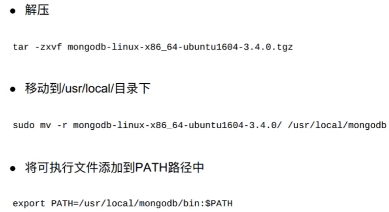
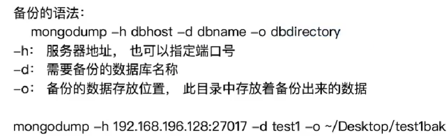
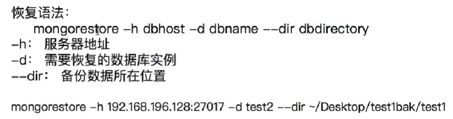
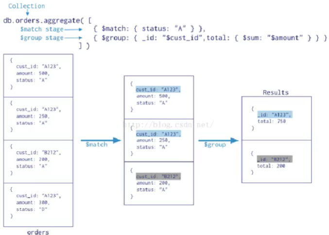

## 安装mongodb




## 常用命令

```shell
查看当前的数据库: db
查看所有的数据库: show dbs /show databases
切换数据库: use db_name
删除当前的数据库: db.dropDatabase()
```

```shell
不手动创建集合:
向不存在的集合中第一次加入数据时,集合会被创建出来


手动创建结合:
db.createCollection(name,options)
db.createCollection("stu") 

db.createCollection("sub", { capped : true, size : 10})
参数capped: 默认值为false表示不设置上限,值为true表示设置上限
参数size: 当capped值为true时, 需要指定此参数,表示上限大小,当文档达到上限时,会将之前的数据覆盖,单位为字节


查看集合: show collections
删除集合: db.集合名称.drop() 
```


## 数据类型

```shell
Object ID:文档ID
String: 字符串,最常用,必须是有效的UTF-8
Boolean:存储一个布尔值, true或false
Integer: 整数可以是32位或64位,这取决于服务器
Double:存储浮点值
Arrays: 数组或列表, 多个值存储到一个键
Object:用于嵌入式的文档,即一个值为一个文档
Null: 存储Null值
Timestamp: 时间戳, 表示从1970-1-1到现在的总秒数
Date:存储当前日期或时间的UNIX时间格式
```


## 注意

```shell
创建日期语句如下:参数的格式为YYYY-MM-DD
new Date("2017-12-20')

每个文档都有一个属性, 为_id, 保证每个文档的唯一性
可以自己去设置id插入文档,如果没有提供,那么MongoDB为每个文档提供了一个独特的_id,类型为objectID

objectID是一个12字节的十六进制数:
    前4个字节为当前时间戳
    接下来3个字节的机器ID
    接下来的2个字节中MongoDB的服务进程id
    最后3个字节是简单的增量值
```


## 增删改查

```shell
db.集合名称.insert(document)
db.stu.insert({name:'gj',gender:1})z
db.stu.insert({_id:20170101,name:'gj',gender:1})
插入文档时,如果不指定id参数, MongoDB会为文档分配一个`唯一的ObjectId`

db.集合名称.save(document)
如果文档的_id已经存在则修改, 如果文档的_id不存在则添加

insert 插入数据,'_id'存在就报错
save   插入数据,'_id'存在就更新
```

```shell
db.集合名称.find()
```

```shell
db.集合名称.update(<query> ,<update>,{multi: <boolean>})

参数query:查询条件
参数update:更新操作符
参数multi:可选, `默认是false,表示只更新找到的第一条记录`,值为true表示把满足条件的文档全部更新

# 更新一条 把整条数据替换成{name:'mnc'}
db.stu.update({name:'hr'},{name:'mnc'})
# 更新一条 把name为hr的值替换成hys
db.stu.update({name:'hr'},{$set:{name:'hys'}})
# 更新全部
db.stu.update({},{$set:{gender:0},multi:true}) 

注意: "multi update only works with $ operators" 
```

```shell
db.集合名称.remove(<query>,{justOne: <boolean>})

参数query:可选,删除的文档的条件
参数justOne:可选,如果设为true或1,则只删除一条,`默认false,表示删除多条`
```


## 高级查询

```shell
# find():查询
db.集合名称.find({条件文档})

# findOne():查询,只返回第一个
db.集合名称.findOne({条件文档})

# pretty():将结果格式化
db.集合名称.find({条件文档}).pretty()
```

```shell
# 比较运算符
等于:默认是等于判断,没有运算符
小于: $lt (less than)
小于等于: $lte (less than equal)
大于: $gt (greater than)
大于等于: $gte
不等于: $ne 

例: db.stu.find({age:{$gte:18}})
```

```shell
# 范围运算符
使用"$in", "$nin"判断是否在某个范围内

# 查询年龄为18, 28的学生
db.stu.find({age:{$in:[18,28,38]}})
```

```shell
# 逻辑运算符
and:在json中写多个条件即可
# 查询年龄大于或等于18,并且性别为true的学生
db.stu.find({age:{$gte:18},gender:true})

or:使用$or,值为数组, 数组中每个元素为json
# 查询年龄大于18,或性别为false的学生
db.stu.find({$or:[{age:{$gt:18}},{gender:false}]})

# 查询年龄大于18或性别为男生,并且姓名是郭靖
db.stu.find({$or:[{age:{$gte:18}},{gender:true}],name:'gj'})	
```

```shell
# 正则表达式
使用//或$regex编写正则表达式
# 查询姓黄的学生
db.products.find({sku:/^abc/})		 	# ^开头
db.products.find({sku:{$regex:'789$'}}) # $结尾
```

```shell
# limit skip
# 方法limit():用于读取指定数量的文档
db.集合名称.find().limit(NUMBER)
# 查询2条学生信息
db.stu.find().limit(2)

# 方法skip(): 用于跳过指定数量的文档
db.集合名称.find().skip(NUMBER)
db.stu.find().skip(2)

# 同时使用
db.stu.find().limit(4).skip(5)
db.stu.find().skip(5).limit(4)
```

```shell
# 自定义查询 js语句
使用$where后面写一个函数,返回满足条件的数据
# 查询年龄大于30的学生
db.stu.find({
	$where:function(){
		return this.age>30;
	}
})
```

```shell
# 投影
在查询到的返回结果中, 只选择必要的字段
db.集合名称.find({},{字段名称1,...})
参数为字段与值,值为1表示显示,值为0不显 `除了_id,其他值没必要设为0,只设置要显示的为1就行`
特殊:对于`id列默认是显示`的,如果不显示需要明确设置为0

db.stu.find({},{_id:0,name:1,gender:1}) 
```

```shell
# 排序
方法sort(), 用于对集进行排序
db.集合名称.find().sort({字段1,...})
参数为1`升序`排列
参数为-1`降序`排列

# 根据性别降序,再根据年龄升序
db.stu.find().sort({gender:-1,age:1}) 
```

```shell
# 统计个数
方法count()用于统计结果集中文档条数
db.集合名称.find({条件}).count()
db.集合名称.count({条件})

db.stu.find({gender:true}).count()
db.stu.count({age:{$gt:20},gender:true})
```

```shell
# 去重
方法distinct()对数据进行去重	
db.集合名称.distinct('去重字段',{条件})

db.stu.distinct('hometown', {age:{$gt:18}})
```


## 数据备份和恢复






## 聚合和管道

聚合(aggregate)是基于数据处理的聚合管道,每个文档通过一个由**多个阶段(stage)**组成的管道,可以**对每个阶段的管道进行分组、过滤**等功能,然后经一系列的处理,输出相应的结果。

`db.集合名称.aggregate({管道:{表达式}})`



```shell
# 常用管道
在mongodb中,文档处理完毕后, 通过管道进行下一次处理

常用管道如下:
$group: 将集合中的文档分组, 可用于统计结果
$match: 过滤数据, 只输出符合条件的文档
$project: 修改输入文档的结构,如重命名、增加、删除字段、创建计算结果
$sort: 将输入文档排序后输出
$limit: 限制聚合管道返回的文档数
$skip:跳过指定数量的文档,并返回余下的文档
$unwind: 将数组类型的字段进行拆分 
```

```shell
# 表达式
处理输入文档并输出
语法:	表达式:'$列名'

常用表达式:
$sum:计算总和, $sum:1表示以一倍计数
$avg:计算平均值
$min:获取最小值
$max: 获取最大值
$push:在结果文档中插入值到一个数组中
$first:根据资源文档的排序获取第一个文档数据
$last:根据资源文档的排序获取最后一个文档数据
```


```shell
# $group
将集合中的文档分组,可用于统计结果
`_id`表示分组的依据,使用某个字段的格式为'$字段'

# 例1:统计男生、女生的总人数
db.stu.aggregate(
	# counter 是自定义的key值
	{$group:{_id:'$gender',counter:{$sum:1}}}
)
# {$group:{_id:{...,..}}} 对多个字段进行分组
```

> group文档:
>
> https://docs.mongodb.com/manual/reference/operator/aggregation/group/ 


```shell
# group by null
将集合中所有文档分为一组

# 例2:求学生总人数、平均年龄
db.stu.aggregate(
	{$group:{_id:null,counter:{$sum:1},avgAge:{$avg:'$age'}}}
)
```

```shell
# group注意点
$group对应的字典中有几个键,结果中就有几个键
分组依据需要放到`_id`后面
取不同的字段的值需要使用,$gender , $age
```

```shell
# project
修改输入文档的结构,如重命名、增加、删除字段、创建计算结果

# 例1:查询学生的姓名、年龄
db.stu.aggregate({$project:{_id:0, name :1, age:1}})
# 例2:查询男生、女生人数,输出人数
db.stu.aggregate(
	{$group:{_id:'$gender', counter: {$sum:1}}},
	{$project:{_id:0, counter: 1}}
)
```

```shell
# match
用于过滤数据,只输出符合条件的文档
使用MongoDB的标准查询操作
`match是管道命令,能将结果交给后一个管道,但是find不可以`

# 例1:查询年龄大于20的学生
db.stu.aggregate(
	{$match:{age:{$gt:20}}}
)

# 例2:查询年龄大于20的男生、女生人数
db.stu.aggregate(
	{$match:{age:{$gt:20}}},
	{$group:{_id:'$gender', counter: {$sum:1}}}
)
```

```shell
# sort
将输入文档排序后输出
# 例1:查询学生信息,按年龄升序
db.stu.aggregate({$sort: {age: 1}})

# 例2:查询男生、女生人数,按人数降序
db.stu.aggregate(
	{$group:{_id: '$gender', counter: {$sum: 1}}},
	{$sort:{counter:-1}}
)
```

```shell
$skip	跳过指定数量的文档,并返回余下的文档
$limit	限制聚合管道返回的文档数
# 注意顺序: 先写skip, 再写limit
```

```shell
# unwind
将文档中的某一个数组类型字段拆分成多条,每条包含数组中的一个值

# 语法: 
db.集合名称.aggregate({$unwind:'$字段名称'})

db.t2.insert({_id:1,item:'t-shirt',size:['S','M','L']})
db.t2.aggregate({$unwind: '$size'})

# 结果如下:
{"_id": 1, "item":"t-shirt", "size":"S"}
{"_id": 1, "item":"t-shirt", "size":"M"}
{"_id": 1, "item":"t-shirt", "size":"L"}


属性值为false表示丢弃属性值为空的文档
属性preserveNullAndEmptyArrays值为true表示保留属性值为空的文档
# 用法:
db.inventory.aggregate({
	$unwind:{
		path:'$字段名称',
		preserveNullAndEmptyArrays:<boolean> #防止数据丢失
	}
})
```


## 索引

```shell
# 索引:以提升查询速度

# 测试:插入10万条数据到数据库中
for(i=0;i<100000;i++){db.t255.insert({name:'test'+i,age:i})}

# explain('executionStats') 打印出来的 executionTimeMillis是运行的毫秒数
db.t1.find({name:'test10000'})
db.t1.find({name:'test10000'}).explain('executionStats')

# 建立索引之后对比:
语法: db.集合.ensureIndex({属性:1}), 1表示升序,-1表示降序

具体操作: `db.t255.ensureIndex({nane:1})`
db.t1.find({name:'test10000').explain('executionStats")
```

```shell
# 在默认情况下索引字段的值可以相同
# 创建唯一索引(索引的值是唯一的)
db.t1.ensureIndex({"name":1},{"unique":true})

# 建立联合索引(什么时候需要联合索引):
db.t1.ensureIndex({name:1,age:1})

# 查看当前集合的所有索引:
db.t1.getIndexes()

# 删除索引:
db.t1.dropIndex({'索引名称':1})
```


## MoongoDB Redis MySql 使用场景

- mysql是关系型数据库,支持事务
- mongodb, redis非关系型数据库,不支持事务
- mysql, mongodb, redis的使用根据如何方便进行选择
  - 希望速度快的时候,选择mongodb或者是redis
  - 数据量过大的时候,选择频繁使用的数据存入redis,其他的存入mongodb
  -  mongodb不用提前建表建数据库,使用方便,字段数量不确定的时候使用mongodb
  - 后续需要用到数据之间的关系,此时考虑mysql


```html
db.getCollection("SeasonData").aggregate(
{$match:{'type':4}},
{$group:{_id:{'season':'$jsonStr.赛季','teamid':'$teamBaseInfo_id'},val:{'$max':'$jsonStr.进攻'}}},
{$sort:{"_id.teamid":1,"_id.season":-1}},
)
```


```shell
allList = {}
    for json in allRecord:
        values = json['jsonStr']
        for key in values:
            listVal = 0
            try:
                listVal = float(values[key])
            except Exception:
                listVal = float(0)
            if allList.__contains__(key):
                allList.get(key).append(listVal)
            else:
                allList[key] = [listVal]
```

