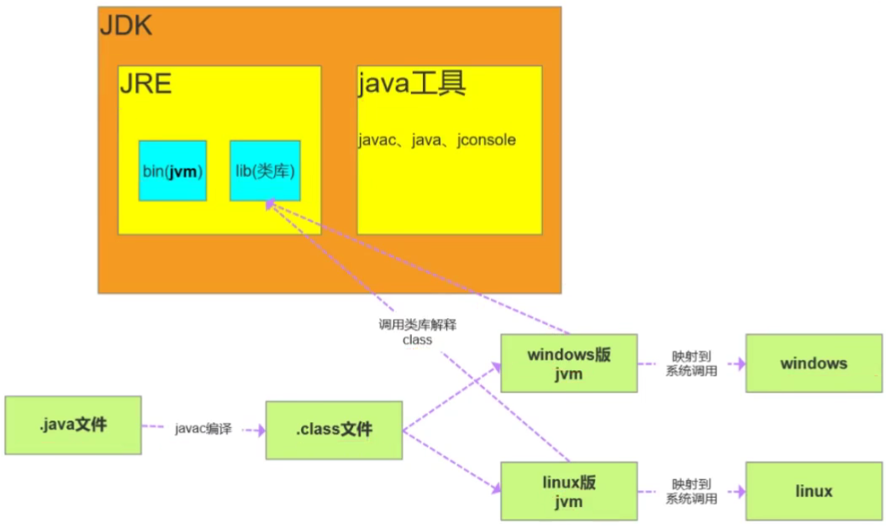
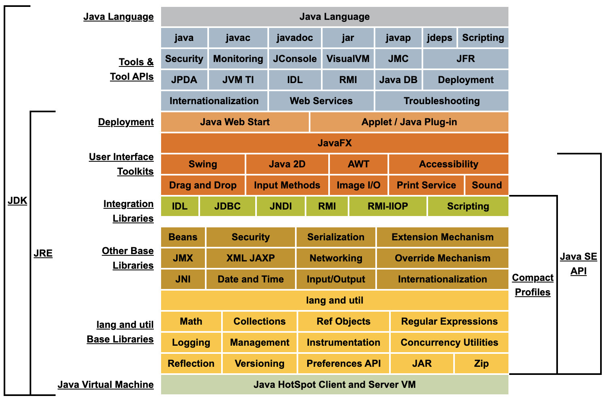
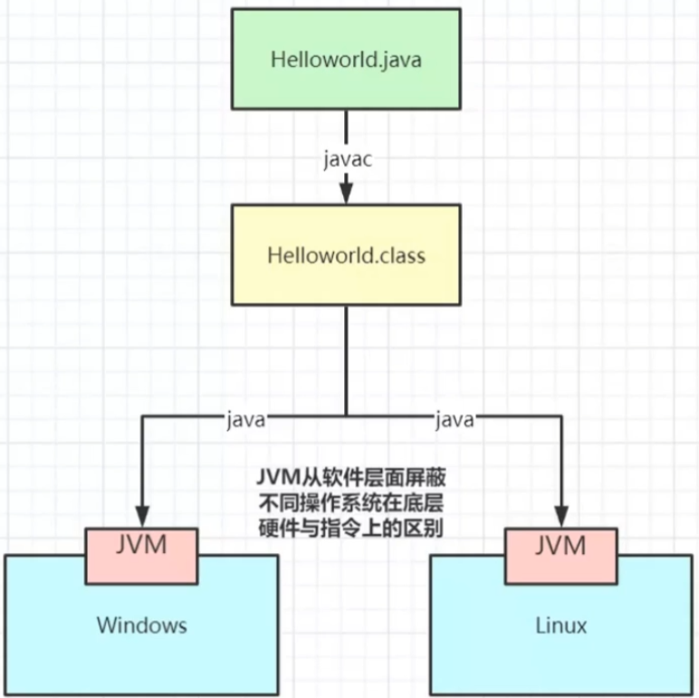
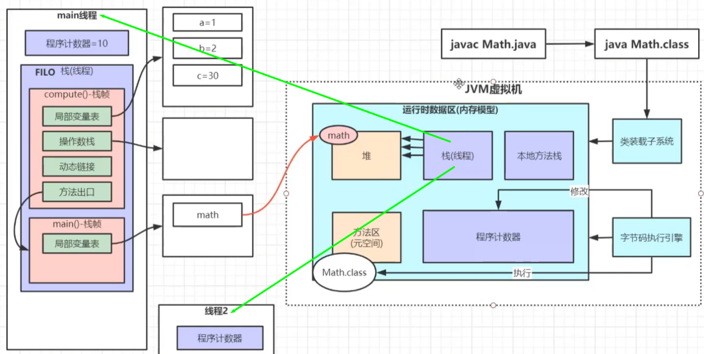
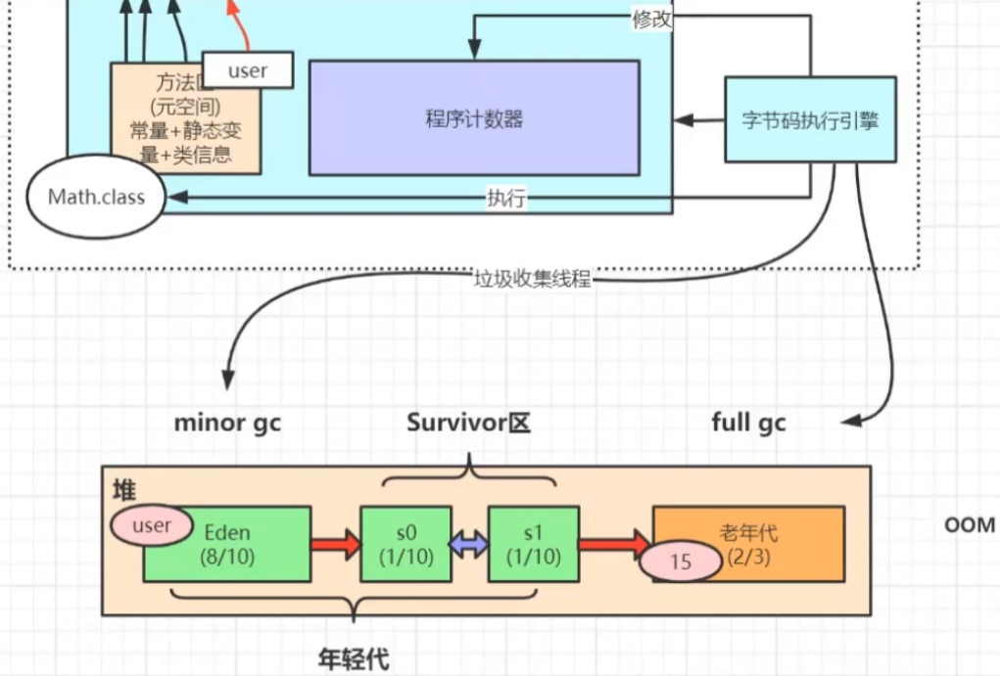

JDK: Java Develpment Kit java开发工具

JRE: Java Runtime Environment java运行时环境

JVM: java Virtual Machine java虚拟机












设计 **程序计数器** 是为了多线程切换

**操作数栈** 供操作数做加减乘除运算的临时的一块存储空间



直接引用跟间接引用的都是非垃圾

调优主要是为了减少full gc(也就是减少STW[stop the world])


JDK的开发人员为什么要设计STW?

因为'变量'的状态一直在变,而我gc不可能每次都重新找'垃圾'然后处理,不如先暂停(STW)把'垃圾'先处理掉先


GC算法 -> G1收集器: 大内存满的情况下,一次只回收部分,减少一次STW的时间

```shell
# 下载 arthas-boot包
wget https://alibaba.github.io/arthas/arthas-boot.jar
```

