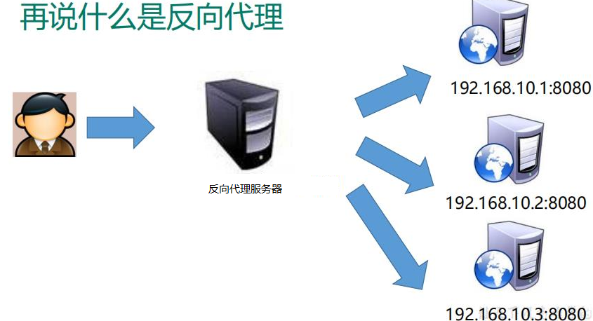
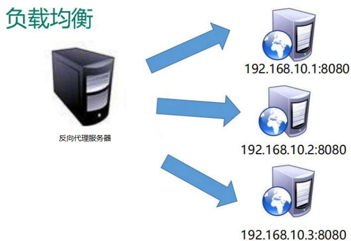
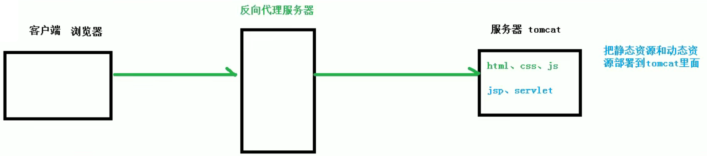
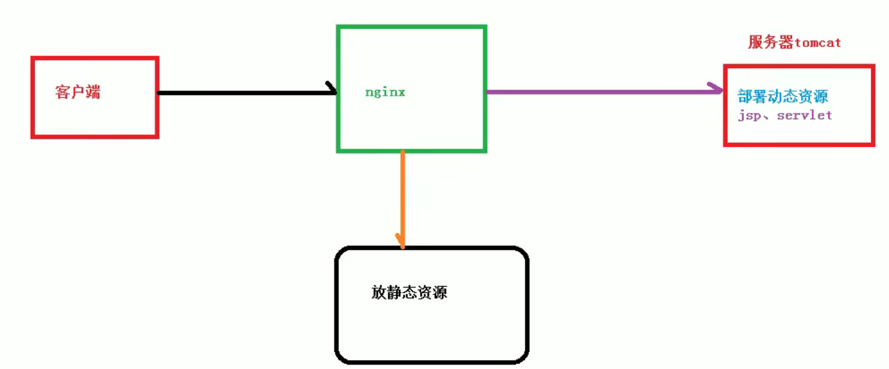

# 什么是nginx

Nginx ("engine x") 是一个高性能的 HTTP 和反向代理服务器,特点是占有内存少, 并发能

力强, 事实上 nginx 的并发能力确实在同类型的网页服务器中表现较好

Nginx 专为性能优化而开发, 性能是其最重要的考量,实现上非常注重效率 , 能经受高负载的考验,有报告表明能支持高

达 50,000 个并发连接数

# 反向代理

## 正向代理

正向代理, 客户端需要配置代理服务器

## 反向代理

反向代理, 其实客户端对代理是无感知的, 因为客户端不需要任何配置就可以访问, 我们只需要将请求发送到反向代理服务器, 由反向代理服务器去选择目标服务器获取数据后, 在返回给客户端, 此时反向代理服务器和目标服务器对外就是一个服务器, **暴露的是代理服务器地址,隐藏了真实服务器 IP 地址**

# 负载均衡

单个服务器解决不了，我们增加服务器的数量，然后将请求分发到各个服务器上，将原先请求集中到单个服务器上的情况改为将请求分发到多个服务器上，将负载分发到不同的服务器，也就是我们所说的**负载均衡**

# 动静分离

为了加快网站的解析速度, 可以把动态页面和静态页面由不同的服务器来解析, 加快解析速度	降低原来单个服务器的压力

