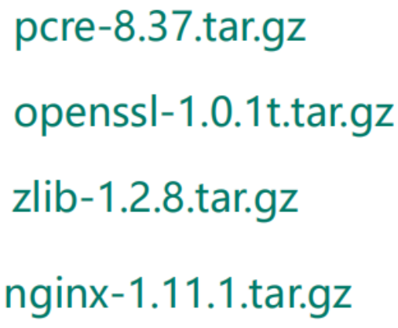
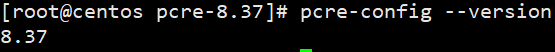
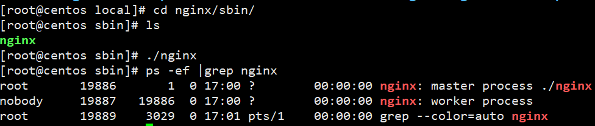

# nginx 相关依赖




# 安装pcre

```shell
wget http://downloads.sourceforge.net/project/pcre/pcre/8.37/pcre-8.37.tar.gz
解压文件
./configure 完成后，回到 pcre 目录下执行 make
再执行 make install
```

```shell
执行./configure报错, 缺少gcc环境
no acceptable C compiler found in $PATH

解决办法:
yum install gcc
apt-get install gcc

yum install gcc-c++
```




# 安装openssl zlib

```shell
yum -y install make zlib zlib-devel gcc-c++ libtool openssl openssl-devel
```


# 安装nginx

```shell
nginx下载: http://nginx.org/en/download.html

解压缩 nginx-xx.tar.gz 包
进入解压缩目录，执行./configure
make && make install

安装成功之后, 在/usr/local多出来一个文件夹nginx, 在nginx有sbin启动脚本
```



```shell
nginx 80端口无法访问, 解决方法:

firewall-cmd --state	# 查看防火墙状态

systemctl start firewalld	#打开防火墙

#查看当前防火墙开放的端口
1. firewall-cmd --list-all
2. firewall-cmd --list-ports	

firewall-cmd --zone=public --add-port=80/tcp --permanent	#添加80端口

firewall-cmd --reload	#重新启动防火墙
```

