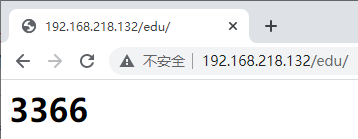

# 反向代理

## xxx端口绑定到80端口

配置**nginx.conf**文件


## 不同路径访问到不同端口

1. 启动两个tomcat, 分别指定端口为3355 3366

2. 配置**nginx.conf**

   

3. 在**/usr/local/tomcat/webapps**分别新建目录**edu** **vod**

4. 在目录里面新建**index.html**文件,用于测试

5. 测试


# location 指令说明

```shell
location [ = | ~ | ~* | ^~] uri {

}
```

1. = ：用于不含正则表达式的 uri 前, 要求请求字符串与 uri 严格匹配, 如果匹配成功, 就停止继续向下搜索并立即处理该请求
2. ~：用于表示 uri 包含正则表达式, 并且区分大小写
3. ~*：用于表示 uri 包含正则表达式, 并且不区分大小写
4. ^~：用于不含正则表达式的 uri 前, 要求 Nginx 服务器找到标识 uri 和请求字符串匹配度最高的 location 后, 立即使用此 location 处理请求, 而不再使用 location 块中的正则 uri 和请求字符串做匹配

> 注意：如果 uri 包含正则表达式, 则必须要有 ~ 或者 ~* 标识


# 负载均衡

1. 启动两个tomcat, 分别指定端口为3355 3366

2. 在**/usr/local/tomcat/webapps**新建目录**edu**

3. 在目录里面新建**index.html**文件,用于测试

4. 配置**nginx.conf**

   ```shell
   http{
   ......
   	upstream myserver{
   	    #ip_hash;
           server localhost:3355 weight=1;
           server localhost:3366 weight=1;
           #fair
       }
   ......
   	location / {
               ......
               proxy_pass http://myserver;
   	}
   ......
   }
   ```

   

   

5. 测试





## 负载均衡策略

1. 轮询(默认)

   每个请求按时间顺序逐一分配到不同的后端服务器, 如果后端服务器 down 掉, 能自动剔除

2. weight

   weight 代表权,重默认为 1,权重越高被分配的客户端越多

3. ip_hash

   每个请求按访问 ip 的 hash 结果分配, 这样每个访客固定访问一个后端服务器, 可以解决 session 的问题

4. fair(第三方)

   按后端服务器的响应时间来分配请求, 响应时间短的优先分配


# 动静分离

Nginx 动静分离简单来说就是把动态跟静态请求分开, 不能理解成只是单纯的把动态页面和静态页面物理分离

严格意义上说应该是动态请求跟静态请求分开, 可以理解成使用 Nginx 处理静态页面, Tomcat 处理动态页面


1. 纯粹把静态文件独立成单独的域名, 放在独立的服务器上, 也是目前主流推崇的方案
2. 是动态跟静态文件混合在一起发布, 通过 nginx 来分开

通过 location 指定不同的后缀名实现不同的请求转发。

通过 expires 参数设置, 可以使浏览器缓存过期时间, 减少与服务器之前的请求和流量。具体 Expires 定义：是给一个资源设定一个过期时间, 也就是说无需去服务端验证, 直接通过浏览器自身确认是否过期即可, 所以不会产生额外的流量。此种方法非常适合不经常变动的资源。(如果经常更新的文件, 不建议使用 Expires 来缓存)

例如我这里设置 3d, 表示在这 3 天之内访问这个 URL, 发送一个请求, 比对服务器该文件最后更新时间没有变化, 则不会从服务器抓取, 返回状态码304, 如果有修改, 则直接从服务器重新下载, 返回状态码 200


1. 准备好'静态资源'

   

2. 配置**nginx.conf**

   

3. 测试

   

   

4. 配置**autoindex**的效果

   


