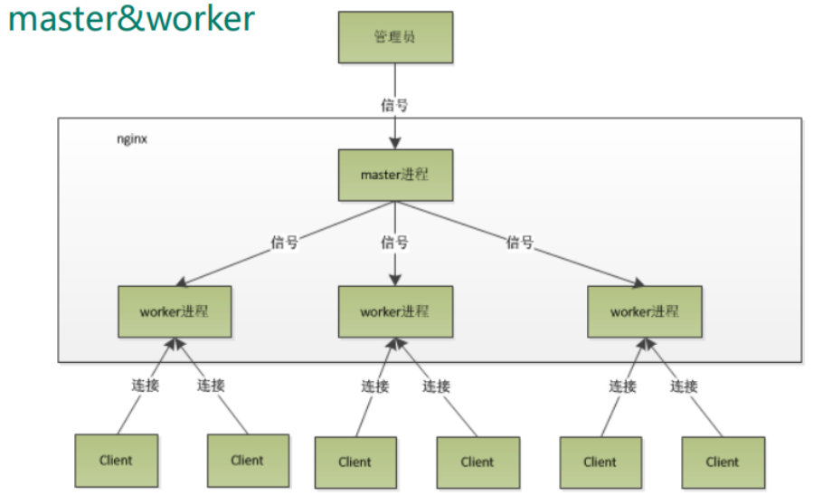
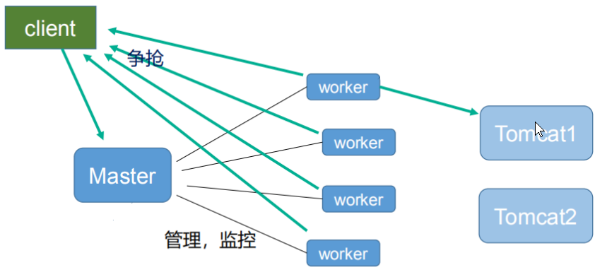
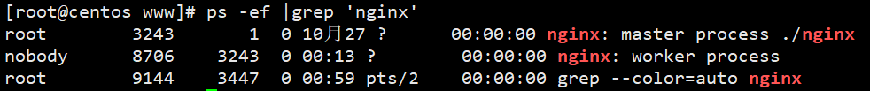

## 一个master多个worker的好处

1. 利于热部署	./nginx -s reload
2. 每个 worker独立进程, 不需要加锁, 省掉了锁带来的开销, 让互相之间不会影响, worker 进程的异常退出, 不会影响所有请求, 降低风险


## 设置多少个worker比较合适

每个 worker 的线程可以把一个 cpu 的性能发挥到极致, 所以 worker 数和服务器的 cpu数相等是最为适宜的

设少了会浪费 cpu, 设多了会造成 cpu 频繁切换上下文带来的损耗

```shell
#设置 worker 数量。
worker_processes 4
#work 绑定 cpu(4 work 绑定 4cpu)。
worker_cpu_affinity 0001 0010 0100 1000
#work 绑定 cpu (4 work 绑定 8cpu 中的 4 个) 。
worker_cpu_affinity 0000001 00000010 00000100 00001000
```


## 连接数 worker_connection

作为反向代理服务器, 每个并发会建立与客户端的连接和与后端服务的连接, 会占用两个连接(四个连接数, worker跟客户端来回(2) + worker跟后端服务来回(2))

1. 发送请求， 占用了worker的几个连接数？

   2 或者 4

2. 一个master有四个worker, 每个worker支持最大连接数1024, 最大并发数是多少?

   普通的静态访问最大并发数是： worker_connections * worker_processes /2

   HTTP 作 为反向代理来说, 最大并发数量应该是 worker_connections * worker_processes/4

