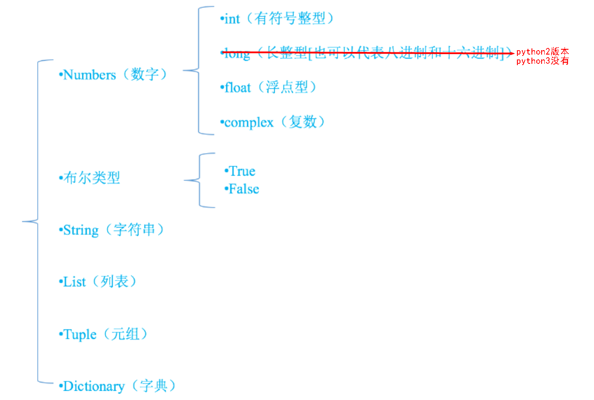

## 注释

在我们工作编码的过程中，如果一段代码的逻辑比较复杂，不是特别容易理解，可以适当的添加注释，以辅助自己或者其他编码人员解读代码

```python
# 单行注释

'''
多行注释
'''
```


## 变量

定义变量的语法为: `变量名 = 变量值`   (这里的 = 作用是赋值)

- 变量即是可以变化的量，可以随时进行修改
- 程序就是用来处理数据的，而变量就是用来存储数据的


## 变量类型



> 单引号和双引号的嵌套
>
> 单引号**可以套**双引号	单引号**不能套**单引号
>
> 双引号**可以套**单引号	双引号**不能套**双引号


```python
# 在python中，只要定义了一个变量，而且它有数据，那么它的类型就已经确定了，不需要咱们开发者主动的 去说明它的类型，系统会自动辨别
# 变量没有类型，数据才有类型
# 如果临时想要查看一个变量存储的数据类型，可以使用 type(变量的名字)，来查看变量存储的数据类型
```


## 标识符和关键字

计算机编程语言中，标识符是用户编程时使用的名字，用于给变量、常量、函数、语句块等命名，以建立起名称与使用之间的关系

- 标识符由字母、下划线和数字组成，且**数字不能开头**
- 严格区分大小写
- 不能使用关键字


### 命名规范

- 标识符命名要做到顾名思义
- 遵守一定的命名规范
  - 驼峰命名法，又分为大驼峰命名法和小驼峰命名法
  - 还有一种命名法是用下划线“_”来连接所有的单词

Python的命令规则遵循PEP8标准


### 关键字

关键字，已经被python官方使用了，所以不允许开发者自己定义和关键字相同名字的标识符

```python
False None True and as assert break class continue def del elif else except finally for from global if import in is lambda nonlocal not or pass raise return try while with yield
```


## 类型转换

| 函数     | 说明                  |
| -------- | --------------------- |
| int(x)   | 将x转换为一个整数     |
| float(x) | 将x转换为一个浮点数   |
| str(x)   | 将对象 x 转换为字符串 |
| bool(x)  | 将对象x转换成为布尔值 |

```python
print(int("123")) # 123 将字符串转换成为整数
print(int(123.78)) # 123 将浮点数转换成为整数
print(int(True)) # 1 布尔值True转换成为整数是 1
print(int(False)) # 0 布尔值False转换成为整数是 0

# 以下情况将会转换失败 
''' 
123.456 和 12ab 字符串，都包含非法字符，不能被转换成为整数，会报错
'''
```

```python
f1 = float("12.34") 
print(f1) # 12.34 
print(type(f1)) # float 将字符串的 "12.34" 转换成为浮点数 12.34 

f2 = float(23) 
print(f2) # 23.0 
print(type(f2)) # float 将整数转换成为了浮点数
```

```python
str1 = str(45) 
str2 = str(34.56) 
str3 = str(True) # True
print(type(str1),type(str2),type(str3))
```

```python
# 只有字符串中有内容,那么进行bool类型的转换,返回True
print(bool('')) # False
print(bool("")) # False
# 如果对非0的Number进行bool类型的转换,都是True
print(bool(0)) # Flase
print(bool(0.0)) # Flase
# 只要有数据,那么进行bool类型的转换,就返回True
print(bool({})) # False
print(bool([])）# False
print(bool(())）# False
```


## 运算符

### 算数运算符

| 运算符 | 描述   | 实例                                                         |
| ------ | ------ | ------------------------------------------------------------ |
| +      | 加     | 两个对象相加 a + b 输出结果 30                               |
| -      | 减     | 得到负数或是一个数减去另一个数 a - b 输出结果 -10            |
| *      | 乘     | 两个数相乘或是返回一个被重复若干次的字符串 a * b 输出结果 200 |
| /      | 除     | b / a 输出结果 2                                             |
| //     | 取整除 | 返回商的整数部分 9//2 输出结果 4 , 9.0//2.0 输出结果 4.0     |
| %      | 取余   | 返回除法的余数 b % a 输出结果 0                              |
| **     | 指数   | a**b 为10的20次方                                            |
| ()     | 小括号 | 提高运算优先级，比如: (1+2) * 3                              |

> 混合运算时，优先级顺序为： ** 高于 * / % // 高于 + - ，为了避免歧义，建议使用 () 来处理运算符优先级


```python
# 拓展
str1 = '123'
str2 = '456'
print(str1 + str2) # 123456

i = 456
print(str1 + i) # 报错

print(str1*3) # 123123123
```


### 赋值运算符

| 运算符 | 描述       | 实例                                                         |
| ------ | ---------- | ------------------------------------------------------------ |
| =      | 赋值运算符 | 把 = 号右边的结果 赋给 左边的变量，如 num = 1 + 2 * 3，结果num的值为7 |

```python
a = b = 4 # a=4,b=4

c,d,e = 1,2,3 # c=1,d=2,e=3
```


### 复合赋值运算符

| 运算符 | 描述             | 实例                      |
| ------ | ---------------- | ------------------------- |
| +=     | 加法赋值运算符   | c += a 等效于 c = c + a   |
| -=     | 减法赋值运算符   | c -= a 等效于 c = c - a   |
| *=     | 乘法赋值运算符   | c *= a 等效于 c = c * a   |
| /=     | 除法赋值运算符   | c /= a 等效于 c = c / a   |
| //=    | 取整除赋值运算符 | c //= a 等效于 c = c // a |
| %=     | 取模赋值运算符   | c %= a 等效于 c = c % a   |
| **=    | 幂赋值运算符     | c \*\*= a 等效于 c = c \*\* a |


### 比较运算符

| 运算符 | 描述                                                         | 实例               |
| ------ | ------------------------------------------------------------ | ------------------ |
| ==     | 等于:比较对象是否相等                                        | (a == b) 返回False |
| !=     | 不等于:比较两个对象是否不相等                                | (a != b) 返回True  |
| >      | 大于:返回x是否大于y                                          | (a > b) 返回False  |
| >=     | 大于等于:返回x是否大于等于y                                  | (a >= b) 返回False |
| <      | 小于:返回x是否小于y。所有比较运算符返回1表示真，返回0表示假。这分别与特殊的变量True和False等价 | (a < b) 返回True   |
| <=     | 小于等于:返回x是否小于等于y                                  | (a <= b) 返回True  |

> <>: python2版本使用的'不等于'


### 逻辑运算符

| 运算符 | 逻辑表达式 | 描述                                                         | 实例                                                         |
| ------ | ---------- | ------------------------------------------------------------ | ------------------------------------------------------------ |
| and    | x and y    | 只要有一个运算数是False，结果就是False;<br />只有所有的运算数都为True时，结果才是True<br />做取值运算时，取第一个为False的值，如果所有的值都为True,取最后一个值 | True and True and False-->结果为False<br />True and True and True-->结果为True |
| or     | x or y     | 只要有一个运算数是True，结果就是True<br />只有所有的运算数都为False时，结果才是False<br />做取值运算时，取第一个为True的值，如果所有的值都为False,取最后一个值 | False or False or True-->结果为True<br />False or False or False-->结果为False |
| not    | not x      | 布尔"非" - 如果 x 为 True，返回 False<br />如果 x 为False，它返回 True | not True --> False                                           |

> 短路


## 输入输出

```python
# 普通输出
print('abc')

# 格式化输出
# %s:字符串  %d:数值
name = 'zhangsan'
age = 17
print('名字是%s,年龄%d' % (name,age))
```

```python
# 输入, input返回的是字符串类型
input('提示语')
```


## 流程控制语句

```python
if 布尔表达式1:
    ...
elif 布尔表达式2:
    ...
else:
    ...
```

```python
# range方法的结果,返回一个可以遍历的对象
# range(起始值,结束值,步长) 左闭右开区间

# for 变量 in 要遍历ed数据:
#	方法体
```


## 字符串

```python
# 获取长度:len len函数可以获取字符串的长度。 
# 查找内容:find 查找指定内容在字符串中是否存在，如果存在就返回该内容在字符串中第一次 出现的开始位置索引值，如果不存在，则返回-1. 
# 判断:startswith,endswith 判断字符串是不是以谁谁谁开头/结尾 
# 计算出现次数:count 返回 str在start和end之间 在 mystr里面出现的次数 
# 替换内容:replace 替换字符串中指定的内容，如果指定次数count，则替换不会超过count次。 
# 切割字符串:split 通过参数的内容切割字符串 
# 修改大小写:upper,lower 将字符串中的大小写互换 
# 空格处理:strip 去空格 
# 字符串拼接:join 字符串拼接
str1 = 'a'
print(str1.join('hello')) #haealalao
```


## 列表高级

```python
# 新增
# append 在末尾添加元素
list.append(self, object)
# insert 在指定位置插入元素
list.insert(self, index, object)
# extend 合并两个列表
list.extend(self, iterable)
```

```python
# 修改
list1 = [1, 2]
list1[1] = 3
```

```python
# 查找
# in（存在）,如果存在那么结果为true，否则为false 
# not in（不存在），如果不存在那么结果为true，否则false
```

```python
# 删除
list2 = [1, 2]
# del：根据下标进行删除 
del list2[1]
# pop：删除最后一个元素 
# remove：根据元素的值进行删除
list2.remove(1)
```


## 元组高级

Python的元组与列表类似，不同之处在于**元组的元素不能修改**。元组使用小括号，列表使用方括号

```python
# 定义只有一个元素的元组, 需要在唯一的元素后写一个逗号
tup = (1,)
```


## 切片

切片是指对操作的对象截取其中一部分的操作。**字符串、列表、元组**都支持切片操作。 

切片的语法：[起始:结束:步长]	前包后不包

```python
# 索引是通过下标取某一个元素 
# 切片是通过下标去某一段元素 
s = 'Hello World!' 
print(s) 
print(s[4]) # 'o' 字符串里的第4个元素 
print(s[3:7]) # 'lo W' 包含下标 3，不含下标 7 
print(s[1:]) # 'ello World!' 从下标为1开始，取出 后面所有的元素（没有结束位） 
print(s[:4]) # 'Hell' 从起始位置开始，取到 下标为4的前一个元素（不包括结束位本身） 
print(s[1:5:2]) # 'el' 从下标为1开始，取到下标为5的前一个元素，步长为2（不包括结束位本身）
```


## 字典高级

```python
# 查找
info = {'name':'NM','age':18}
print(info['age'])
# 获取年龄 # print(info['sex']) # 获取不存在的key，会发生异常 
print(info.get('sex')) # 获取不存在的key，获取到空的内容，不会出现异常
print(info.get('sex'， '女')) # 获取不存在的key, 可以提供一个默认值
```

```python
# 修改
dic['key'] = 'value' # 为已存在的键赋值就是修改

# 添加
dic['key'] = 'value' # 为不存在的键赋值就是添加元素
```

```python
# 删除
# del删除指定的元素
del dic['key']
# del删除整个字典
del dic
# clear清空整个字典
dic.clear()
```

```python
# 遍历
# 遍历字典的key（键）
for key in dic.keys()
# 遍历字典的value（值）
for key in dic.values()
# 遍历字典的项（元素）
for item in dic.items()
# 遍历字典的key-value（键值对）
for key,value in dic.items()
```


## 函数

```python
# 定义函数
def 函数名():
    代码

# 调用函数
函数名() 

# 定义时小括号中的参数，用来接收参数用的，称为 "形参"
# 调用时小括号中的参数，用来传递给函数用的，称为 "实参"
```

```python
# 调用函数时参数的顺序
def test(a,b): 
   print(a,b)
test(1,2) # 位置参数 1 2 
test(b=1,a=2) # 关键字参数 2 1
```

```python
# 返回值
# 定义函数 
def add2num(a, b): 
    return a+b 

# 调用函数，顺便保存函数的返回值 
result = add2num(100,98) 
# 因为result已经保存了add2num的返回值，所以接下来就可以使用了 
print(result)
```


## 定义域

**局部变量**，就是在函数内部定义的变量 

其作用范围是这个函数内部，即只能在这个函数中使用，在函数的外部是不能使用的


在函数外边定义的变量叫做 **全局变量** 

全局变量能够在所有的函数中进行访问


> 在满足条件的情况下, 要使用作用域最小的变量范围


## 文件

在python，使用open函数，可以打开一个已经存在的文件，或者创建一个新文件

open(文件路径，访问模式)

```python
# 新建一个文件，文件名为:test.txt 
f = open('test.txt', 'w')

# 关闭这个文件 
f.close()
```


### 文件路径

- 绝对路径：指的是绝对位置，完整地描述了目标的所在地，所有目录层级关系是一目了然的
  - 例如： `E:\python` ，从电脑的盘符开始，表示的就是一个绝对路径
- 相对路径：是从当前文件所在的文件夹开始的路径
  - `test.txt` ，是在当前文件夹查找 `test.txt` 文件
  - `./test.txt` ，也是在当前文件夹里查找 `test.txt` 文件， `./` 表示的是当前文件夹
  - `../test.txt` ，从当前文件夹的上一级文件夹里查找 `test.txt` 文件。 `../` 表示的是上一级文件夹
  - `demo/test.txt` ，在当前文件夹里查找 `demo` 这个文件夹，并在这个文件夹里查找 `test.txt` 文件


### 访问模式

| 访问模式 | 说明                                                         |
| -------- | ------------------------------------------------------------ |
| r        | 以只读方式打开文件。文件的指针将会放在文件的开头。如果文件不存在，则报错。**这是默认模式** |
| w        | 打开一个文件只用于写入。如果该文件已存在则将其覆盖。如果该文件不存在，创建新文件 |
| a        | 打开一个文件用于追加。如果该文件已存在，文件指针将会放在文件的结尾。也就是说，新的内容将会被写入到已有内容之后。如果该文件不存在，创建新文件进行写入 |
| r+       | 打开一个文件用于读写。文件指针将会放在文件的开头             |
| w+       | 打开一个文件用于读写。如果该文件已存在则将其覆盖。如果该文件不存在，创建新文件 |
| a+       | 打开一个文件用于读写。如果该文件已存在，文件指针将会放在文件的结尾。文件打开时会是追加模式。如果该文件不存在，创建新文件用于读写 |
| rb       | 以二进制格式打开一个文件用于只读。文件指针将会放在文件的开头 |
| wb       | 以二进制格式打开一个文件只用于写入。如果该文件已存在则将其覆盖。如果该文件不存在，创建新文件 |
| ab       | 以二进制格式打开一个文件用于追加。如果该文件已存在，文件指针将会放在文件的结尾。也就是说，新的内容将会被写入到已有内容之后。如果该文件不存在，创建新文件进行写入 |
| rb+      | 以二进制格式打开一个文件用于读写。文件指针将会放在文件的开头 |
| wb+      | 以二进制格式打开一个文件用于读写。如果该文件已存在则将其覆盖。如果该文件不存在，创建新文件 |
| ab+      | 以二进制格式打开一个文件用于读写。如果该文件已存在，文件指针将会放在文件的结尾。如果该文件不存在，创建新文件用于读写 |


### 文件的读写

```python
# 使用write()可以完成向文件写入数据
f = open('test.txt', 'w')
f.write('hello world, i am here!\n' * 5)
f.close()

# 如果文件不存在，那么创建；如果存在那么就先清空，然后写入数据
```

``` python
# 使用read(num)可以从文件中读取数据，num表示要从文件中读取的数据的长度（单位是字节），如果没有传入num，那么就表示读取文件中所有的数据
f = open('test.txt', 'r')
content = f.read(5) # 最多读取5个数据
content = f.read() # 从上次读取的位置继续读取剩下的所有的数据
f.close()

f = open('test.txt', 'r')
content = f.readline() # readline只用来读取一行数据
content = f.readlines() # 可以按照行的方式把整个文件中的内容进行一次性读取, 返回的是一个列表，其中每一行为列表的 一个元素
f.close()
```


## 序列化和反序列化

设计一套协议，按照某种规则，把内存中的数据转换为字节序列，保存到文件，这就是序列化

**对象---》字节序列 === 序列化**

反之，从文件的字节序列恢复到内存中，就是反序列化

**字节序列--》对象 ===反序列化**


### JSON实现序列化

```python
import json 
file = open('names.txt', 'w') 
names = ['zhangsan', 'lisi', 'wangwu', 'jerry', 'henry', 'merry', 'chris'] 
# file.write(names) 出错，不能直接将列表写入到文件里 

# 可以调用 json的dumps方法，传入一个对象参数 
result = json.dumps(names) 
# dumps 方法得到的结果是一个字符串 
print(type(result)) # <class 'str'> 
# 可以将字符串写入到文件里 
file.write(result) 
file.close()
```

```python
import json
file = open('names.txt', 'w')
names = ['zhangsan', 'lisi', 'wangwu', 'jerry', 'henry', 'merry', 'chris']

# dump方法可以接收一个文件参数，在将对象转换成为字符串的同时写入到文件里
json.dump(names, file)
file.close()
```


### JSON实现反序列化

```python
import json 
# 调用loads方法，传入一个字符串，可以将这个字符串加载成为Python对象 
result = json.loads('["zhangsan", "lisi", "wangwu", "jerry", "henry", "merry", "chris"]') print(type(result)) # <class 'list'>
```

```python
import json 
# 以可读方式打开一个文件 
file = open('names.txt', 'r') 
# 调用load方法，将文件里的内容加载成为一个Python对象 
result = json.load(file) 
print(result) 
file.close()
```


## 异常

```python
try:
    可能会出现异常的代码块
except 异常的类型:
    出现异常以后的处理语句
```
