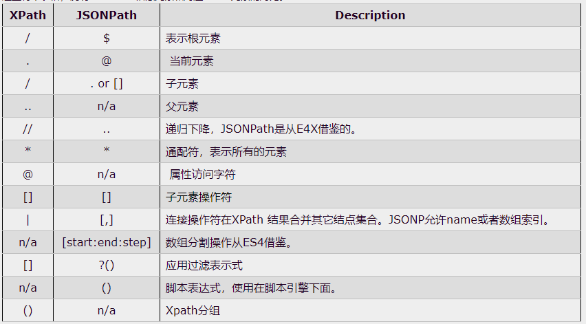

## xpath

```python
# 1. Chrome 网上应用店 https://chrome.google.com
# 2. 搜索下载  XPath Helper
# 3. 随便打开一个页面测试, ctrl+shift+x

# 安装lxml库
pip install lxml ‐i https://pypi.douban.com/simple
# 导入lxml.etree 
from lxml import etree 
# etree.parse() 解析本地文件 
html_tree = etree.parse('XX.html') 
# etree.HTML() 服务器响应文件 
html_tree = etree.HTML(response.read().decode('utf‐8') 
# html_tree.xpath(xpath路径)
```

1. 路径查询 

   //：查找所有子孙节点，不考虑层级关系 

   / ：找直接子节点 

2. 谓词查询 

   //div[@id] 

   //div[@id="maincontent"] 

3. 属性查询 

   //@class 

4. 模糊查询 

   //div[contains(@id, "he")] 

   //div[starts‐with(@id, "he")] 

5. 内容查询 

   //div/h1/text() 

6. 逻辑运算 

   //div[@id="head" and @class="s_down"] 

   //title | //price


## JsonPath

```python
# pip安装：
	pip install jsonpath 
# jsonpath的使用： 
	obj = json.load(open('json文件', 'r', encoding='utf‐8')) 
    ret = jsonpath.jsonpath(obj, 'jsonpath语法')
```



#### 网上SONPath例子

https://www.cnblogs.com/jpfss/p/10973590.html

```json
{ "store": {
    "book": [ 
      { "category": "reference",
        "author": "Nigel Rees",
        "title": "Sayings of the Century",
        "price": 8.95
      },
      { "category": "fiction",
        "author": "Evelyn Waugh",
        "title": "Sword of Honour",
        "price": 12.99
      },
      { "category": "fiction",
        "author": "Herman Melville",
        "title": "Moby Dick",
        "isbn": "0-553-21311-3",
        "price": 8.99
      },
      { "category": "fiction",
        "author": "J. R. R. Tolkien",
        "title": "The Lord of the Rings",
        "isbn": "0-395-19395-8",
        "price": 22.99
      }
    ],
    "bicycle": {
      "color": "red",
      "price": 19.95
    }
  }
}
```

| **XPath**              | **JSONPath**                      | **结果**                               |
| ---------------------- | --------------------------------- | -------------------------------------- |
| `/store/book/author`   | `$.store.book[*].author`          | 书点所有书的作者                       |
| `//author`             | `$..author`                       | 所有的作者                             |
| `/store/*`             | `$.store.*`                       | store的所有元素。所有的bookst和bicycle |
| `/store//price`        | `$.store..price`                  | store里面所有东西的price               |
| `//book[3]`            | `$..book[2]`                      | 第三个书                               |
| `//book[last()]`       | `$..book[(@.length-1)]`           | 最后一本书                             |
| `//book[position()<3]` | `$..book[0,1]`<br />`$..book[:2]` | 前面的两本书。                         |
| `//book[isbn]`         | `$..book[?(@.isbn)]`              | 过滤出所有的包含isbn的书。             |
| `//book[price<10]`     | `$..book[?(@.price<10)]`          | 过滤出价格低于10的书。                 |
| `//*`                  | `$..*`                            | 所有元素。                             |


## BeautifulSoup

- BeautifulSoup简称：  **bs4** 

- 什么是BeatifulSoup？ 

  BeautifulSoup，和lxml一样，是一个html的解析器，主要功能也是解析和提取数据 

- 优缺点？ 

  缺点：效率没有lxml的效率高 

  优点：接口设计人性化，使用方便

```python
# 安装
pip install bs4 
# 导入
from bs4 import BeautifulSoup
# 创建对象 
	# 服务器响应的文件生成对象 
    soup = BeautifulSoup(response.read().decode(), 'lxml') 
    # 本地文件生成对象 
    soup = BeautifulSoup(open('1.html'), 'lxml') 
    # 注意：默认打开文件的编码格式gbk所以需要指定打开编码格式
```


### 节点定位

1. 根据标签名查找节点

   ​	soup.a 【注】只能找到第一个a

   ​	soup.a.name

   ​	soup.a.attrs

2. 函数

   ```python
   # (1).find(返回一个对象)
   	find('a') # 只找到第一个a标签
       find('a', title='名字')
       find('a', class_='名字')
   # (2).find_all(返回一个列表)
   	find_all('a') # 查找到所有的a 
       find_all(['a', 'span']) # 返回所有的a和span 
       find_all('a', limit=2) # 只找前两个a
   # (3).select(根据选择器得到节点对象)[推荐]
   	# 1.element 例:p 
       # 2..class 例:.firstname 
       # 3.#id 例:#firstname
       # 4.属性选择器
       	# [attribute] 
           	li = soup.select('li[class]') 
           # [attribute=value] 
           	li = soup.select('li[class="hengheng1"]')
       # 5.层级选择器
       	# element element
           # element>element
           # element,element
           soup = soup.select('a , span')
   ```

   

### 节点信息

```python
# 获取节点内容：适用于标签中嵌套标签的结构
	# 如果标签对象中只有内容, 那么string和get_text()都可以使用
    # 如果标签对象中除了内容还有标签, 那么string就获取不到数据, 而get_text()是可以获取数据
	obj.string
    obj.get_text() # 推荐
# 节点的属性
	# tag.name 获取标签名
        tag = find('li)
        print(tag.name)
    # tag.attrs将属性值作为一个字典返回
# 获取节点属性
	obj.attrs.get('title') # 常用
    obj.get('title')
    obj['title']
```


