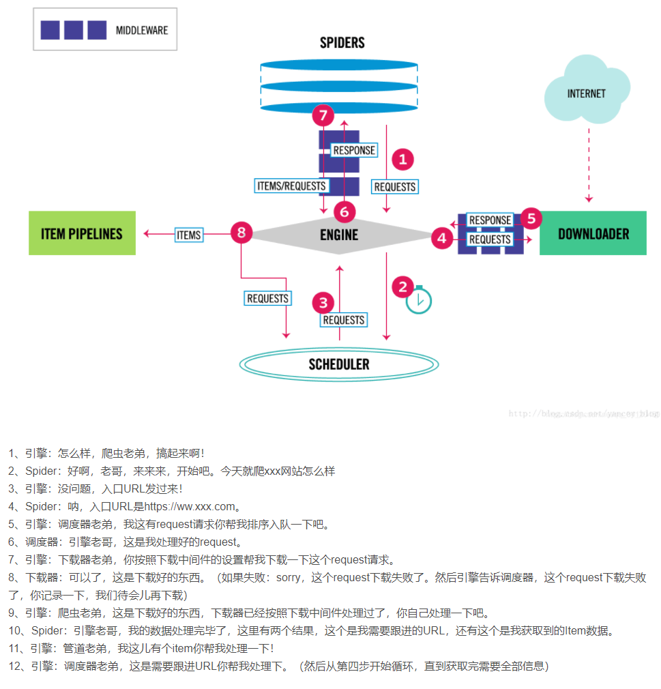
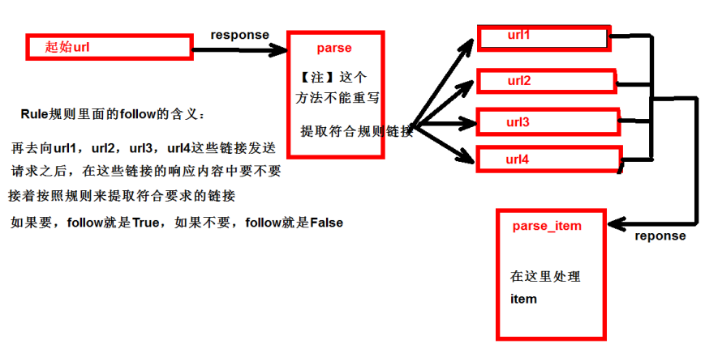

Scrapy是一个为了爬取网站数据，提取结构性数据而编写的应用框架。 可以应用在包括数据挖掘，信息处理或存储历史数据等一系列的程序中

## 创建运行

```python
# scrapy项目:
	终端输入 scrapy startproject 项目名称

# 项目组成:
    spiders 
        __init__.py 
        自定义的爬虫文件.py   # 由我们自己创建，是实现爬虫核心功能的文件 
    __init__.py
    items.py   # 定义数据结构的地方，是一个继承自scrapy.Item的类 
    middlewares.py   # 中间件 代理 
    pipelines.py   # 管道文件，里面只有一个类，用于处理下载数据的后续处理 
    			   # 默认是300优先级，值越小优先级越高（1‐1000） 
    settings.py    # 配置文件 比如：是否遵守robots协议，User‐Agent定义等
    
# 创建爬虫文件:
    跳转到spiders文件夹 cd 目录名字/目录名字/spiders
    scrapy genspider 爬虫名字 网页的域名
    
# 爬虫文件的基本组成:
    继承scrapy.Spider类 
        name = 'baidu'   # 运行爬虫文件时使用的名字 
        allowed_domains   # 爬虫允许的域名，在爬取的时候，如果不是此域名之下的 url，会被过滤掉 
        start_urls   # 声明了爬虫的起始地址，可以写多个url，一般是一个 
        parse(self, response)   # 解析数据的回调函数 
            response.text   # 响应的是字符串 
            response.body   # 响应的是二进制文件 
            response.xpath()   # xpath方法的返回值类型是selector列表 
            extract()   # 提取的是selector对象的是data 
            extract_first()   # 提取的是selector列表中的第一个数据
            
# 运行爬虫文件:
	scrapy crawl 爬虫名称
    注意：应在spiders文件夹内执行
```


## 架构

```shell
引擎   # 自动运行，无需关注，会自动组织所有的请求对象，分发给下载器 
下载器   # 从引擎处获取到请求对象后，请求数据 
spiders   # Spider类定义了如何爬取某个(或某些)网站。包括了爬取的动作(例 如:是否跟进链接)以及如何从网页的内容中提取结构化数据(爬取item)。 换句话说，Spider就是您定义爬取的动作及 分析某个网页(或者是有些网页)的地方。 
调度器   # 有自己的调度规则，无需关注 
管道（Item pipeline）   #最终处理数据的管道，会预留接口供我们处理数据 当Item在Spider中被收集之后，它将会被传递到Item Pipeline，一些组件会按照一定的顺序执行对Item的处理。 每个item pipeline组件(有时称之为“Item Pipeline”)是实现了简单方法的Python类。他们接收到Item并通过它执行 一些行为，同时也决定此Item是否继续通过pipeline，或是被丢弃而不再进行处理。 
		以下是item pipeline的一些典型应用:
        1. 清理HTML数据 
        2. 验证爬取的数据(检查item包含某些字段) 
        3. 查重(并丢弃) 
        4. 将爬取结果保存到数据库中
```


## 工作原理



> https://blog.csdn.net/qq_34120459/article/details/86711728


## scrapy shell

Scrapy终端，是一个交互终端，供您在未启动spider的情况下尝试及调试您的爬取代码。 其本意是用来测试提取数据的代码，不过您可以将其作为正常的Python终端，在上面测试任何的Python代码

该终端是用来测试XPath或CSS表达式，查看他们的工作方式及从爬取的网页中提取的数据。 在编写您的spider时，该终端提供了交互性测试您的表达式代码的功能，免去了每次修改后运行spider的麻烦

一旦熟悉了Scrapy终端后，您会发现其在开发和调试spider时发挥的巨大作用

```python
# 安装: 
	pip install ipython

# 应用
	直接终端执行 scrapy shell 域名
```


## yield

- 带有 yield 的函数不再是一个普通函数，而是一个生成器generator，可用于迭代 
- yield 是一个类似 return 的关键字，迭代一次遇到yield时就返回yield后面(右边)的值。重点是：下一次迭代时，从上一次迭代遇到的yield后面的代码(下一行)开始执行
- yield就是 return 返回一个值，并且记住这个返回的位置，下次迭代就从这个位置后(下一行)开始 0


## pymysql

```python
pip install pymysql
pymysql.connect(host,port,user,password,db,charset)
conn.cursor()
cursor.execute()
```


## CrawlSpider

继承自scrapy.Spider

CrawlSpider可以定义规则，再解析html内容的时候，可以根据链接规则提取出指定的链接，然后再向这些链接发送请求

```python
# 提取链接
scrapy.linkextractors.LinkExtractor(
    allow = (), # 正则表达式 提取符合正则的链接 
    deny = (), # (不用)正则表达式 不提取符合正则的链接 
    allow_domains = (), # （不用）允许的域名 
    deny_domains = (), # （不用）不允许的域名 
    restrict_xpaths = (), # xpath，提取符合xpath规则的链接 
    restrict_css = () # 提取符合选择器规则的链接
)

# 模拟使用
	links1 = LinkExtractor(allow=r'list_23_\d+\.html')   # 正则用法
    links2 = LinkExtractor(restrict_xpaths=r'//div[@class="x"]')   # xpath用法
    links3 = LinkExtractor(restrict_css='.x')   # css用法
    
# 提取链接
	link.extract_links(response)
```



1. callback只能写函数名字符串, callback='parse_item' 

2. 在基本的spider中，如果重新发送请求，那里的callback写的是 callback=self.parse_item 

   follow=true 是否跟进 就是按照提取连接规则进行提取


### 案例

```shell
1.创建项目：scrapy startproject dushuproject 
2.跳转到spiders路径 cd 项目地址 
3.创建爬虫类：scrapy genspider ‐t crawl read www.dushu.com 
4.items 
5.spiders 
6.settings 
7.pipelines
```


## 数据入库

```python
# settings配置参数
	DB_HOST = '192.168.231.128'              
    DB_PORT = 3306
    DB_USER = 'root'
    DB_PASSWORD = '1234'
    DB_NAME = 'test'
    DB_CHARSET = 'utf8'
    
# 管道配置
from scrapy.utils.project import get_project_settings
import pymysql

class MysqlPipeline(object):
    # __init__方法和open_spider的作用是一样的
    # init是获取settings中的连接参数
    def __init__(self):
        settings = get_project_settings()
        self.host = settings['DB_HOST']
        self.port = settings['DB_PORT']
        self.user = settings['DB_USER']
        self.pwd = settings['DB_PWD']
        self.name = settings['DB_NAME']
        self.charset = settings['DB_CHARSET']
        self.connect()

    #  连接数据库并且获取cursor对象
    def connect(self):
        self.conn = pymysql.connect(host=self.host,
                                    port=self.port,
                                    user=self.user,
                                    password=self.pwd,
                                    db=self.name,
                                    charset=self.charset)
        self.cursor = self.conn.cursor()

    def process_item(self, item, spider):
        sql = 'insert into book(image_url, book_name, author, info) values("%s", "%s", "%s", "%s")' % (
            item['image_url'],
            item['book_name'], item['author'], item['info'])
        sql = 'insert into book(image_url,book_name,author,info) values("{}", "{}", "{}", "{}")'.format(
            item['image_url'], item['book_name'], item['author'], item['info'])
        #  执行sql语句
        self.cursor.execute(sql)
        self.conn.commit()
        return item

    def close_spider(self, spider):
        self.conn.close()
        self.cursor.close()
```


## 日志信息和日志等级

```shell
# 日志级别
    CRITICAL：严重错误 
    ERROR： 一般错误 
    WARNING： 警告
    INFO: 一般信息 
    DEBUG： 调试信息 

    默认的日志等级是DEBUG 
    只要出现了DEBUG或者DEBUG以上等级的日志 
    那么这些日志将会打印 

# settings.py文件设置
    默认的级别为DEBUG，会显示上面所有的信息
    在配置文件中 settings.py
    LOG_FILE:  显示的信息全部记录到文件中，屏幕不再显示，注意文件后缀一定是.log 
    LOG_LEVEL: 日志显示的等级，就是显示哪些，不显示哪些
```


## scrapy的post请求

```python
# 重写start_requests方法： 
	def start_requests(self) 

# start_requests的返回值： 
	scrapy.FormRequest(url=url, headers=headers, callback=self.parse_item, formdata=data) 
        # url: 要发送的post地址 
        # headers：可以定制头信息 
        # callback: 回调函数 
        # formdata: post所携带的数据，这是一个字典
```


## 代理

```python
# 到settings.py中，打开一个选项 
DOWNLOADER_MIDDLEWARES = { 'postproject.middlewares.Proxy': 543, }

# 到middlewares.py中写代码 
def process_request(self, request, spider): 
    request.meta['proxy'] = 'https://113.68.202.10:9999'
    return None
```

